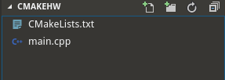
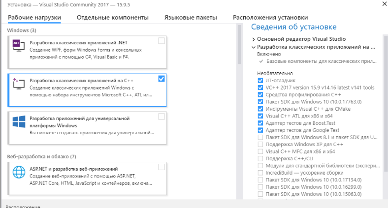
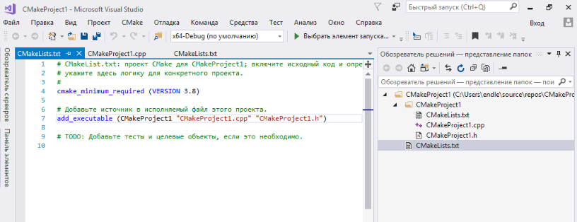

# Система зборки на основі Cmake


## Автоматизація складання


### Автоматизація складання

**Система зборки** - утиліта, яка дозволяє автоматизувати процес складання застосунка.


### Автоматизація складання

**Автоматизація складання** - етап процесу розробки програмного забезпечення, що полягає в автоматизації широкого спектра завдань, що вирішуються програмістами в їх повсякденній діяльності.

Включає в себе такі дії, як:
- компіляція вихідного коду в Об'єктний модуль
- збірка бінарного коду в виконуваний файл
- виконання тестів
- розгортання програми на виробничій платформі
- написання супровідної документації або опис змін нової версії


## Системи сборок C/C++


### Make
- **make** - утиліта, яка автоматизує процес перетворення файлів з однієї форми в іншу. Найчастіше це компіляція вихідного коду в об'єктні файли і подальша компонування у виконувані файли або бібліотеки.
- Утиліта використовує спеціальні make-файли, в яких вказані залежності файлів один від одного і правила для їх задоволення.
- Make не підтримується нативно в Windows.


### Autotools
- **Autotools**, або система збирання GNU, - це набір програмних засобів, призначених для підтримки переносимості вихідного коду програм між UNIX-подібними системами.
- Немає нативної підтримки в Windows.


### Cmake

CMake (від англ. Cross-platform make) - це кроссплатформенная система автоматизації збирання програмного забезпечення з джерельного коду. CMake не займається безпосередньо складанням, а лише генерує файли управління складанням з файлів CMakeLists.txt:

- Makefile в системах Unix для збірки з допомогою make;
- файли projects / solutions (.vcxproj / .vcproj / .sln) в Windows для збірки з допомогою Visual C ++;
- проекти XCode в Mac OS X.


### Cmake


### Cmake
Хто використовує CMake:

- LLVM/Clang compiler framework
- KDE desktop
- MySQL (and its famous fork MariaDB)
- OpenCV
- Blender
- and many others ...


## Hello World Cmake


### Hello World Cmake
Створіть директорію cmakehw. Всередині диреторії створіть CMakeLists.txt і файл main.cpp.




### Hello World Cmake
Вміст main.cpp наступний:
```cpp
#include <iostream>

int main()
{
    std::cout << "Hello CMake";
    return 0;
}
```
Вміст CMakeLists.txt наступний:
```
cmake_minimum_required(VERSION 2.8)
add_executable(main main.cpp)
```


### Hello World Cmake
Давайте розбиремо, що ж написано в CMakeLists.txt:
- cmake_minimum_required, вказує мінімальну версію cmake з, якою можна збудувати проект
- add_executable - задає ім'я збудованого виконуваного файла і список джерельних файлів


### Hello World Cmake
Для зборки проекту потрібно виконати команду:
```bash
cmake .
```
Оскільки даний приклад, продемонстровано на системі Linux був згенерований MakeFile, для подальшого будування можна використати команду:
```
make
```


### Hello World Cmake
- В результаті наш проект буде збудовано. В робочій директорії зявиться файл main.
- Файл main можна запустити командою:

```bash
./main
```


## Створення виконуваного фалу в іншій директорії


### Створення виконуваного фалу в іншій директорії
В минулому прикладі виконуваний файл після зборки з'являвся в корневій директорії проекту, що не є хорошою практикою. Для того, щоб виконуваний файл створювався в іншій директорії можна задати параметр - CMAKE_RUNTIME_OUTPUT_DIRECTORY:
```
cmake_minimum_required(VERSION 2.8)
set(CMAKE_RUNTIME_OUTPUT_DIRECTORY ${CMAKE_BINARY_DIR}/bin)
add_executable(main main.cpp)
```
Після збирання проекту виконуваний файл буде розміщено в директорії bin:


## Включення CMakeLists.txt з дочірньої директорії


### Включення CMakeLists.txt з дочірньої директорії
Зараз в нашому проекті всього один джерельний файл, в реальному проекті, звісно, файлів буде сотні, а то і тисячі. Для групування CMake дозволяє створювати CMakeLists.txt в дочірніх директоріях і включати їх в головний CMakeLists.txt:

Додамо до минулого прикладу директорію src. Створимо в директорії src CMakeLists.txt і перенесимо в неї main.cpp:


### Включення CMakeLists.txt з дочірньої директорії
**src/CMakeLists.txt**:
```
cmake_minimum_required(VERSION 2.8)
add_executable(main "main.cpp")
```
**CMakeLists.txt**:
```
cmake_minimum_required(VERSION 2.8)
set(CMAKE_RUNTIME_OUTPUT_DIRECTORY ${CMAKE_BINARY_DIR}/bin)
add_subdirectory("src")
```


## Компіляція і використання бібліотек


### Компіляція і використання бібліотек
Для наступної структури проекту:


### Компіляція і використання бібліотек
**MakeLists.txt на рівні кореня виглядатиме як**:
```
cmake_minimum_required(VERSION 2.8.4)
project(test)
add_subdirectory(component1)
add_subdirectory(component2)
add_executable(test main.cpp)
target_link_libraries(test component1 component2)
```

**CMakeLists.txt в дочірніх директоріях будуть всього навсього містити**:
```
add_library(component2  STATIC  component2.cpp)
```


### Компіляція і використання бібліотек
Компіляція буде виглядати як:

```
cmake .
make
```


## CMake і .gitignore


### .gitignore файл для CMake - проектів виглядає наступним чином:

```
CMakeLists.txt.user
CMakeCache.txt
CMakeFiles
CMakeScripts
Testing
Makefile
cmake_install.cmake
install_manifest.txt
compile_commands.json
CTestTestfile.cmake
_deps
```


## Cmake на Windows з використанням Visual Studio


### Cmake на Windows з використанням Visual Studio
У Visual Studio 2015 користувачі Visual Studio можуть використовувати [CMake Generator](https://cmake.org/cmake/help/v3.9/manual/cmake-generators.7.html) для створення файлів проекту MSBuild, які IDE витрачає на IntelliSense, перегляд і компіляцію.


### Cmake на Windows з використанням Visual Studio
Починаючи з Visual Studio 2017 отримав вбудовану підтримку CMake. Головне, потрібно пересвідчитися, що флажок CMake Tools For Visual Studio був ввімкнений при інсталяції(За замовчуванням вів вімкнений):




### Cmake на Windows з використанням Visual Studio
Створити новий проект, який використовує CMake можна у вкладці Visual C++ -> Кросплатформні -> CMake:


### Cmake на Windows з використанням Visual Studio
В якості згенерованого проекту ми отримаємо вже знайому нам структуру:

