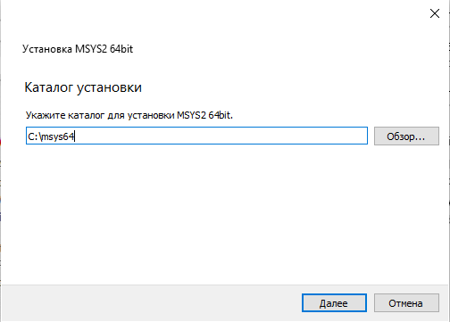
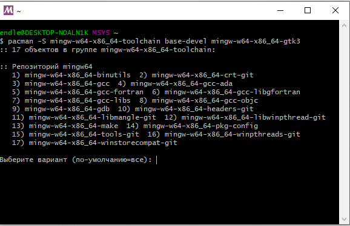
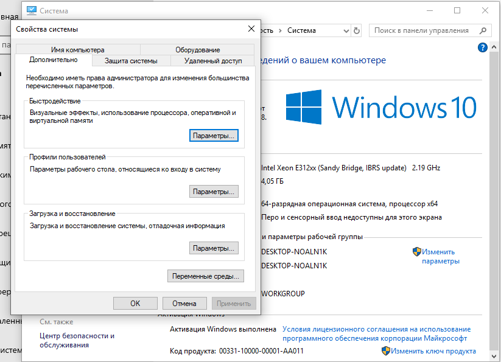
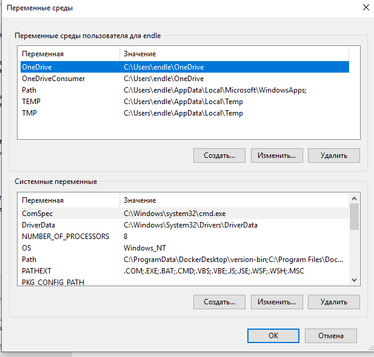
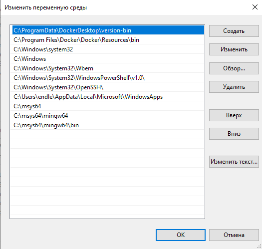
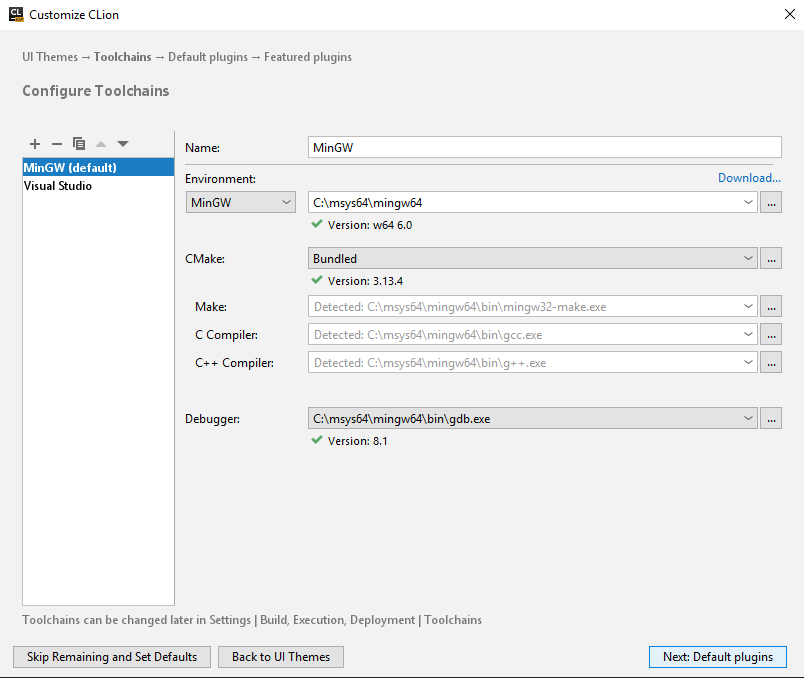
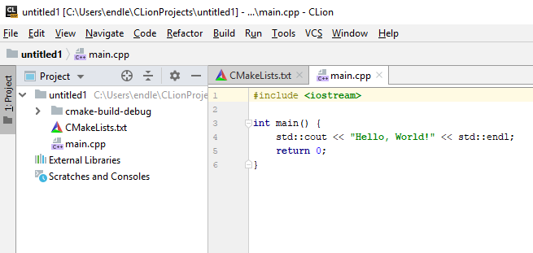
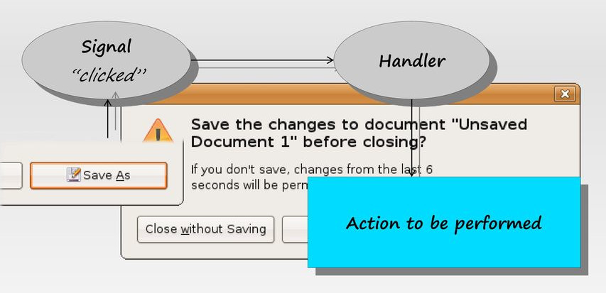
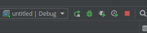

# GTK Intro


## GTK Intro


### GTK Intro
**GTK+** (від The GIMP ToolKit) — кросплатформовий набір інструментів для створення графічних інтерфейсів користувача. Разом із Qt є одним із найпопулярніших інструментів для X Window System.


### GTK Intro
GTK+ було розроблено для GNU Image Manipulation Program (GIMP), растрового графічного редактора, у 1997 році Спенсером Кімбалом (Spencer Kimball) та Петером Матісом (Peter Mattis), членами eXperimental Computing Facility (XCF) в UC Berkeley. GTK+ розвивається в рамках проекту GNU і є вільним програмним забезпеченням.


### GTK Intro
До складу тулкіта входить повний набір віджетів, що дозволяють використовувати GTK+ для проектів різного рівня і розміру. GTK+ спеціально спроектований для підтримки не тільки C/C++, але й інших мов програмування, таких як Perl і Python, що в поєднанні з використанням візуального будівника інтерфейсу Glade дозволяє істотно спростити розробку і скоротити час написання графічних інтерфейсів.


### GTK Intro
GTK+ написана на мові програмування С, і використовує систему об'єктів GObject, що робить її об'єктно-орієнтованою. Платформа GNOME забезпечує міжмовне зв'язування для наступних мов:

- C++ (gtkmm)
- Fortran (gtk-fortran)
- Perl (Gtk2-perl)
- Ruby (ruby-gtk2)
- Python (PyGTK)
- Java (java-gnome) (не доступна Microsoft Windows)
- C# (Gtk#)
- PHP (PHP-GTK)


## GLib


### GLib
**GLib** — низькорівнева бібліотека, що розширює можливості, надані стандартної бібліотекою libc мови C


### GLib
- Розробляється в рамках і лежить в основах проектів GTK+ і GNOME. GLib широко використовується в застосунках, в тому числі і неграфічних. Випуск чергової версії бібліотеки за часом зазвичай збігається з випуском нової версії GTK+.
- Glib надає основну об'єктну систему, яка використовується в GNOME, реалізацію основного циклу, а також великий набір допоміжних функцій для рядків і типових структур даних.
- Зараз GLib здатна працювати на багатьох UNIX-подібних операційних системах, а також Windows, OS/2 і BeOS.


### GLib
GLib надає такі можливості:

- великий набір базових і похідних типів даних;
- макроси і розвинений механізм налагоджувальних повідомлень;
- рядкові функції;
- функції для перетворення символів та підтримки юнікоду;
- вбудовані макроси gettext для інтернаціоналізації;
- засоби для роботи з динамічною пам'яттю;
- засоби для динамічного завантаження модулів;
- атомарні операції;
- .....


### Базові типи даних GLib
- Базові типи даних GLib призначені для зручності програміста і переносимості програми. Розмір змінної будь-якого з цих типів однаковий для кожної використовуваної апаратної платформи.
- Список всіх типів можна переглянкти за посиланням [Gnome developer](https://developer.gnome.org/glib/stable/glib-Basic-Types.html)


### Базові типи даних GLib
in workbook


## GObject


### GObject
GObject - частина бібліотеки GLib, що реалізує об'єктів-оріентірованнние розширення для чистого C. Подібна концепція, крім самої GLib, використовується в таких проектах, як GStreamer, GSettings, ATK, Pango і весь проект GNOME в цілому, а також у великій кількості прикладних програм: GIMP, Inkscape, Geany, Gedit і багатьох інших.


### Наслідування в C
```cpp
struct Todo{
    int id = 0;
    char* title;
    char* dueDate;
};
```


### Наслідування в C
```cpp
struct Todo{
    int id = 0;
    char* title;
    char* dueDate;
    int todoCount = 0;
    int doneCount = 0;
    bool isCountTodo = false;
};
```


### Наслідування в C
```cpp
struct Todo{
    int id = 0;
    char* title;
    char* dueDate;
};

struct CountTodo{
    int id = 0;
    char* title;
    char* dueDate;
    int todoCount = 0;
    int doneCount = 0;
};
```


### Наслідування в C
Наслідування в C:

```cpp
#include <iostream>

struct Todo{
    int id = 0;
    char* title;
    char* dueDate;
};

struct CountTodo{
    struct Todo todo;
    int todoCount = 0;
    int doneCount = 0;
};

Todo createTodo(int id, char* title, char *dueDate){
    return Todo{id,title,dueDate};
}

CountTodo createCountTodo(
        int id,
        char* title,
        char *dueDate,
        int todoCount,
        int doneCount
        ){
    CountTodo countTodo;
    countTodo.todo.id = id;
    countTodo.todo.title = title;
    countTodo.todo.dueDate = dueDate;
    countTodo.todoCount = todoCount;
    countTodo.doneCount = doneCount;
    return countTodo;
}

int main (int argc, char **argv)
{
    struct CountTodo countTodo = createCountTodo(
            1,
            "buy milk",
            "today",
            10,
            0
            );
    std::cout << "title: " << countTodo.todo.title;
    std::cout << "Need to do: " << countTodo.todoCount;
}
```


### Наслідування в C
Приведення типів:

```cpp
#include <iostream>

struct Todo{
    int id = 0;
    char* title;
    char* dueDate;
};

struct CountTodo{
    struct Todo todo;
    int todoCount = 0;
    int doneCount = 0;
};

Todo createTodo(int id, char* title, char *dueDate){
    return Todo{id,title,dueDate};
}

void displayTodoInfo(Todo& todo){
    std::cout << "id: " << todo.id << std::endl;
    std::cout << "title: " << todo.title << std::endl;
    std::cout << "dueDate: " << todo.dueDate << std::endl;
}

CountTodo createCountTodo(
        int id,
        char* title,
        char *dueDate,
        int todoCount,
        int doneCount
        ){
    CountTodo countTodo;
    countTodo.todo.id = id;
    countTodo.todo.title = title;
    countTodo.todo.dueDate = dueDate;
    countTodo.todoCount = todoCount;
    countTodo.doneCount = doneCount;
    return countTodo;
}

int main (int argc, char **argv)
{
    struct CountTodo countTodo = createCountTodo(
            1,
            "buy milk",
            "today",
            10,
            0
            );
    std::cout << "title: " << countTodo.todo.title << std::endl;
    std::cout << "Need to do: " << countTodo.todoCount << std::endl;

    //displayTodoInfo(countTodo); error

    //cast CountTodo to Todo
    struct Todo *todo;
    todo = (Todo *)&countTodo;

    displayTodoInfo(*todo);
}
```


## Віджет в GTK


### Віджет в GTK
- Під вджетом в GTK розуміється примітив графічного інтерфейсу користувача, який має стандартний зовнішній вигляд і виконує стандартні дії.
- Наприклад, кнопка, список, меню, вікно, діалог і т.д.


### Віджет в GTK
- Ієрархія об'єктів GTK
- [developer.gnome.org](https://developer.gnome.org/gtk3/stable/ch02.html)


### Віджет в GTK
- **GObject** - це базовий тип. Він здійснює: Управління пам'яттю з підрахунком силок; Створення / знищення інтерфейсів;Основні властивості об'єкта з установкою / отриманням функціональних пар;Легке використання сигналів
- **GInitiallyUnowned** успадковує GObject. Єдина відмінність між ними полягає в тому що початкова посилання GInitiallyUnowned позначається як плаваюча посилання. Це означає що ні якою частиною коду ні хто не "володіє". Основна мотивація забезпечення плаваючих посилань - зручність C. Зокрема, це дозволяє писати код як:
```cpp
container = create_container();
container_add_child (container, create_child());
```


### Віджет в GTK
- **GtkWidget** - базовий клас для всіх віджетів
- **GtkContainer** - віджети, які можуть містити в собі інші віджети.
- **GtkBin** - це контейнер, який може містити лише один віджет


## Налаштування середовища розробки


### Налаштування середовища розробки
Завантажте і установіть [MSYS2](https://www.msys2.org/)


### Налаштування середовища розробки


### Налаштування середовища розробки



### Налаштування середовища розробки
Відкрийте MSYS2 Shell і виконайте наступну команду:
```bash
pacman -S mingw-w64-x86_64-toolchain base-devel mingw-w64-x86_64-gtk3
```



### Налаштування середовища розробки
Додайте шляхи до MSYS2 і MinGW в системну змінну PATH:



### Налаштування середовища розробки



### Налаштування середовища розробки



### Налаштування середовища розробки
Завантажте і установіть CLion.

При першому запуску сконфігуруйте Toolchain для роботи із MinGW всередині MSYS2:




### Налаштування середовища розробки
CLion за замовчуванням собирає проекти, з використанням CMake:




### Налаштування середовища розробки
Для того, щоб працювати із GTK потрібно модифікувати CMakeLists.txt наступним чином:

```
cmake_minimum_required(VERSION 3.13)
project(untitled)

set(CMAKE_CXX_STANDARD 14)

FIND_PACKAGE(PkgConfig REQUIRED)
PKG_CHECK_MODULES(GTK3 REQUIRED gtk+-3.0)

INCLUDE_DIRECTORIES(${GTK3_INCLUDE_DIRS})
LINK_DIRECTORIES(${GTK3_LIBRARY_DIRS})

# Add other flags to the compiler
ADD_DEFINITIONS(${GTK3_CFLAGS_OTHER})

add_executable(untitled main.cpp)

TARGET_LINK_LIBRARIES(untitled ${GTK3_LIBRARIES})
```

Де untitled потрібно замінити, назвою вашого проекта.


### Налаштування середовища розробки


## Перша програма


### Перша програма
```cpp
#include <gtk/gtk.h>

int main (int argc, char **argv)
{
  GtkWidget *window;

  gtk_init(&argc, &argv);

  window = gtk_window_new(GTK_WINDOW_TOPLEVEL);
  gtk_window_set_title(GTK_WINDOW(window), "Hello world");
  gtk_window_set_default_size(GTK_WINDOW(window), 500, 500);

  gtk_widget_show_all(window);

  gtk_main();
}
```


### Перша програма


### Перша програма
- **GtkWidget** - посилання на об'єкт вікна
- **gtk_init(&argc, &argv)** - Цю функцію потрібно викликати, перш ніж використовувати будь-які інші функції GTK + у ваших додатках GUI. Вона ініціалізує все необхідне для роботи з інструментарієм і аналізує деякі стандартні параметри командного рядка. Незважаючи на те, що ви повинні передавати параметри argc, argv з main () до цієї функції, можна передати NULL, якщо argv не доступний або командна команда не потрібна.
- **window = gtk_window_new(GTK_WINDOW_TOPLEVEL)** - створення нового об'єкту головного вікна.
- **gtk_window_set_title(GTK_WINDOW(window), "Hello world")** - встановлення заголовка головного вікна
- **gtk_window_set_default_size(GTK_WINDOW(window), 500, 500)** - встановлення заголовка головного вікна
- **gtk_widget_show_all(window)** - за замовчуванням віджети не показуються користувачеві. Ця функція робу видимими віджет window і всі його дочірні веджети
- **gtk_main()** - Запускає основний цикл до виклику gtk_main_quit ().


## Сигнали


### Сигнали
Як в більшості графічних інструментаріїв, в GTK + реалізована модель з керуванням по подіях (event-driven).




### Сигнали
Концепція сигналів організована навколо головного циклу (main loop) обробки подій. Головний цикл являє собою нескінченний цикл, що включає три етапи: перевірку наявності обставин, їх обробку і очікування. Коли виникає подія, об'єкт, асоційований з цією подією посилає сигнал, який повідомляє головному циклу про подію, що відбулася. Далі головний цикл шукає сигнал у внутрішній таблиці, де зіставлені сигнали і обробники, ці зіставлення іноді називають зворотними викликами (callbacks).


### Реєстрація сигналу і функції зворотнього виклику
Реєстрація сигналу виглядає як:

```cpp
g_signal_connect(G_OBJECT (window),  "delete-event", 
         G_CALLBACK(cb_delete), NULL);
g_signal_connect (G_OBJECT(button), "clicked", 
          G_CALLBACK(cb_button_click), label);
```


### Реєстрація сигналу і функції зворотнього виклику
де першим аргументом є віджет, який буде створювати сигнал, а другий - ім'я сигналу, який ви хочете переловити. Третій - функція, яку ви хочете викликати, коли сигнал був ініційований, а четвертий - дані, які ви хотіли б передати цій функції.


### Реєстрація сигналу і функції зворотнього виклику
Функція, задана в третьому аргументі, називається "функцією зворотного виклику", і, зазвичай, має форму:
```cpp
void callback_func( GtkWidget *widget,
                    ... /* other signal arguments */
                    gpointer   callback_data );
```
де перший аргумент буде покажчиком на віджет, який ініціює сигнал, а останній - покажчик на дані, наведені як останній аргумент функції g_signal_connect (), як показано вище.

Зауважимо, що вищезгадана форма для оголошення функції зворотного виклику є лише загальним керівництвом, оскільки деякі конкретні сигнали віджета генерують різні параметри виклику.


## Безпечне завершення GTK+ застосунка


### Безпечне завершення GTK+ застосунка
кщо ми закриємо вікно, запустивши минулий приклад, насправді наш застосунок не завершить свою роботу. Просто вікно більше не показується користувачеві:




### Безпечне завершення GTK+ застосунка
Ми можемо пов'язати певну подію, яка повинна відбутися з віджетом, зі своєю функцією.

```cpp
g_signal_connect(G_OBJECT(window), "destroy", G_CALLBACK(gtk_main_quit), NULL);
```


### Безпечне завершення GTK+ застосунка
В даному випадку це стандартна фунция gtk_main_quit (), яка безпечно завершить наш додаток.

```cpp
#include <gtk/gtk.h>

int main (int argc, char **argv)
{
  GtkWidget *window;
  gtk_init(&argc, &argv);
  window = gtk_window_new(GTK_WINDOW_TOPLEVEL);
  gtk_window_set_title(GTK_WINDOW(window), "Hello world");
  gtk_window_set_default_size(GTK_WINDOW(window), 500, 500);
  g_signal_connect(G_OBJECT(window), "destroy", G_CALLBACK(gtk_main_quit), NULL);
  gtk_widget_show_all(window);
  gtk_main();
}
```


## Зміна напису на кнопці


### Зміна напису на кнопці
Тепер створимо кнопку, після натискання на яку надпис на кнопці буде змінюватися.

Для початку додамо кнопку:

```cpp
GtkWidget *button;
button = gtk_button_new_with_label("Click Me!!!");

gtk_container_add(GTK_CONTAINER(window), button);
```


### Зміна напису на кнопці
```cpp
#include <gtk/gtk.h>

int main (int argc, char **argv)
{
  GtkWidget *window;
  gtk_init(&argc, &argv);
  window = gtk_window_new(GTK_WINDOW_TOPLEVEL);
  gtk_window_set_title(GTK_WINDOW(window), "Hello world");
  gtk_window_set_default_size(GTK_WINDOW(window), 500, 500);
  g_signal_connect(G_OBJECT(window), "destroy", G_CALLBACK(gtk_main_quit), NULL);
  GtkWidget *button;
  button = gtk_button_new_with_label("Click Me!!!");
  gtk_container_add(GTK_CONTAINER(window), button);
  gtk_widget_show_all(window);
  gtk_main();
}
```


### Зміна напису на кнопці
В Результаті ми отримаємо кнопку, яка займає весь доступний простір всередині вікна.


### Зміна напису на кнопці
Покищо, при натиску на кнопку нічого не відбувається. Для того, щоб обробляти користувацькі події нам знадобиться:
- створити функцію, яка обробляє певну подію
- зв'язати подію і створену функцію


### Зміна напису на кнопці
Створимо функцію on_button_click, яка буде змінювати текст кнопки:

```cpp
void on_button_click(GtkButton *button, gpointer data)
{
    gtk_button_set_label(button, "Button was clicked");
}
```


### Зміна напису на кнопці
Тепер зв'яжимо сигнал "clicked" кнопки і функцію on_button_click

```cpp
g_signal_connect(GTK_BUTTON(button), "clicked", G_CALLBACK(on_button_click), NULL);
```


### Зміна напису на кнопці
Тепер джерельний код програми наступний:

```cpp
#include <gtk/gtk.h>
void on_button_click(GtkButton *button, gpointer data)
{
    gtk_button_set_label(button, "Button was clicked");
}
int main (int argc, char **argv)
{
    GtkWidget *window;
    gtk_init(&argc, &argv);
    window = gtk_window_new(GTK_WINDOW_TOPLEVEL);
    gtk_window_set_title(GTK_WINDOW(window), "Hello world");
    gtk_window_set_default_size(GTK_WINDOW(window), 500, 500);
    g_signal_connect(G_OBJECT(window), "destroy", G_CALLBACK(gtk_main_quit), NULL);
    GtkWidget *button;
    button = gtk_button_new_with_label("Click Me!!!");
    g_signal_connect(GTK_BUTTON(button), "clicked", G_CALLBACK(on_button_click), NULL);
    gtk_container_add(GTK_CONTAINER(window), button);
    gtk_widget_show_all(window);
    gtk_main();
}
```


##