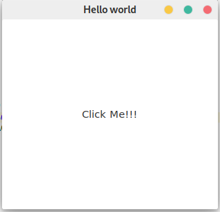

# GTK intro

**GTK+** (від The GIMP ToolKit) — кросплатформовий набір інструментів для створення графічних інтерфейсів користувача. Разом із Qt є одним із найпопулярніших інструментів для X Window System.

GTK+ було розроблено для GNU Image Manipulation Program (GIMP), растрового графічного редактора, у 1997 році Спенсером Кімбалом (Spencer Kimball) та Петером Матісом (Peter Mattis), членами eXperimental Computing Facility (XCF) в UC Berkeley. GTK+ розвивається в рамках проекту GNU і є вільним програмним забезпеченням.

До складу тулкіта входить повний набір віджетів, що дозволяють використовувати GTK+ для проектів різного рівня і розміру. GTK+ спеціально спроектований для підтримки не тільки C/C++, але й інших мов програмування, таких як Perl і Python, що в поєднанні з використанням візуального будівника інтерфейсу Glade дозволяє істотно спростити розробку і скоротити час написання графічних інтерфейсів.

GTK+ написана на мові програмування С, і використовує систему об'єктів GObject, що робить її об'єктно-орієнтованою. Платформа GNOME забезпечує міжмовне зв'язування для наступних мов:

- C++ (gtkmm)
- Fortran (gtk-fortran)
- Perl (Gtk2-perl)
- Ruby (ruby-gtk2)
- Python (PyGTK)
- Java (java-gnome) (не доступна Microsoft Windows)
- C# (Gtk#)
- PHP (PHP-GTK)

# GObject

# Налаштування середовища розробки

# Перша програма

```
#include <gtk/gtk.h>

int main (int argc, char **argv)
{
  GtkWidget *window;

  gtk_init(&argc, &argv);

  window = gtk_window_new(GTK_WINDOW_TOPLEVEL);
  gtk_window_set_title(GTK_WINDOW(window), "Hello world");
  gtk_window_set_default_size(GTK_WINDOW(window), 500, 500);

  gtk_widget_show_all(window);

  gtk_main();
}
```


# Сигнали

Ми можемо пов'язати певну подію, яка повинна відбутися з віджетом, зі своєю функцією.

```
g_signal_connect(G_OBJECT(window), "destroy", G_CALLBACK(gtk_main_quit), NULL);
```

В даному випадку це стандартна фунция gtk_main_quit (), яка безпечно завершить наш додаток.

```
#include <gtk/gtk.h>

int main (int argc, char **argv)
{
  GtkWidget *window;


  gtk_init(&argc, &argv);

  window = gtk_window_new(GTK_WINDOW_TOPLEVEL);
  gtk_window_set_title(GTK_WINDOW(window), "Hello world");
  gtk_window_set_default_size(GTK_WINDOW(window), 500, 500);
  g_signal_connect(G_OBJECT(window), "destroy", G_CALLBACK(gtk_main_quit), NULL);

  gtk_widget_show_all(window);

  gtk_main();
}
```

Тепер створимо кнопку, після натискання на яку надпис на кнопці буде змінюватися.

Для початку додамо кнопку:

```
GtkWidget *button;
button = gtk_button_new_with_label("Click Me!!!");

gtk_container_add(GTK_CONTAINER(window), button);
```

Весь код програми:

```
#include <gtk/gtk.h>

int main (int argc, char **argv)
{
  GtkWidget *window;


  gtk_init(&argc, &argv);

  window = gtk_window_new(GTK_WINDOW_TOPLEVEL);
  gtk_window_set_title(GTK_WINDOW(window), "Hello world");
  gtk_window_set_default_size(GTK_WINDOW(window), 500, 500);
  g_signal_connect(G_OBJECT(window), "destroy", G_CALLBACK(gtk_main_quit), NULL);

  GtkWidget *button;
  button = gtk_button_new_with_label("Click Me!!!");

  gtk_container_add(GTK_CONTAINER(window), button);

  gtk_widget_show_all(window);

  gtk_main();
}
```

В Результаті ми отримаємо кнопку, яка займає весь доступний простір всередині вікна.



Покищо, при натиску на кнопку нічого не відбувається. Для того, щоб обробляти користувацькі події нам знадобиться:
- створити функцію, яка обробляє певну подію
- зв'язати подію і створену функцію

Створимо функцію on_button_click, яка буде змінювати текст кнопки:

```
void on_button_click(GtkButton *button, gpointer data)
{
    gtk_button_set_label(button, "Button was clicked");
}
```

Тепер зв'яжимо сигнал "clicked" кнопки і функцію on_button_click

```
g_signal_connect(GTK_BUTTON(button), "clicked", G_CALLBACK(on_button_click), NULL);
```

Тепер джерельний код програми наступний:

```
#include <gtk/gtk.h>

void on_button_click(GtkButton *button, gpointer data)
{
    gtk_button_set_label(button, "Button was clicked");
}

int main (int argc, char **argv)
{
    GtkWidget *window;


    gtk_init(&argc, &argv);

    window = gtk_window_new(GTK_WINDOW_TOPLEVEL);
    gtk_window_set_title(GTK_WINDOW(window), "Hello world");
    gtk_window_set_default_size(GTK_WINDOW(window), 500, 500);
    g_signal_connect(G_OBJECT(window), "destroy", G_CALLBACK(gtk_main_quit), NULL);

    GtkWidget *button;
    button = gtk_button_new_with_label("Click Me!!!");
    g_signal_connect(GTK_BUTTON(button), "clicked", G_CALLBACK(on_button_click), NULL);

    gtk_container_add(GTK_CONTAINER(window), button);

    gtk_widget_show_all(window);

    gtk_main();
}
```

# Домашнє завдання

## Варіанти

# Контрольні запитання