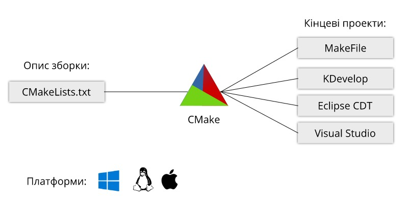
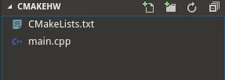
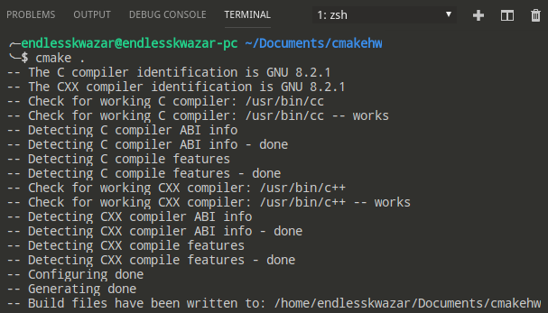
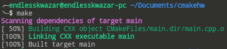
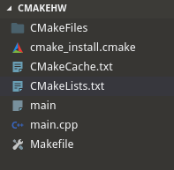
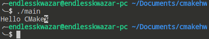
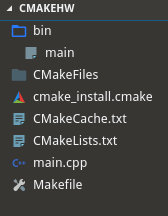
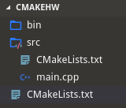

# CMake

# Зміст

${toc}

# Що таке система збоки і навіщо її використовувати

# Make

# Autotools

# Meson

# Cmake

CMake (від англ. Cross-platform make) - це кроссплатформенная система автоматизації збирання програмного забезпечення з джерельного коду. CMake не займається безпосередньо складанням, а лише генерує файли управління складанням з файлів CMakeLists.txt:

- Makefile в системах Unix для збірки з допомогою make;
- файли projects / solutions (.vcxproj / .vcproj / .sln) в Windows для збірки з допомогою Visual C ++;
- проекти XCode в Mac OS X.



## Хто використовує CMake

- LLVM/Clang compiler framework
- KDE desktop
- MySQL (and its famous fork MariaDB)
- OpenCV
- Blender
- and many others ...

# Hello World project

Створіть директорію cmakehw. Всередині диреторії створіть CMakeLists.txt і файл main.cpp.



Вміст main.cpp наступний:

```cpp
#include <iostream>

int main()
{
    std::cout << "Hello CMake";
    return 0;
}
```

Вміст CMakeLists.txt наступний:

```
cmake_minimum_required(VERSION 2.8)

add_executable(main main.cpp)
```

Давайте розбиремо, що ж написано в CMakeLists.txt:
- cmake_minimum_required, вказує мінімальну версію cmake з, якою можна збудувати проект
- add_executable - задає ім'я збудованого виконуваного файла і список джерельних файлів

Для зборки проекту потрібно виконати команду:

```bash
cmake .
```



Оскільки даний приклад, продемонстровано на системі Linux був згенерований MakeFile, для подальшого будування можна використати команду:
```
make
```



В результаті наш проект буде збудовано. В робочій директорії зявиться файл main:



Файл main можна запустити командою:

```bash
./main
```




# Створення виконуваного фалу в іншій директорії

В минулому прикладі виконуваний файл після зборки з'являвся в корневій директорії проекту, що не є хорошою практикою. Для того, щоб виконуваний файл створювався в іншій директорії можна задати параметр - CMAKE_RUNTIME_OUTPUT_DIRECTORY:

```
cmake_minimum_required(VERSION 2.8)
set(CMAKE_RUNTIME_OUTPUT_DIRECTORY ${CMAKE_BINARY_DIR}/bin)

add_executable(main main.cpp)
```

Після збирання проекту виконуваний файл буде розміщено в директорії bin:



# Включення CMakeLists.txt з дочірньої директорії

Зараз в нашому проекті всього один джерельний файл, в реальному проекті, звісно, файлів буде сотні, а то і тисячі. Для групування CMake дозволяє створювати CMakeLists.txt в дочірніх директоріях і включати їх в головний CMakeLists.txt:

Додамо до минулого прикладу директорію src. Створимо в директорії src CMakeLists.txt і перенесимо в неї main.cpp:



src/CMakeLists.txt:
```
cmake_minimum_required(VERSION 2.8)

add_executable(main "main.cpp")
```

CMakeLists.txt:
```
cmake_minimum_required(VERSION 2.8)
set(CMAKE_RUNTIME_OUTPUT_DIRECTORY ${CMAKE_BINARY_DIR}/bin)

add_subdirectory("src")
```

# Компіляція бібліотеки

# Залежності

# CMake і .gitignore

# Cmake на Windows з використанням Visual Studio

# Cmake на Windows з використанням CLion