# GTK intro

# Зміст

${toc}

# Що таке GTK

> **GTK+** (від The GIMP ToolKit) — кросплатформовий набір інструментів для створення графічних інтерфейсів користувача. Разом із Qt є одним із найпопулярніших інструментів для X Window System.

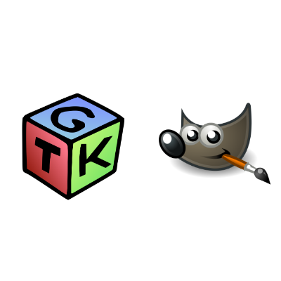

GTK+ було розроблено для GNU Image Manipulation Program (GIMP), растрового графічного редактора, у 1997 році Спенсером Кімбалом (Spencer Kimball) та Петером Матісом (Peter Mattis), членами eXperimental Computing Facility (XCF) в UC Berkeley. GTK+ розвивається в рамках проекту GNU і є вільним програмним забезпеченням.

До складу тулкіта входить повний набір віджетів, що дозволяють використовувати GTK+ для проектів різного рівня і розміру. GTK+ спеціально спроектований для підтримки не тільки C/C++, але й інших мов програмування, таких як Perl і Python, що в поєднанні з використанням візуального будівника інтерфейсу Glade дозволяє істотно спростити розробку і скоротити час написання графічних інтерфейсів.

GTK+ написана на мові програмування С, і використовує систему об'єктів GObject, що робить її об'єктно-орієнтованою. Платформа GNOME забезпечує міжмовне зв'язування для наступних мов:

- C++ (gtkmm)
- Fortran (gtk-fortran)
- Perl (Gtk2-perl)
- Ruby (ruby-gtk2)
- Python (PyGTK)
- Java (java-gnome) (не доступна Microsoft Windows)
- C# (Gtk#)
- PHP (PHP-GTK)

# GLib

> **GLib** — низькорівнева бібліотека, що розширює можливості, надані стандартної бібліотекою libc мови C.

Розробляється в рамках і лежить в основах проектів GTK+ і GNOME. GLib широко використовується в застосунках, в тому числі і неграфічних. Випуск чергової версії бібліотеки за часом зазвичай збігається з випуском нової версії GTK+.

Glib надає основну об'єктну систему, яка використовується в GNOME, реалізацію основного циклу, а також великий набір допоміжних функцій для рядків і типових структур даних.

Зараз GLib здатна працювати на багатьох UNIX-подібних операційних системах, а також Windows, OS/2 і BeOS.

GLib надає такі можливості:

- великий набір базових і похідних типів даних;
- макроси і розвинений механізм налагоджувальних повідомлень;
- рядкові функції;
- функції для перетворення символів та підтримки юнікоду;
- вбудовані макроси gettext для інтернаціоналізації;
- засоби для роботи з динамічною пам'яттю;
- засоби для динамічного завантаження модулів;
- атомарні операції;
- програмні ниті і засоби їхньої синхронізації;
- породження нових процесів;
- таймери, функції для роботи з датою і часом;
- генератор псевдо-випадкових чисел;
- універсальний лексичний сканер;
- синтаксичний аналізатор параметрів командного рядка;
- синтаксичний аналізатор підмножини даних типу XML;
- синтаксичний аналізатор. ini-подібних конфігураційних файлів;
- засоби введення-виведення;
- функції перезахоплення;
- утиліти командного рядка;
- синтаксичний аналізатор файлів, що містять закладку;
- засоби роботи з регулярними виразами типу Glob.

# Базові типи даних GLib

Базові типи даних GLib призначені для зручності програміста і переносимості програми. Розмір змінної будь-якого з цих типів однаковий для кожної використовуваної апаратної платформи.

Список всіх типів можна переглянкти за посиланням [Gnome developer](https://developer.gnome.org/glib/stable/glib-Basic-Types.html)

## Цілі типи даних

**Знакові типи:**

| Тип | Пояснення |
|-----|----------|
| gint | Відповідає стандартному типу C int. Значення цього типу можуть варіюватися від G_MININT() до G_MAXINT(). |
| gint8 | Ціле число, має бути 8 біт на всіх платформах. Значення цього типу можуть варіюватися від G_MININT8 (= -128) до G_MAXINT8 (= 127). |  
| gint16 | Ціле число, що  має бути 16 біт на всіх платформах. Значення цього типу можуть варіюватися від G_MININT16 (= -32,768) до G_MAXINT16 (= 32,767). |
| gint32 | Ціле число, має бути 32 біти на всіх платформах. Значення цього типу можуть варіюватися від G_MININT32 (= -2,147,483,648) до G_MAXINT32 (= 2,147,483,647). |
| gint64 | Ціле число, має бути 64 біта на всіх платформах. Значення цього типу можуть варіюватися від G_MININT64 (= -9,223,372,036,854,775,808) до G_MAXINT64 (= 9,223,372,036,854,775,807). |
| gshort | Відповідає стандарту C short. Значення цього типу можуть варіюватися від G_MINSHORT до G_MAXSHORT. |
| glong | Відповідає стандарту C long. Значення цього типу можуть варіюватися від G_MINLONG до G_MAXLONG. |

**Беззнакові типи:**

| Тип | Пояснення |
|-----|----------|
| guint | Відповідає стандарту C unsigned int. Значення цього типу можуть варіюватися від 0 до G_MAXUINT. |
| guint8 | Ціле число без знака, що гарантується 8 бітами на всіх платформах. Значення цього типу можуть варіюватися від 0 до G_MAXUINT8 (= 255). |
| guint16 | Ціле число без знака, що гарантується 16 бітами на всіх платформах. Значення цього типу можуть варіюватися від 0 до G_MAXUINT16 (= 65,535). |
| guint32 | Ціле число без знака, що гарантується 32 бітами на всіх платформах. Значення цього типу можуть варіюватися від 0 до G_MAXUINT32 (= 4,294,967,295). |
| guint64 | Ціле число без знака, яке гарантовано буде 64-бітним на всіх платформах. Значення цього типу можуть становити від 0 до G_MAXUINT64 (= 18,446,744,073,709,551,615). |
| gushort | Відповідає стандарту C unsigned short. Значення цього типу можуть варіюватися від 0 до G_MAXUSHORT. |
| gulong | Відповідає стандарту C unsigned long. Значення цього типу можуть варіюватися від 0 до G_MAXULONG. |

## Типи даних з плаваючою точкою

| Тип | Пояснення |
|-----|----------|
| gfloat | Відповідає стандарту типу C float. Значення цього типу можуть варіюватися від -G_MAXFLOAT до G_MAXFLOAT. |
| gdouble | Відповідає стандартному С double. Значення цього типу можуть варіюватися від -G_MAXDOUBLE до G_MAXDOUBLE. |

## Символьний тип даних

GLib надає два типи для роботи із символами:

- gchar - Відповідає стандартному типу C char.
- guchar - Відповідає стандартному типу C unsigned char.

## gboolean

Оскільки стандарт C не має логічного типу, GLib надає тип gboolean. Змінні цього типу повинні містити тільки значення TRUE або FALSE.

## gpointer, gconstpointer

### gpointer

Для того, щоб зрозуміти навіщо потрібен gpointer, спочатку потрібно розглянути void *.

У C ++ існує спеціальний тип покажчика, який називається покажчиком на невизначений тип. Для визначення такого покажчика замість імені типу використовується ключове слово void.

Таким чином, покажчик void (void *) є покажчиком, який не вказує інформацію про тип. Він повідомляє вам, де знаходяться дані, але він не говорить вам, як інтерпретувати його. Ви знаєте, що в цю адресу є щось, але ви не знаєте, якщо це int, a double або масив літаючих корів. Щоб насправді використовувати такі дані, вам потрібно отримати інформацію про нього будь-яким іншим способом (наприклад, за допомогою якого-небудь іншого магічного параметра), вказати цей покажчик на звичайний тип покажчика, а потім використовувати його як зазвичай.

void * часто використовується в C, щоб забезпечити деяку підтримку універсального програмування.

GLib вводить нетипізований показчик gpointer, який виглядає краще ніж void * і його простіше використовувати.

```cpp
gpointer gpointer1;
gint a = 3;
gpointer1 = GINT_TO_POINTER(a);

g_print("%i", GPOINTER_TO_INT(gpointer1));
```

### gconstpointer

Нетипізований покажчик на константні дані. Наведені дані не повинні змінюватися. Зазвичай це використовується в прототипах функцій, щоб вказати, що дані, на які вказується, не будуть змінені функцією.

## GString

GString - це об'єкт, який обробляє керування пам'яттю C-рядка для вас. Основна увага GString - це текст, типово UTF-8.

Просто так створити строку не можна. Для створення і маніпулюванням GString, використовуються визначені для цього функції. Для того щоб створити новий об'єкт GString можна скористатися наступними функцією g_string_new ()

```cpp
GString *str = g_string_new("Hello");
```

Оскільки GString атоматично розшируються ми можемо модифікувати рядок не задумуючись про виділення пам'яті:

```cpp
GString *str = g_string_new("Hello");
str = g_string_append(str, " World!!!");
```

Для того щоб отримати доступ до дійсного тексту GString, потрібно використати властивість str:

```cpp
struct GString {
  gchar  *str;
  gsize len;
  gsize allocated_len;
};
```

```cpp
GString *str = g_string_new("Hello");
    str = g_string_append(str, " World!!!");
    g_print("%s", str->str);
```


## String Utility Functions

Повний список функцій для роботи із строками і рядками можна знайти за посиланнями:
- [GLib Strings](https://developer.gnome.org/glib/stable/glib-Strings.html)
- [String Utility Functions](https://developer.gnome.org/glib/stable/glib-String-Utility-Functions.html)

# GObject

> GObject - частина бібліотеки GLib, що реалізує об'єктів-оріентірованнние розширення для чистого C. Подібна концепція, крім самої GLib, використовується в таких проектах, як GStreamer, GSettings, ATK, Pango і весь проект GNOME в цілому, а також у великій кількості прикладних програм: GIMP, Inkscape, Geany, Gedit і багатьох інших. Велика кількість мов програмування, починаючи від таких мейнстрімових, як Python і Java, і закінчуючи шедеврами на кшталт Haskell або D, мають прив'язки до GLib / GTK +, а для значної кількості мов Біндінг до GTK + взагалі є єдиним способом побудови GUI.

На відміну від інших схожих проектів, GObject відрізняють архітектурні особливості, метою яких є легка і прозора реалізація прив'язок бібліотек, написаних із застосуванням чистого Сі і GObject, до інших мов програмування, в тому числі з динамічною типізацією і управлінням пам'яттю за допомогою збирача сміття. Саме цим пояснюється деяке відчуття переусложнённості, яке може виникнути у програміста, який приступив до знайомства з GObject API. Проте, ця система дуже продумана і логічна, так що проблем з розумінням усього викладеного нижче у програміста, знайомого з C ++ або Java, виникнути не повинно.

## Наслідування в C

```cpp
struct Todo{
    int id = 0;
    char* title;
    char* dueDate;
};
```

```cpp
struct Todo{
    int id = 0;
    char* title;
    char* dueDate;
    int todoCount = 0;
    int doneCount = 0;
    bool isCountTodo = false;
};
```

```cpp
struct Todo{
    int id = 0;
    char* title;
    char* dueDate;
};

struct CountTodo{
    int id = 0;
    char* title;
    char* dueDate;
    int todoCount = 0;
    int doneCount = 0;
};
```

Наслідування в C:

```cpp
#include <iostream>

struct Todo{
    int id = 0;
    char* title;
    char* dueDate;
};

struct CountTodo{
    struct Todo todo;
    int todoCount = 0;
    int doneCount = 0;
};

Todo createTodo(int id, char* title, char *dueDate){
    return Todo{id,title,dueDate};
}

CountTodo createCountTodo(
        int id,
        char* title,
        char *dueDate,
        int todoCount,
        int doneCount
        ){
    CountTodo countTodo;
    countTodo.todo.id = id;
    countTodo.todo.title = title;
    countTodo.todo.dueDate = dueDate;
    countTodo.todoCount = todoCount;
    countTodo.doneCount = doneCount;
    return countTodo;
}

int main (int argc, char **argv)
{
    struct CountTodo countTodo = createCountTodo(
            1,
            "buy milk",
            "today",
            10,
            0
            );
    std::cout << "title: " << countTodo.todo.title;
    std::cout << "Need to do: " << countTodo.todoCount;
}
```

Приведення типів:

```cpp
#include <iostream>

struct Todo{
    int id = 0;
    char* title;
    char* dueDate;
};

struct CountTodo{
    struct Todo todo;
    int todoCount = 0;
    int doneCount = 0;
};

Todo createTodo(int id, char* title, char *dueDate){
    return Todo{id,title,dueDate};
}

void displayTodoInfo(Todo& todo){
    std::cout << "id: " << todo.id << std::endl;
    std::cout << "title: " << todo.title << std::endl;
    std::cout << "dueDate: " << todo.dueDate << std::endl;
}

CountTodo createCountTodo(
        int id,
        char* title,
        char *dueDate,
        int todoCount,
        int doneCount
        ){
    CountTodo countTodo;
    countTodo.todo.id = id;
    countTodo.todo.title = title;
    countTodo.todo.dueDate = dueDate;
    countTodo.todoCount = todoCount;
    countTodo.doneCount = doneCount;
    return countTodo;
}

int main (int argc, char **argv)
{
    struct CountTodo countTodo = createCountTodo(
            1,
            "buy milk",
            "today",
            10,
            0
            );
    std::cout << "title: " << countTodo.todo.title << std::endl;
    std::cout << "Need to do: " << countTodo.todoCount << std::endl;

    //displayTodoInfo(countTodo); error

    //cast CountTodo to Todo
    struct Todo *todo;
    todo = (Todo *)&countTodo;

    displayTodoInfo(*todo);
}
```

# Віджет в GTK

> Під вджетом в GTK розуміється примітив графічного інтерфейсу користувача, який має стандартний зовнішній вигляд і виконує стандартні дії.

Наприклад, кнопка, список, меню, вікно, діалог і т.д.

# Ієрархія об'єктів GTK

[developer.gnome.org](https://developer.gnome.org/gtk3/stable/ch02.html)

> **GObject** - це базовий тип. Він здійснює:
> - Управління пам'яттю з підрахунком силок
> - Створення / знищення інтерфейсів
> - Основні властивості об'єкта з установкою / отриманням функціональних пар
> - Легке використання сигналів

> **GInitiallyUnowned** успадковує GObject. Єдина відмінність між ними полягає в тому що початкова посилання GInitiallyUnowned позначається як плаваюча посилання. Це означає що ні якою частиною коду ні хто не "володіє". Основна мотивація забезпечення плаваючих посилань - зручність C. Зокрема, це дозволяє писати код як:
```cpp
container = create_container();
container_add_child (container, create_child());
```

> **GtkWidget** - базовий клас для всіх віджетів

> **GtkContainer** - віджети, які можуть містити в собі інші віджети.

> **GtkBin** - це контейнер, який може містити лише один віджет

# Налаштування середовища розробки

## Clion на платформі Windows

Завантажте і установіть [MSYS2](https://www.msys2.org/)

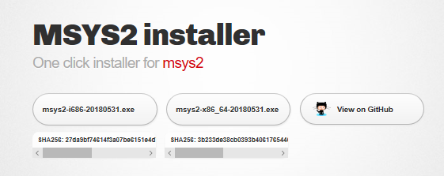

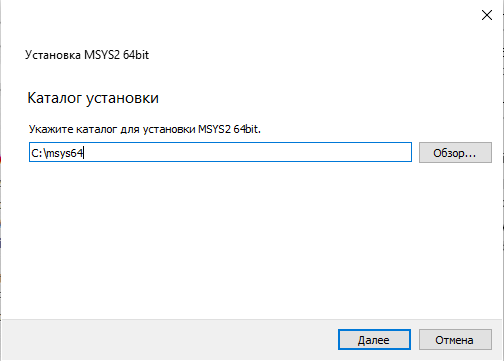

Відкрийте MSYS2 Shell і виконайте наступну команду:

```bash
pacman -S mingw-w64-x86_64-toolchain base-devel mingw-w64-x86_64-gtk3
```

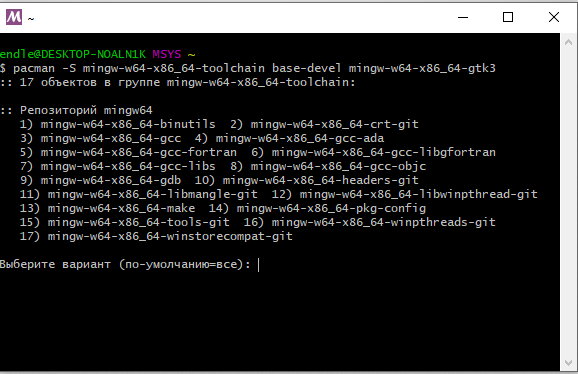

Додайте шляхи до MSYS2 і MinGW в системну змінну PATH:

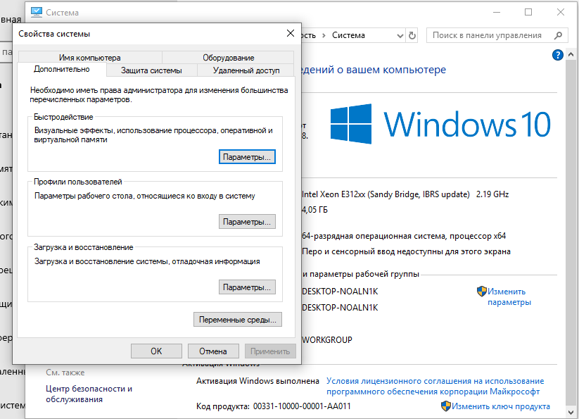

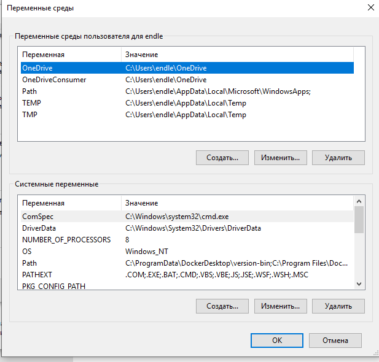

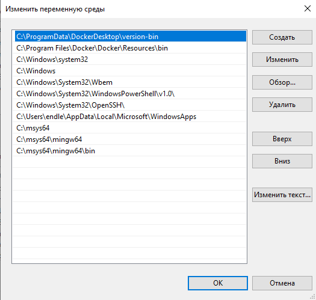

Завантажте і установіть CLion.

При першому запуску сконфігуруйте Toolchain для роботи із MinGW всередині MSYS2:

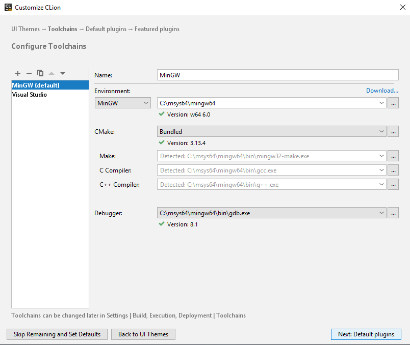

CLion за замовчуванням собирає проекти, з використанням CMake:

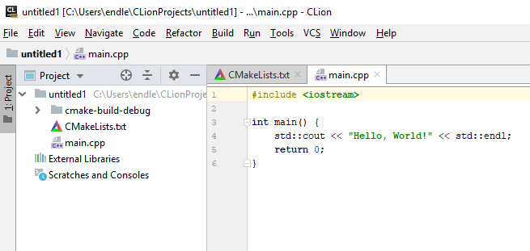

Для того, щоб працювати із GTK потрібно модифікувати CMakeLists.txt наступним чином:

```
cmake_minimum_required(VERSION 3.13)
project(untitled)

set(CMAKE_CXX_STANDARD 14)

FIND_PACKAGE(PkgConfig REQUIRED)
PKG_CHECK_MODULES(GTK3 REQUIRED gtk+-3.0)

INCLUDE_DIRECTORIES(${GTK3_INCLUDE_DIRS})
LINK_DIRECTORIES(${GTK3_LIBRARY_DIRS})

# Add other flags to the compiler
ADD_DEFINITIONS(${GTK3_CFLAGS_OTHER})

add_executable(untitled main.cpp)

TARGET_LINK_LIBRARIES(untitled ${GTK3_LIBRARIES})
```

Де untitled потрібно замінити, назвою вашого проекта.

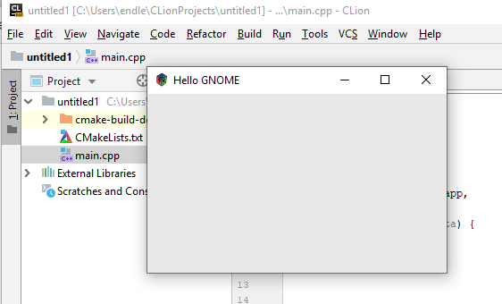

# Перша програма

```cpp
#include <gtk/gtk.h>

int main (int argc, char **argv)
{
  GtkWidget *window;

  gtk_init(&argc, &argv);

  window = gtk_window_new(GTK_WINDOW_TOPLEVEL);
  gtk_window_set_title(GTK_WINDOW(window), "Hello world");
  gtk_window_set_default_size(GTK_WINDOW(window), 500, 500);

  gtk_widget_show_all(window);

  gtk_main();
}
```

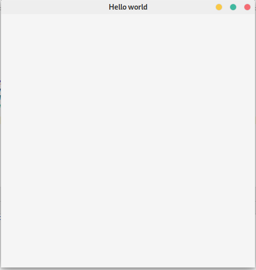

- **GtkWidget** - посилання на об'єкт вікна
- **gtk_init(&argc, &argv)** - Цю функцію потрібно викликати, перш ніж використовувати будь-які інші функції GTK + у ваших додатках GUI. Вона ініціалізує все необхідне для роботи з інструментарієм і аналізує деякі стандартні параметри командного рядка. Незважаючи на те, що ви повинні передавати параметри argc, argv з main () до цієї функції, можна передати NULL, якщо argv не доступний або командна команда не потрібна.
- **window = gtk_window_new(GTK_WINDOW_TOPLEVEL)** - створення нового об'єкту головного вікна.
- **gtk_window_set_title(GTK_WINDOW(window), "Hello world")** - встановлення заголовка головного вікна
- **gtk_window_set_default_size(GTK_WINDOW(window), 500, 500)** - встановлення заголовка головного вікна
- **gtk_widget_show_all(window)** - за замовчуванням віджети не показуються користувачеві. Ця функція робу видимими віджет window і всі його дочірні веджети
- **gtk_main()** - Запускає основний цикл до виклику gtk_main_quit ().
  

# Сигнали

Як в більшості графічних інструментаріїв, в GTK + реалізована модель з керуванням по подіях (event-driven).

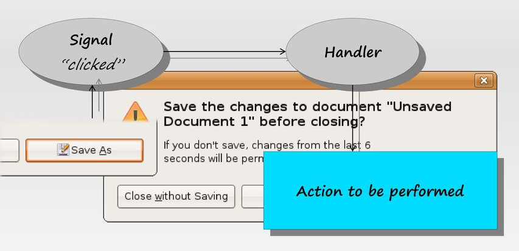

Концепція сигналів організована навколо головного циклу (main loop) обробки подій. Головний цикл являє собою нескінченний цикл, що включає три етапи: перевірку наявності обставин, їх обробку і очікування. Коли виникає подія, об'єкт, асоційований з цією подією посилає сигнал, який повідомляє головному циклу про подію, що відбулася. Далі головний цикл шукає сигнал у внутрішній таблиці, де зіставлені сигнали і обробники, ці зіставлення іноді називають зворотними викликами (callbacks). В кінці-кінців головний цикл викликає знайдений обробник сигналу для сигналу, що прийшов від об'єкта.

## Реєстрація сигналу і функції зворотнього виклику

Реєстрація сигналу виглядає як:

```cpp
g_signal_connect(G_OBJECT (window),  "delete-event", 
         G_CALLBACK(cb_delete), NULL);
g_signal_connect (G_OBJECT(button), "clicked", 
          G_CALLBACK(cb_button_click), label);
```

де першим аргументом є віджет, який буде створювати сигнал, а другий - ім'я сигналу, який ви хочете переловити. Третій - функція, яку ви хочете викликати, коли сигнал був ініційований, а четвертий - дані, які ви хотіли б передати цій функції.

Функція, задана в третьому аргументі, називається "функцією зворотного виклику", і, зазвичай, має форму:

```cpp
void callback_func( GtkWidget *widget,
                    ... /* other signal arguments */
                    gpointer   callback_data );
```

де перший аргумент буде покажчиком на віджет, який ініціює сигнал, а останній - покажчик на дані, наведені як останній аргумент функції g_signal_connect (), як показано вище.

Зауважимо, що вищезгадана форма для оголошення функції зворотного виклику є лише загальним керівництвом, оскільки деякі конкретні сигнали віджета генерують різні параметри виклику.

## Безпечне завершення GTK+ застосунка

Якщо ми закриємо вікно, запустивши минулий приклад, насправді наш застосунок не завершить свою роботу. Просто вікно більше не показується користувачеві:

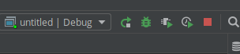

Ми можемо пов'язати певну подію, яка повинна відбутися з віджетом, зі своєю функцією.

```cpp
g_signal_connect(G_OBJECT(window), "destroy", G_CALLBACK(gtk_main_quit), NULL);
```

В даному випадку це стандартна фунция gtk_main_quit (), яка безпечно завершить наш додаток.

```cpp
#include <gtk/gtk.h>

int main (int argc, char **argv)
{
  GtkWidget *window;


  gtk_init(&argc, &argv);

  window = gtk_window_new(GTK_WINDOW_TOPLEVEL);
  gtk_window_set_title(GTK_WINDOW(window), "Hello world");
  gtk_window_set_default_size(GTK_WINDOW(window), 500, 500);
  g_signal_connect(G_OBJECT(window), "destroy", G_CALLBACK(gtk_main_quit), NULL);

  gtk_widget_show_all(window);

  gtk_main();
}
```

## Зміна напису на кнопці

Тепер створимо кнопку, після натискання на яку надпис на кнопці буде змінюватися.

Для початку додамо кнопку:

```cpp
GtkWidget *button;
button = gtk_button_new_with_label("Click Me!!!");

gtk_container_add(GTK_CONTAINER(window), button);
```

Весь код програми:

```cpp
#include <gtk/gtk.h>

int main (int argc, char **argv)
{
  GtkWidget *window;


  gtk_init(&argc, &argv);

  window = gtk_window_new(GTK_WINDOW_TOPLEVEL);
  gtk_window_set_title(GTK_WINDOW(window), "Hello world");
  gtk_window_set_default_size(GTK_WINDOW(window), 500, 500);
  g_signal_connect(G_OBJECT(window), "destroy", G_CALLBACK(gtk_main_quit), NULL);

  GtkWidget *button;
  button = gtk_button_new_with_label("Click Me!!!");

  gtk_container_add(GTK_CONTAINER(window), button);

  gtk_widget_show_all(window);

  gtk_main();
}
```

В Результаті ми отримаємо кнопку, яка займає весь доступний простір всередині вікна.

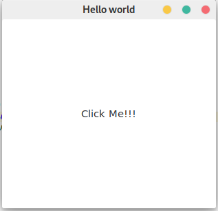

Покищо, при натиску на кнопку нічого не відбувається. Для того, щоб обробляти користувацькі події нам знадобиться:
- створити функцію, яка обробляє певну подію
- зв'язати подію і створену функцію

Створимо функцію on_button_click, яка буде змінювати текст кнопки:

```cpp
void on_button_click(GtkButton *button, gpointer data)
{
    gtk_button_set_label(button, "Button was clicked");
}
```

Тепер зв'яжимо сигнал "clicked" кнопки і функцію on_button_click

```cpp
g_signal_connect(GTK_BUTTON(button), "clicked", G_CALLBACK(on_button_click), NULL);
```

Тепер джерельний код програми наступний:

```cpp
#include <gtk/gtk.h>

void on_button_click(GtkButton *button, gpointer data)
{
    gtk_button_set_label(button, "Button was clicked");
}

int main (int argc, char **argv)
{
    GtkWidget *window;

+
    gtk_init(&argc, &argv);

    window = gtk_window_new(GTK_WINDOW_TOPLEVEL);
    gtk_window_set_title(GTK_WINDOW(window), "Hello world");
    gtk_window_set_default_size(GTK_WINDOW(window), 500, 500);
    g_signal_connect(G_OBJECT(window), "destroy", G_CALLBACK(gtk_main_quit), NULL);

    GtkWidget *button;
    button = gtk_button_new_with_label("Click Me!!!");
    g_signal_connect(GTK_BUTTON(button), "clicked", G_CALLBACK(on_button_click), NULL);

    gtk_container_add(GTK_CONTAINER(window), button);

    gtk_widget_show_all(window);

    gtk_main();
}
```

# Домашнє завдання

Розробіть GTK - застосунок. Встановіть заголовок вікна рівний вашому прізвищу та ініціали. Додайте кнопку, при натиск на яку GTK - застосунок безпечно завершує свою роботу.

# Контрольні запитання

1. Що таке GTK+?
2. Що таке GLib і GObject?
3. Поясніть принцип наслідування в C.
4. Розкажіть про перші 4 класи в ієрархії GTK, а саме
5. Розкажіть як можна написати мінімальну програму на GTK+?
6. Поясніть концепцію сигналів в GTK+?