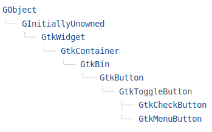
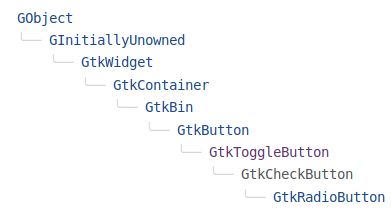
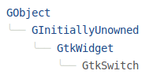
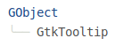
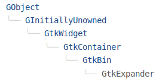

# Основні користувацькі інтерфейси GTK

# Зміст

${toc}

# Label

GtkLabel - віджет, який відображає невеликий або середній обсяг тексту

Для створення віджета використовується функція - gtk_label_new.

```cpp
GtkWidget* gtk_label_new (const gchar *str);
```

В функцію можна передати NULL для створення без тексту

```cpp
#include <gtk/gtk.h>

int main (int argc, char **argv)
{
    GtkWidget* window;
    GtkWidget* label;

    gtk_init(&argc, &argv);

    //inti the window
    window = gtk_window_new(GTK_WINDOW_TOPLEVEL);
    gtk_window_set_title(GTK_WINDOW(window), "Hello world");
    gtk_window_set_default_size(GTK_WINDOW(window), 500, 500);
    g_signal_connect(G_OBJECT(window), "destroy", G_CALLBACK(gtk_main_quit), NULL);


    //init the label
    label = gtk_label_new("Hello World!!!");

    //add combobox to window
    gtk_container_add(GTK_CONTAINER(window), label);

    //show the window
    gtk_widget_show_all(window);
    gtk_main();
}
```

Для позиціонування тексту існує декілька користних функцій:

**gtk_label_set_justify ()**
```cpp
void
gtk_label_set_justify (GtkLabel *label,
                       GtkJustification jtype);
```

Встановлює вирівнювання рядків у тексті відносно один одного. GTK_JUSTIFY_LEFT - це значення за промовчанням, коли віджет спочатку створюється за допомогою gtk_label_new (). gtk_label_set_justify () не впливає на мітки, які містять лише один рядок.

**gtk_label_set_xalign ()**
```cpp
void
gtk_label_set_xalign (GtkLabel *label,
                      gfloat xalign);
```

Встановлює позиціонування тексту по осі X. Значення xalign знаходиться в діапазоні 0-1.

```cpp
#include <gtk/gtk.h>

int main (int argc, char **argv)
{
    GtkWidget* window;
    GtkWidget* label;

    gtk_init(&argc, &argv);

    //inti the window
    window = gtk_window_new(GTK_WINDOW_TOPLEVEL);
    gtk_window_set_title(GTK_WINDOW(window), "Hello world");
    gtk_window_set_default_size(GTK_WINDOW(window), 500, 500);
    g_signal_connect(G_OBJECT(window), "destroy", G_CALLBACK(gtk_main_quit), NULL);


    //init the label
    label = gtk_label_new("Hello World!!!");
    gtk_label_set_xalign(GTK_LABEL(label), 1);

    //add combobox to window
    gtk_container_add(GTK_CONTAINER(window), label);

    //show the window
    gtk_widget_show_all(window);
    gtk_main();
}
```

**gtk_label_set_yalign ()**

```cpp
void
gtk_label_set_yalign (GtkLabel *label,
                      gfloat yalign);
```

Встановлює позиціонування тексту по осі Y. Значення xalign знаходиться в діапазоні 0-1.

Варто, розгалядати ситуацію, коли текст не поміщається в поточні розміри віджета. Для цього існує функція gtk_label_set_line_wrap ()

```cpp
void
gtk_label_set_line_wrap (GtkLabel *label,
                         gboolean wrap);
```

Перемикає перенесення рядків у межах віджета GtkLabel. TRUE робить переривання рядків, якщо текст перевищує розмір віджета. FALSE дозволяє тексту обрізати краєм віджета, якщо він перевищує розмір віджета.

```cpp
#include <gtk/gtk.h>

int main (int argc, char **argv)
{
    GtkWidget* window;
    GtkWidget* label;

    gtk_init(&argc, &argv);

    //inti the window
    window = gtk_window_new(GTK_WINDOW_TOPLEVEL);
    gtk_window_set_title(GTK_WINDOW(window), "Hello world");
    gtk_window_set_default_size(GTK_WINDOW(window), 500, 500);
    g_signal_connect(G_OBJECT(window), "destroy", G_CALLBACK(gtk_main_quit), NULL);


    //init the label
    label = gtk_label_new("Toggles line wrapping within"
                          " the GtkLabel widget. TRUE makes it break lines"
                          " if text exceeds the widget’s size. FALSE lets"
                          " the text get cut off by the edge of the widget "
                          "if it exceeds the widget size.");
    gtk_label_set_line_wrap(GTK_LABEL(label), TRUE);

    //add combobox to window
    gtk_container_add(GTK_CONTAINER(window), label);

    //show the window
    gtk_widget_show_all(window);
    gtk_main();
}
```

Зверніть увагу, на те, що текст не можна виділити і скопіювати за допомогою мишки. Щоб це виправити можна використати функцію: **gtk_label_set_selectable ()**

```cpp
void
gtk_label_set_selectable (GtkLabel *label,
                          gboolean setting);
```

Selectable lable дозволяють користувачеві вибирати текст з мітки, для копіювання та вставки.

```cpp
#include <gtk/gtk.h>

int main (int argc, char **argv)
{
    GtkWidget* window;
    GtkWidget* label;

    gtk_init(&argc, &argv);

    //inti the window
    window = gtk_window_new(GTK_WINDOW_TOPLEVEL);
    gtk_window_set_title(GTK_WINDOW(window), "Hello world");
    gtk_window_set_default_size(GTK_WINDOW(window), 500, 500);
    g_signal_connect(G_OBJECT(window), "destroy", G_CALLBACK(gtk_main_quit), NULL);


    //init the label
    label = gtk_label_new("Toggles line wrapping within"
                          " the GtkLabel widget. TRUE makes it break lines"
                          " if text exceeds the widget’s size. FALSE lets"
                          " the text get cut off by the edge of the widget "
                          "if it exceeds the widget size.");
    gtk_label_set_line_wrap(GTK_LABEL(label), TRUE);

    //add combobox to window
    gtk_container_add(GTK_CONTAINER(window), label);

    //show the window
    gtk_widget_show_all(window);
    gtk_main();
}
```

# GtkButton

**GtkButton** - віджет, який видає сигнал при натисканні.

Створити кнопку можна, використовуючи наступні функції:

- **gtk_button_new** - Створює пусту кнопку
- **gtk_button_new_with_label** - Створює кнопку з переданим текстом

```cpp
#include <gtk/gtk.h>

int main (int argc, char **argv)
{
    GtkWidget* window;
    GtkWidget* button;

    gtk_init(&argc, &argv);

    //inti the window
    window = gtk_window_new(GTK_WINDOW_TOPLEVEL);
    gtk_window_set_title(GTK_WINDOW(window), "Hello world");
    gtk_window_set_default_size(GTK_WINDOW(window), 500, 500);
    g_signal_connect(G_OBJECT(window), "destroy", G_CALLBACK(gtk_main_quit), NULL);


    //init the button
    button = gtk_button_new_with_label("Click");

    //add button to window
    gtk_container_add(GTK_CONTAINER(window), button);

    //show the window
    gtk_widget_show_all(window);
    gtk_main();
}
```

## GtkButton в якості контейнера

GtkButton може виступати в якості контейнера для інших віджетів. Давайте додамо да GtkButton інший віджет по аналогії як ми додали GtkButton в GtkWindow

```cpp
#include <gtk/gtk.h>

int main (int argc, char **argv)
{
    GtkWidget* window;
    GtkWidget* button;
    GtkWidget* lable;

    gtk_init(&argc, &argv);

    //inti the window
    window = gtk_window_new(GTK_WINDOW_TOPLEVEL);
    gtk_window_set_title(GTK_WINDOW(window), "Hello world");
    gtk_window_set_default_size(GTK_WINDOW(window), 500, 500);
    g_signal_connect(G_OBJECT(window), "destroy", G_CALLBACK(gtk_main_quit), NULL);

    //init the lable
    lable = gtk_label_new("Click");

    //init the button
    button = gtk_button_new();

    //add lable to button
    gtk_container_add(GTK_CONTAINER(button), lable);

    //add button to window
    gtk_container_add(GTK_CONTAINER(window), button);

    //show the window
    gtk_widget_show_all(window);
    gtk_main();
}
```

## Зміна надпису Lable, при натиску на кнопку

Одним із основних сигналів є **clicked**:

```cpp
#include <gtk/gtk.h>

GtkWidget* lable;

void on_button_clicked(GtkButton* button, gpointer data)
{
    gtk_label_set_text(GTK_LABEL(lable), "it was clicked");
}

int main (int argc, char **argv)
{
    GtkWidget* window;
    GtkWidget* button;

    gtk_init(&argc, &argv);

    //inti the window
    window = gtk_window_new(GTK_WINDOW_TOPLEVEL);
    gtk_window_set_title(GTK_WINDOW(window), "Hello world");
    gtk_window_set_default_size(GTK_WINDOW(window), 500, 500);
    g_signal_connect(G_OBJECT(window), "destroy", G_CALLBACK(gtk_main_quit), NULL);

    //init the lable
    lable = gtk_label_new("Click");

    //init the button
    button = gtk_button_new();
    g_signal_connect(G_OBJECT(button), "clicked", G_CALLBACK(on_button_clicked), NULL);

    //add lable to button
    gtk_container_add(GTK_CONTAINER(button), lable);

    //add button to window
    gtk_container_add(GTK_CONTAINER(window), button);

    //show the window
    gtk_widget_show_all(window);
    gtk_main();
}
```

# GtkToggleButton

**GtkToggleButton** - кнопки, які зберігають свій стан.



Для створення такої кнопки використовується функція:

```cpp
GtkWidget *
gtk_toggle_button_new (void);

GtkWidget *
gtk_toggle_button_new_with_label (const gchar *label);
```

Для керування станом кнопки використовуються функції:

```cpp
gboolean
gtk_toggle_button_get_active (GtkToggleButton *toggle_button);
```

```cpp
void
gtk_toggle_button_set_active (GtkToggleButton *toggle_button,
                              gboolean is_active);
```

## Приклад використання GtkToggleButton

```cpp
#include <gtk/gtk.h>

void display_state(GtkToggleButton* button, gpointer data)
{
    GtkLabel* lbl = GTK_LABEL(data);
    if(gtk_toggle_button_get_active(button)){
        gtk_label_set_text(lbl, "in active state");
    }
    else{
        gtk_label_set_text(lbl, "in deactive state");
    }

}

int main (int argc, char **argv)
{
    GtkWidget* window;
    GtkWidget* label;
    GtkWidget* toggleButton;
    GtkWidget* box;

    gtk_init(&argc, &argv);

    //inti the window
    window = gtk_window_new(GTK_WINDOW_TOPLEVEL);
    gtk_window_set_title(GTK_WINDOW(window), "Hello world");
    gtk_window_set_default_size(GTK_WINDOW(window), 500, 500);
    g_signal_connect(G_OBJECT(window), "destroy", G_CALLBACK(gtk_main_quit), NULL);
    box = gtk_box_new(GTK_ORIENTATION_VERTICAL, 0);

    //init label and button
    label = gtk_label_new(NULL);
    toggleButton = gtk_toggle_button_new_with_label("Toggle state");

    //connect tiggle signal to function
    g_signal_connect(GTK_TOGGLE_BUTTON(toggleButton), "toggled", G_CALLBACK(display_state), label);

    //add widgets to window
    gtk_box_pack_start(GTK_BOX(box), label, true, true, 0);
    gtk_box_pack_start(GTK_BOX(box), toggleButton, true, true, 0);
    gtk_container_add(GTK_CONTAINER(window), box);

    //show the window
    gtk_widget_show_all(window);
    gtk_main();
}
```

# GtkCheckButton

**GtkCheckButton** - Створення віджетів з дискретною кнопкою перемикання.

Для створення віджета використовується функція:

```cpp
GtkWidget *
gtk_check_button_new (void);
```

```cpp
GtkWidget *
gtk_check_button_new_with_label (const gchar *label);
```



## Приклад використання GtkCheckButton

```cpp
#include <gtk/gtk.h>

void display_state(GtkCheckButton* check, gpointer data)
{
    GtkLabel* lbl = GTK_LABEL(data);

    if(gtk_toggle_button_get_active(GTK_TOGGLE_BUTTON(check))){
        gtk_label_set_text(lbl,"checked");
    }
    else{
        gtk_label_set_text(lbl, "not checked");
    }
}

int main (int argc, char **argv)
{
    GtkWidget* window;
    GtkWidget* box;
    GtkWidget* label;
    GtkWidget* check;

    gtk_init(&argc, &argv);

    //inti the window
    window = gtk_window_new(GTK_WINDOW_TOPLEVEL);
    gtk_window_set_title(GTK_WINDOW(window), "Hello world");
    gtk_window_set_default_size(GTK_WINDOW(window), 500, 500);
    g_signal_connect(G_OBJECT(window), "destroy", G_CALLBACK(gtk_main_quit), NULL);
    box = gtk_box_new(GTK_ORIENTATION_VERTICAL, 0);

    //init label and checkbox
    label = gtk_label_new(NULL);
    check = gtk_check_button_new_with_label("Some option");
    g_signal_connect(GTK_CHECK_BUTTON(check), "toggled", G_CALLBACK(display_state), label);


    //add widgets to window
    gtk_box_pack_start(GTK_BOX(box), label, true, true, 0);
    gtk_box_pack_start(GTK_BOX(box), check, true, true, 0);
    gtk_container_add(GTK_CONTAINER(window), box);

    //show the window
    gtk_widget_show_all(window);
    gtk_main();
}
```

# GtkRadioButton

**GtkRadioButton** - Вибір з декількох кнопок перевірки.

Для створення використовується функція:

```cpp
GtkWidget *
gtk_radio_button_new (GSList *group);
```

в group передається NULLб якщо створюється нова група.

```cpp
GtkWidget *
gtk_radio_button_new_with_label (GSList *group,
                                 const gchar *label);


## Приклад використання GtkRadioButton

```cpp
#include <gtk/gtk.h>

void display_state(GtkCheckButton* check, gpointer data)
{
    GtkLabel* lbl = GTK_LABEL(data);

    if(gtk_toggle_button_get_active(GTK_TOGGLE_BUTTON(check))){
        gtk_label_set_text(lbl,"checked");
    }
    else{
        gtk_label_set_text(lbl, "not checked");
    }
}

int main (int argc, char **argv)
{
    GtkWidget* window;
    GtkWidget* box;
    GtkWidget* radio1;
    GtkWidget* radio2;

    gtk_init(&argc, &argv);

    //inti the window
    window = gtk_window_new(GTK_WINDOW_TOPLEVEL);
    gtk_window_set_title(GTK_WINDOW(window), "Hello world");
    gtk_window_set_default_size(GTK_WINDOW(window), 500, 500);
    g_signal_connect(G_OBJECT(window), "destroy", G_CALLBACK(gtk_main_quit), NULL);
    box = gtk_box_new(GTK_ORIENTATION_VERTICAL, 0);

    //init label and checkbox
    radio1 = gtk_radio_button_new_with_label(NULL, "1");
    radio2 = gtk_radio_button_new_with_label(NULL, "2");
    gtk_radio_button_join_group(GTK_RADIO_BUTTON(radio1), GTK_RADIO_BUTTON(radio2));
    
    //add widgets to window
    gtk_box_pack_start(GTK_BOX(box), radio1, true, true, 0);
    gtk_box_pack_start(GTK_BOX(box), radio2, true, true, 0);
    gtk_container_add(GTK_CONTAINER(window), box);

    //show the window
    gtk_widget_show_all(window);
    gtk_main();
}
```

# GtkEntry

**GtkEntry** - Поле введення тексту в одному рядку.

Для створення використовується функція:

```cpp
GtkWidget *
gtk_entry_new (void);
```

## Приклад використання GtkEntry

```cpp
#include <gtk/gtk.h>

int main (int argc, char **argv)
{
    GtkWidget* window;
    GtkWidget* textBox;

    gtk_init(&argc, &argv);

    //inti the window
    window = gtk_window_new(GTK_WINDOW_TOPLEVEL);
    gtk_window_set_title(GTK_WINDOW(window), "Hello world");
    gtk_window_set_default_size(GTK_WINDOW(window), 500, 500);
    g_signal_connect(G_OBJECT(window), "destroy", G_CALLBACK(gtk_main_quit), NULL);


    //init the GtkEntry
    textBox = gtk_entry_new();

    //add combobox to window
    gtk_container_add(GTK_CONTAINER(window), textBox);

    //show the window
    gtk_widget_show_all(window);
    gtk_main();
}
```

## placeholder

Встановлює текст, який буде відображатись у записі, коли він порожній і нефокусований.

Для встановлення placeholder використовується функція:

```cpp
void
gtk_entry_set_placeholder_text (GtkEntry *entry,
                                const gchar *text);
```

```cpp
#include <gtk/gtk.h>

int main (int argc, char **argv)
{
    GtkWidget* window;
    GtkWidget* textBox;

    gtk_init(&argc, &argv);

    //inti the window
    window = gtk_window_new(GTK_WINDOW_TOPLEVEL);
    gtk_window_set_title(GTK_WINDOW(window), "Hello world");
    gtk_window_set_default_size(GTK_WINDOW(window), 500, 500);
    g_signal_connect(G_OBJECT(window), "destroy", G_CALLBACK(gtk_main_quit), NULL);
    
    //init the GtkEntry
    textBox = gtk_entry_new();
    
    // add placeholder
    gtk_entry_set_placeholder_text(GTK_ENTRY(textBox), "Some placeholder");

    //add entry to window
    gtk_container_add(GTK_CONTAINER(window), textBox);

    //show the window
    gtk_widget_show_all(window);
    gtk_main();
}
```

## Отримання тексту
Для того щоб зчитати текст, який ввів користовувач застосовується функція:

```cpp
const gchar *
gtk_entry_get_text (GtkEntry *entry);
```

Для того, щоб програмно встановити текс в GtkEntry використовується функція:

```cpp
void
gtk_entry_set_text (GtkEntry *entry,
                    const gchar *text);
```

## Зміна тексту в GtkEntry, при натиску на кнопку

```cpp
#include <gtk/gtk.h>

void set_text(GtkButton* button, gpointer data){
    GtkEntry* entry = GTK_ENTRY(data);
    g_print("old text: %s", gtk_entry_get_text(entry));
    gtk_entry_set_text(entry, "Modified text");
}

int main (int argc, char **argv)
{
    GtkWidget* window;
    GtkWidget* textBox;
    GtkWidget* button;
    GtkWidget* box;

    gtk_init(&argc, &argv);

    //inti the window
    box = gtk_box_new (GTK_ORIENTATION_VERTICAL, 1);
    window = gtk_window_new(GTK_WINDOW_TOPLEVEL);
    gtk_window_set_title(GTK_WINDOW(window), "Hello world");
    gtk_window_set_default_size(GTK_WINDOW(window), 500, 500);
    g_signal_connect(G_OBJECT(window), "destroy", G_CALLBACK(gtk_main_quit), NULL);


    //init the GtkEntry
    textBox = gtk_entry_new();

    //init the button
    button = gtk_button_new_with_label("click me");
    g_signal_connect(GTK_BUTTON(button), "clicked", G_CALLBACK(set_text), textBox);

    //add widgets to window
    gtk_container_add(GTK_CONTAINER(window), box);

    gtk_box_pack_start(GTK_BOX(box), textBox, true, true, 0);
    gtk_box_pack_start(GTK_BOX(box), button, true, true, 0);

    //show the window
    gtk_widget_show_all(window);
    gtk_main();
}
```

# GtkTextView

## GtkTextBuffer

**GtkTextBuffer** - зберігає атрибутивний текст для відображення у GtkTextView.

Для створення GtkTextBuffer потрібно визначити **GtkTextTagTable**, який містить визначені теги і прикріплені до них стилі:

```cpp
textTagTable = gtk_text_tag_table_new();
    GtkTextTag* simpleTag = gtk_text_tag_new("bold");
    g_object_set(simpleTag, "weight", 900);
    gtk_text_tag_table_add(textTagTable,simpleTag);
```

Всі стилі можна переглянути за посиланням [Gnome Developer](https://developer.gnome.org/gtk3/stable/GtkTextTag.html#GtkTextTag--weight)

Для встановлення стилів тега, використовуєьтя функція - **g_object_set**:

```cpp
void
g_object_set (gpointer object,
              const gchar *first_property_name,
              ...);
```

## Відображення тексту жирним накресленням за допомогою GtkTextView

```cpp
#include <gtk/gtk.h>

int main (int argc, char **argv)
{
    GtkWidget* window;
    GtkTextTagTable* textTagTable;

    gtk_init(&argc, &argv);

    //inti the window
    window = gtk_window_new(GTK_WINDOW_TOPLEVEL);
    gtk_window_set_title(GTK_WINDOW(window), "Hello world");
    gtk_window_set_default_size(GTK_WINDOW(window), 500, 500);
    g_signal_connect(G_OBJECT(window), "destroy", G_CALLBACK(gtk_main_quit), NULL);

    //init text tag table
    textTagTable = gtk_text_tag_table_new();
    GtkTextTag* simpleTag = gtk_text_tag_new("bold");
    g_object_set(simpleTag, "weight", 900);
    gtk_text_tag_table_add(textTagTable,simpleTag);

    //init textbuffer
    GtkTextBuffer* textBuffer = gtk_text_buffer_new(textTagTable);

    //get iteration, add text, apply tag
    GtkTextIter iter;
    gtk_text_buffer_get_iter_at_offset(textBuffer, &iter, 0);
    gtk_text_buffer_insert_with_tags_by_name(textBuffer, &iter, "This text is bold", -1, "bold");

    //init textview
    GtkWidget* textView = gtk_text_view_new_with_buffer(textBuffer);

    //add widgets to window
    gtk_container_add(GTK_CONTAINER(window), textView);

    //show the window
    gtk_widget_show_all(window);
    gtk_main();
}
```

# GtkCalendar

**GtkCalendar** - відображає календар і дозволяє користувачеві вибрати дату.

Для створення віджета використовується функція:

```cpp
GtkWidget *
gtk_calendar_new (void);
```

Функція встановить сьогоднішню дату.

Для того, щоб отриати дату використовується функція:

```cpp
void
gtk_calendar_get_date (GtkCalendar *calendar,
                       guint *year,
                       guint *month,
                       guint *day);
```

Для програмного встановлення дати використовуються функції:

```cpp
void
gtk_calendar_select_month (GtkCalendar *calendar,
                           guint month,
                           guint year);
```

```cpp
void
gtk_calendar_select_day (GtkCalendar *calendar,
                         guint day);
```

## Приклад використання GtkCalendar

```cpp
#include <gtk/gtk.h>

void set_date_tomorrow(GtkButton* button, gpointer data)
{
    GtkCalendar* calendar = GTK_CALENDAR(data);
    guint y;
    guint m;
    guint d;
    gtk_calendar_get_date(calendar, &y, &m, &d);
    gtk_calendar_select_day(calendar, d + 1);
}

void set_date_yesterday(GtkButton* button, gpointer data)
{
    GtkCalendar* calendar = GTK_CALENDAR(data);
    guint y;
    guint m;
    guint d;
    gtk_calendar_get_date(calendar, &y, &m, &d);
    gtk_calendar_select_day(calendar, d - 1);
}

int main (int argc, char **argv)
{
    GtkWidget* window;
    GtkWidget* box;
    GtkWidget* calendar;
    GtkWidget* tomorrow;
    GtkWidget* yesterday;

    gtk_init(&argc, &argv);

    //inti the window
    window = gtk_window_new(GTK_WINDOW_TOPLEVEL);
    gtk_window_set_title(GTK_WINDOW(window), "Hello world");
    gtk_window_set_default_size(GTK_WINDOW(window), 500, 500);
    g_signal_connect(G_OBJECT(window), "destroy", G_CALLBACK(gtk_main_quit), NULL);
    box = gtk_box_new(GTK_ORIENTATION_VERTICAL, 0);

    //init the calendar
    calendar = gtk_calendar_new();

    //init the buttons
    tomorrow = gtk_button_new_with_label("Tomorrow");
    g_signal_connect(GTK_BUTTON(tomorrow), "clicked", G_CALLBACK(set_date_tomorrow), calendar);
    yesterday = gtk_button_new_with_label("Yesterday");
    g_signal_connect(GTK_BUTTON(yesterday), "clicked", G_CALLBACK(set_date_yesterday), calendar);

    //add widgets to window
    gtk_box_pack_start(GTK_BOX(box), yesterday, true, true, 0);
    gtk_box_pack_start(GTK_BOX(box), calendar, true, true, 0);
    gtk_box_pack_start(GTK_BOX(box), tomorrow, true, true, 0);
    gtk_container_add(GTK_CONTAINER(window), box);

    //show the window
    gtk_widget_show_all(window);
    gtk_main();
}
```

# ComboBox

**GtkComboBox** - віджет, який використовується для вибору зі списку елементів.

Для створення путих списків можна використати функції:
- gtk_combo_box_new ()
- gtk_combo_box_new_with_entry ()

```cpp
#include <gtk/gtk.h>

int main (int argc, char **argv)
{
    GtkWidget* window;
    GtkWidget* comboBox;

    gtk_init(&argc, &argv);

    //inti the window
    window = gtk_window_new(GTK_WINDOW_TOPLEVEL);
    gtk_window_set_title(GTK_WINDOW(window), "Hello world");
    gtk_window_set_default_size(GTK_WINDOW(window), 500, 500);
    g_signal_connect(G_OBJECT(window), "destroy", G_CALLBACK(gtk_main_quit), NULL);


    //init the combobox
    comboBox = gtk_combo_box_new();

    //add combobox to window
    gtk_container_add(GTK_CONTAINER(window), comboBox);

    //show the window
    gtk_widget_show_all(window);
    gtk_main();
}
```

# GtkSpinButton

# GtkSwitch

**GtkSwitch** - перемикач стилю "перемикач світла".



Для створення віджета використовується функція:

```cpp
GtkWidget *
gtk_switch_new (void);
```

Для маніпулюванням станом використовуються функції:

```cpp
void
gtk_switch_set_active (GtkSwitch *sw,
                       gboolean is_active);
```

```cpp
gboolean
gtk_switch_get_active (GtkSwitch *sw);
```

## Приклад використання GtkSwitch

```cpp
#include <gtk/gtk.h>

void display_state(GtkSwitch* switch1, gboolean state, gpointer data)
{
    GtkLabel* lbl = GTK_LABEL(data);

    if(state){
        gtk_label_set_text(lbl,"checked");
    }
    else{
        gtk_label_set_text(lbl, "not checked");
    }
}

int main (int argc, char **argv)
{
    GtkWidget* window;
    GtkWidget* box;
    GtkWidget* label;
    GtkWidget* switch1;

    gtk_init(&argc, &argv);

    //inti the window
    window = gtk_window_new(GTK_WINDOW_TOPLEVEL);
    gtk_window_set_title(GTK_WINDOW(window), "Hello world");
    gtk_window_set_default_size(GTK_WINDOW(window), 500, 500);
    g_signal_connect(G_OBJECT(window), "destroy", G_CALLBACK(gtk_main_quit), NULL);
    box = gtk_box_new(GTK_ORIENTATION_VERTICAL, 0);

    //init switch
    label = gtk_label_new(NULL);
    switch1 = gtk_switch_new();
    g_signal_connect(GTK_SWITCH(switch1), "state-set", G_CALLBACK(display_state), label);

    //add widgets to window
    gtk_box_pack_start(GTK_BOX(box), label, true, true, 0);
    gtk_box_pack_start(GTK_BOX(box), switch1, true, true, 0);
    gtk_container_add(GTK_CONTAINER(window), box);

    //show the window
    gtk_widget_show_all(window);
    gtk_main();
}
```

# GtkTooltip

**GtkTooltip** - додає поради до ваших віджетів.



## Реалізація простих підказок

Основні підказки можуть бути реалізовані просто за допомогою gtk_widget_set_tooltip_text () або gtk_widget_set_tooltip_markup () без явного об'єкта підказки.

```cpp
#include <gtk/gtk.h>
int main (int argc, char **argv)
{
    GtkWidget* window;
    GtkWidget* box;
    GtkWidget* button;

    gtk_init(&argc, &argv);

    //inti the window
    window = gtk_window_new(GTK_WINDOW_TOPLEVEL);
    gtk_window_set_title(GTK_WINDOW(window), "Hello world");
    gtk_window_set_default_size(GTK_WINDOW(window), 500, 500);
    g_signal_connect(G_OBJECT(window), "destroy", G_CALLBACK(gtk_main_quit), NULL);
    box = gtk_box_new(GTK_ORIENTATION_VERTICAL, 0);

    //init button and set tooltip
    button = gtk_button_new_with_label("Click this button");
    gtk_widget_set_tooltip_text(button, "Click the fucking button");

    //add widgets to window
    gtk_box_pack_start(GTK_BOX(box), button, true, true, 0);
    gtk_container_add(GTK_CONTAINER(window), box);

    //show the window
    gtk_widget_show_all(window);
    gtk_main();
}
```

# GtkImage

**GtkImage** - віджет, що відображає зображення.

Для завантаження зоображення із файлу використовується функція:

```cpp
GtkWidget *
gtk_image_new_from_file (const gchar *filename);
```

Якщо файл не знайдено або не може бути завантажений, у результаті GtkImage відобразиться піктограма "зламаного зображення". Ця функція ніколи не повертає NULL, вона завжди повертає дійсний віджет GtkImage.

```cpp
#include <gtk/gtk.h>
int main (int argc, char **argv)
{
    GtkWidget* window;
    GtkWidget* box;
    GtkWidget* img;

    gtk_init(&argc, &argv);

    //inti the window
    window = gtk_window_new(GTK_WINDOW_TOPLEVEL);
    gtk_window_set_title(GTK_WINDOW(window), "Hello world");
    gtk_window_set_default_size(GTK_WINDOW(window), 500, 500);
    g_signal_connect(G_OBJECT(window), "destroy", G_CALLBACK(gtk_main_quit), NULL);
    box = gtk_box_new(GTK_ORIENTATION_VERTICAL, 0);

    //init image
    img = gtk_image_new_from_file("img-4.png");

    //add widgets to window
    gtk_box_pack_start(GTK_BOX(box), img, true, true, 0);
    gtk_container_add(GTK_CONTAINER(window), box);

    //show the window
    gtk_widget_show_all(window);
    gtk_main();
}
```

# GtkSeparator

**GtkSeparator** - віджет роздільника.

Для створення віджета використовується функція:

```cpp
GtkWidget *
gtk_separator_new (GtkOrientation orientation);
```

```cpp
#include <gtk/gtk.h>
int main (int argc, char **argv)
{
    GtkWidget* window;
    GtkWidget* box;
    GtkWidget* button1;
    GtkWidget* separator;
    GtkWidget* button2;

    gtk_init(&argc, &argv);

    //inti the window
    window = gtk_window_new(GTK_WINDOW_TOPLEVEL);
    gtk_window_set_title(GTK_WINDOW(window), "Hello world");
    gtk_window_set_default_size(GTK_WINDOW(window), 500, 500);
    g_signal_connect(G_OBJECT(window), "destroy", G_CALLBACK(gtk_main_quit), NULL);
    box = gtk_box_new(GTK_ORIENTATION_VERTICAL, 0);

    //init
    button1 = gtk_button_new_with_label("Button1");
    separator = gtk_separator_new(GTK_ORIENTATION_HORIZONTAL);
    button2 = gtk_button_new_with_label("Button2");

    //add widgets to window
    gtk_box_pack_start(GTK_BOX(box), button1, true, true, 0);
    gtk_box_pack_start(GTK_BOX(box), separator, true, true, 0);
    gtk_box_pack_start(GTK_BOX(box), button2, true, true, 0);
    gtk_container_add(GTK_CONTAINER(window), box);

    //show the window
    gtk_widget_show_all(window);
    gtk_main();
}
```

# GtkExpander

**GtkExpander** — A container which can hide its child.



Для створення контейнера використовується функція:

```cpp
GtkWidget *
gtk_expander_new (const gchar *label);
```

Для пакування дочірніх віджетів використовується функція:

```cpp
void
gtk_container_add (GtkContainer *container,
                   GtkWidget *widget);
```

```cpp
#include <gtk/gtk.h>
int main (int argc, char **argv)
{
    GtkWidget* window;
    GtkWidget* box;
    GtkWidget* button1;
    GtkWidget* expander;

    gtk_init(&argc, &argv);

    //inti the window
    window = gtk_window_new(GTK_WINDOW_TOPLEVEL);
    gtk_window_set_title(GTK_WINDOW(window), "Hello world");
    gtk_window_set_default_size(GTK_WINDOW(window), 500, 500);
    g_signal_connect(G_OBJECT(window), "destroy", G_CALLBACK(gtk_main_quit), NULL);
    box = gtk_box_new(GTK_ORIENTATION_VERTICAL, 0);

    //init
    button1 = gtk_button_new_with_label("Button1");
    expander = gtk_expander_new("Buttons");
    gtk_container_add(GTK_CONTAINER(expander), button1);

    //add widgets to window
    gtk_box_pack_start(GTK_BOX(box), expander, true, true, 0);
    gtk_container_add(GTK_CONTAINER(window), box);

    //show the window
    gtk_widget_show_all(window);
    gtk_main();
}
```

# GtkHeaderBar

**GtkHeaderBar** - контейнер з центрованою дитиною.

Для створення використовується функція:

```cpp
GtkWidget *
gtk_header_bar_new (void);
```

Для встановлення заголовка і під - заголовка використовується функція:

```cpp
void
gtk_header_bar_set_title (GtkHeaderBar *bar,
                          const gchar *title);
```

```cpp
void
gtk_header_bar_set_subtitle (GtkHeaderBar *bar,
                             const gchar *subtitle);
```

```cpp
#include <gtk/gtk.h>
int main (int argc, char **argv)
{
    GtkWidget* window;
    GtkWidget* box;
    GtkWidget* button1;
    GtkWidget* button2;
    GtkWidget* bar;

    gtk_init(&argc, &argv);

    //inti the window
    window = gtk_window_new(GTK_WINDOW_TOPLEVEL);
    gtk_window_set_title(GTK_WINDOW(window), "Hello world");
    gtk_window_set_default_size(GTK_WINDOW(window), 500, 500);
    g_signal_connect(G_OBJECT(window), "destroy", G_CALLBACK(gtk_main_quit), NULL);
    box = gtk_box_new(GTK_ORIENTATION_VERTICAL, 0);

    //init
    button1 = gtk_button_new_with_label("Button1");
    button2 = gtk_button_new_with_label("Button2");
    bar = gtk_header_bar_new();
    gtk_header_bar_set_title(GTK_HEADER_BAR(bar), "title");
    gtk_header_bar_set_subtitle(GTK_HEADER_BAR(bar), "sub title");
    gtk_header_bar_pack_start(GTK_HEADER_BAR(bar), button1);
    gtk_header_bar_pack_end(GTK_HEADER_BAR(bar), button2);

    //add widgets to window
    gtk_box_pack_start(GTK_BOX(box), bar, true, true, 0);
    gtk_container_add(GTK_CONTAINER(window), box);

    //show the window
    gtk_widget_show_all(window);
    gtk_main();
}
```

# Домашнє завдання

# Контрольні запитання
