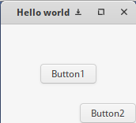
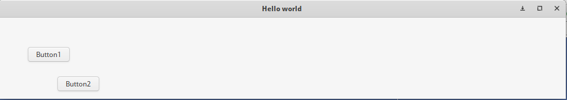
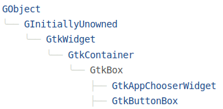
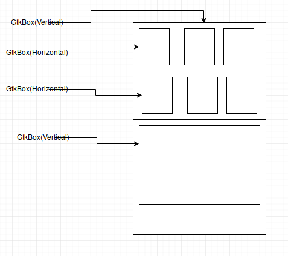
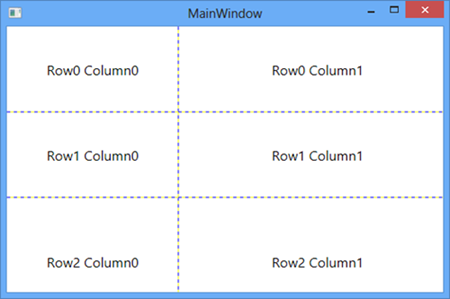
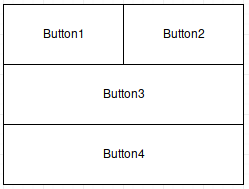
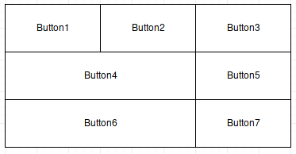
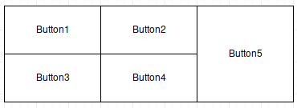
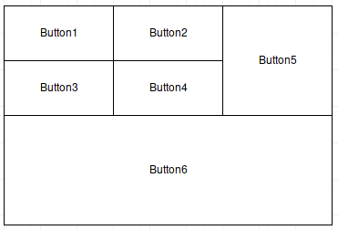
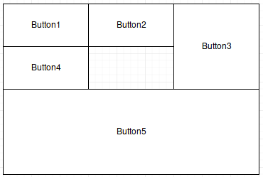

# Контейнери

# Зміст

${toc}

# Що таке контейнери

GTK + організує віджети ієрархічно, використовуючи контейнери. Вони невидимі для кінцевого користувача і вставляються у вікно, або розміщуються один в одного для компонування компонентів. Існують два варіанти контейнерів: одно-вмістні контейнери, які є усіма нащадками Gtk.Bin, і багатовмістні контейнери, які є нащадками Gtk.Container.

[Ієрархія об'єктів GTK](https://developer.gnome.org/gtk3/stable/ch02.html)

# GtkFixed

**GtkFixed** - контейнер, який дозволяє розташувати віджети на фіксованих координатах.

Для створення контейнера використовується функція:

```cpp
GtkWidget *
gtk_fixed_new (void);
```

Для додавання віджета в контейнер використовується функція:

```cpp
void
gtk_fixed_put (GtkFixed *fixed,
               GtkWidget *widget,
               gint x,
               gint y);
```

## Приклад використання GtkFixed

```cpp
#include <gtk/gtk.h>
int main (int argc, char **argv)
{
    GtkWidget* window;
    GtkWidget* fixedContainer;
    GtkWidget* button1;
    GtkWidget* button2;

    gtk_init(&argc, &argv);

    //inti the window
    window = gtk_window_new(GTK_WINDOW_TOPLEVEL);
    gtk_window_set_title(GTK_WINDOW(window), "Hello world");
    gtk_window_set_default_size(GTK_WINDOW(window), 500, 500);
    g_signal_connect(G_OBJECT(window), "destroy", G_CALLBACK(gtk_main_quit), NULL);

    //init
    fixedContainer = gtk_fixed_new();
    button1 = gtk_button_new_with_label("Button1");
    button2 = gtk_button_new_with_label("Button2");
    gtk_fixed_put(GTK_FIXED(fixedContainer), button1, 50, 50);
    gtk_fixed_put(GTK_FIXED(fixedContainer), button2, 100, 100);

    gtk_container_add(GTK_CONTAINER(window), fixedContainer);

    //show the window
    gtk_widget_show_all(window);
    gtk_main();
}
```


## Проблеми абсолютного позиціонування віджетів

Проблема абсолютного позиціонування полягає в фіксованому розміщені при зміні розмірів батьківського контейнера.






# Відносне позиціонування. GTK контейнери

Багато інструментів графічного інтерфейсу вимагають точного розміщення віджетів у вікні, використовуючи абсолютне позиціонування, GTK + використовує інший підхід. Замість того, щоб вказувати місце та розмір кожного віджета у вікні, ви можете розташувати віджети у рядках, стовпцях та / або таблицях. Розмір вашого вікна може бути визначений автоматично, залежно від розмірів віджетів, які він містить. А розміри віджетів, у свою чергу, визначаються кількістю тексту, який вони містять, або мінімальними та максимальними розмірами, які ви вказуєте, та / або тим, як ви просили, щоб доступний простір містився спільно між наборами віджетів. Можна вдосконалити макет, вказавши відстань відступу та значення центрування для кожного з віджетів. GTK+ потім використовує всю цю інформацію, щоб змінити розмір і перемістити все розумно і плавно, коли користувач маніпулює вікном.

## GtkBox

**GtkBox** - контейнер для упаковки віджетів в одному рядку або стовпці.



### Створення віджета
Для створення нового **GtkBox** використовується функція:

```cpp
GtkWidget *
gtk_box_new (GtkOrientation orientation,
             gint spacing);
```

Параметри:
- orientation - горизонтальне або вертикальне розмыщення(GTK_ORIENTATION_HORIZONTAL, GTK_ORIENTATION_VERTICAL)
- spacing - кількість пікселів для розміщення за умовчанням між дітьми.

### Пакування віджетів у контейнер

Для того, щоб додавти віджет в початок **GtkBox** використовується функція:

```cpp
void
gtk_box_pack_start (GtkBox *box,
                    GtkWidget *child,
                    gboolean expand,
                    gboolean fill,
                    guint padding);
```

Параметри:
- box - Екземпляр GtkBox
- child - віджет, який потрібно додати в контейнер
- expand - TRUE, якщо новій дитині буде надано додатковий простір, виділений у вікно. Додатковий простір буде розділений рівномірно між усіма дітьми, які використовують цю опцію
- TRUE, якщо простір, наданий дитині за допомогою параметра expand, фактично виділяється дитині, а не просто заповнює його. Цей параметр не впливає, якщо для параметра розширення встановлено значення FALSE. Дитині завжди виділяється повна висота горизонтального GtkBox і повна ширина вертикального GtkBox. Цей параметр впливає на інший вимір
- padding - додатковий простір у пікселях, який потрібно розмістити між цією дитиною та її сусідами, що перевищує загальну суму, визначену властивістю "spacing". Якщо дитина є віджетом на одному з кінців посилання, то пікселі заповнення також розміщуються між дочірнім і опорним краєм поля

Для того, щоб додати віджет в кінець **GtkBox**: використовується функція:

```cpp
void
gtk_box_pack_end (GtkBox *box,
                  GtkWidget *child,
                  gboolean expand,
                  gboolean fill,
                  guint padding);
```

### Рівномірно розподілений простір

```cpp
#include <gtk/gtk.h>
int main (int argc, char **argv)
{
    GtkWidget* window;
    GtkWidget* gtkBox;
    GtkWidget* button1;
    GtkWidget* button2;
    GtkWidget* button3;
    GtkWidget* button4;

    gtk_init(&argc, &argv);

    //inti the window
    window = gtk_window_new(GTK_WINDOW_TOPLEVEL);
    gtk_window_set_title(GTK_WINDOW(window), "Hello world");
    g_signal_connect(G_OBJECT(window), "destroy", G_CALLBACK(gtk_main_quit), NULL);

    //init
    gtkBox = gtk_box_new(GTK_ORIENTATION_HORIZONTAL, 5);
    button1 = gtk_button_new_with_label("Button1");
    button2 = gtk_button_new_with_label("Button2");
    button3 = gtk_button_new_with_label("Button3");
    button4 = gtk_button_new_with_label("Button4");
    gtk_box_pack_start(GTK_BOX(gtkBox),button1, TRUE, TRUE, 0);
    gtk_box_pack_start(GTK_BOX(gtkBox),button2, TRUE, TRUE, 0);
    gtk_box_pack_start(GTK_BOX(gtkBox),button3, TRUE, TRUE, 0);
    gtk_box_pack_start(GTK_BOX(gtkBox),button4, TRUE, TRUE, 0);

    gtk_container_add(GTK_CONTAINER(window), gtkBox);

    //show the window
    gtk_widget_show_all(window);
    gtk_main();
}
```

### Одна кнопка адаптивна інші ні

```cpp
#include <gtk/gtk.h>
int main (int argc, char **argv)
{
    GtkWidget* window;
    GtkWidget* gtkBox;
    GtkWidget* button1;
    GtkWidget* button2;
    GtkWidget* button3;

    gtk_init(&argc, &argv);

    //inti the window
    window = gtk_window_new(GTK_WINDOW_TOPLEVEL);
    gtk_window_set_title(GTK_WINDOW(window), "Hello world");
    g_signal_connect(G_OBJECT(window), "destroy", G_CALLBACK(gtk_main_quit), NULL);

    //init
    gtkBox = gtk_box_new(GTK_ORIENTATION_HORIZONTAL, 5);
    button1 = gtk_button_new_with_label("Button1");
    button2 = gtk_button_new_with_label("Button2");
    button3 = gtk_button_new_with_label("Button3");
    gtk_box_pack_start(GTK_BOX(gtkBox),button1, TRUE, TRUE, 0);
    gtk_box_pack_start(GTK_BOX(gtkBox),button2, FALSE, FALSE, 0);
    gtk_box_pack_start(GTK_BOX(gtkBox),button3, FALSE, FALSE, 0);

    gtk_container_add(GTK_CONTAINER(window), gtkBox);

    //show the window
    gtk_widget_show_all(window);
    gtk_main();
}
```

### Вертикальний GtkBox, який використовує padding

```cpp
#include <gtk/gtk.h>
int main (int argc, char **argv)
{
    GtkWidget* window;
    GtkWidget* gtkBox;
    GtkWidget* button1;
    GtkWidget* button2;
    GtkWidget* button3;

    gtk_init(&argc, &argv);

    //inti the window
    window = gtk_window_new(GTK_WINDOW_TOPLEVEL);
    gtk_window_set_title(GTK_WINDOW(window), "Hello world");
    g_signal_connect(G_OBJECT(window), "destroy", G_CALLBACK(gtk_main_quit), NULL);

    //init
    gtkBox = gtk_box_new(GTK_ORIENTATION_VERTICAL, 0);
    button1 = gtk_button_new_with_label("Button1");
    button2 = gtk_button_new_with_label("Button2");
    button3 = gtk_button_new_with_label("Button3");
    gtk_box_pack_start(GTK_BOX(gtkBox),button1, TRUE, TRUE, 10);
    gtk_box_pack_start(GTK_BOX(gtkBox),button2, TRUE, TRUE, 20);
    gtk_box_pack_start(GTK_BOX(gtkBox),button3, TRUE, TRUE, 30);

    gtk_container_add(GTK_CONTAINER(window), gtkBox);

    //show the window
    gtk_widget_show_all(window);
    gtk_main();
}
```

### Контейнер всередині контейнера

Кожен контейнер може містити в собі інші контейнери:



### Приклад адаптивної форми

```cpp
#include <gtk/gtk.h>
int main (int argc, char **argv)
{
    GtkWidget* window;
    GtkWidget* rootBox;
    GtkWidget* gtkBox1;
    GtkWidget* gtkBox2;
    GtkWidget* lbl1;
    GtkWidget* lbl2;
    GtkWidget* textEntry1;
    GtkWidget* textEntry2;
    GtkWidget* submitButton;

    gtk_init(&argc, &argv);

    //inti the window
    window = gtk_window_new(GTK_WINDOW_TOPLEVEL);
    gtk_window_set_title(GTK_WINDOW(window), "Hello world");
    g_signal_connect(G_OBJECT(window), "destroy", G_CALLBACK(gtk_main_quit), NULL);

    //init
    lbl1 = gtk_label_new("Логін:");
    lbl2 = gtk_label_new("Пароль:");
    textEntry1 = gtk_entry_new();
    textEntry2 = gtk_entry_new();
    submitButton = gtk_button_new_with_label("Авторизуватися");
    rootBox = gtk_box_new(GTK_ORIENTATION_VERTICAL, 5);
    gtkBox1 = gtk_box_new(GTK_ORIENTATION_HORIZONTAL, 1);
    gtkBox2 = gtk_box_new(GTK_ORIENTATION_HORIZONTAL, 1);

    gtk_box_pack_start(GTK_BOX(gtkBox1), lbl1, FALSE, FALSE, 0);
    gtk_box_pack_start(GTK_BOX(gtkBox1), textEntry1, TRUE, TRUE, 0);
    gtk_box_pack_start(GTK_BOX(gtkBox2), lbl2, FALSE, FALSE, 0);
    gtk_box_pack_start(GTK_BOX(gtkBox2), textEntry2, TRUE, TRUE, 0);

    gtk_box_pack_start(GTK_BOX(rootBox), gtkBox1, TRUE, TRUE, 0);
    gtk_box_pack_start(GTK_BOX(rootBox), gtkBox2, TRUE, TRUE, 0);
    gtk_box_pack_start(GTK_BOX(rootBox), submitButton, TRUE, TRUE, 0);

    gtk_container_add(GTK_CONTAINER(window), rootBox);

    //show the window
    gtk_widget_show_all(window);
    gtk_main();
}
```

### Більш кращий приклад адаптивної форми

```cpp
#include <gtk/gtk.h>
int main (int argc, char **argv)
{
    GtkWidget* window;
    GtkWidget* rootBox;
    GtkWidget* horizonalBoxWrapper;
    GtkWidget* gtkBox1;
    GtkWidget* gtkBox2;
    GtkWidget* lbl1;
    GtkWidget* lbl2;
    GtkWidget* textEntry1;
    GtkWidget* textEntry2;
    GtkWidget* submitButton;

    gtk_init(&argc, &argv);

    //inti the window
    window = gtk_window_new(GTK_WINDOW_TOPLEVEL);
    gtk_window_set_title(GTK_WINDOW(window), "Hello world");
    g_signal_connect(G_OBJECT(window), "destroy", G_CALLBACK(gtk_main_quit), NULL);

    //init
    lbl1 = gtk_label_new("Логін:");
    lbl2 = gtk_label_new("Пароль:");
    textEntry1 = gtk_entry_new();
    textEntry2 = gtk_entry_new();
    submitButton = gtk_button_new_with_label("Авторизуватися");
    rootBox = gtk_box_new(GTK_ORIENTATION_VERTICAL, 5);
    horizonalBoxWrapper = gtk_box_new(GTK_ORIENTATION_HORIZONTAL, 1);
    gtkBox1 = gtk_box_new(GTK_ORIENTATION_VERTICAL, 1);
    gtkBox2 = gtk_box_new(GTK_ORIENTATION_VERTICAL, 1);

    gtk_box_pack_start(GTK_BOX(gtkBox1), lbl1, TRUE, TRUE, 0);
    gtk_box_pack_start(GTK_BOX(gtkBox1), lbl2, TRUE, TRUE, 0);
    gtk_box_pack_start(GTK_BOX(gtkBox2), textEntry1, TRUE, TRUE, 0);
    gtk_box_pack_start(GTK_BOX(gtkBox2), textEntry2, TRUE, TRUE, 0);

    gtk_box_pack_start(GTK_BOX(horizonalBoxWrapper), gtkBox1, TRUE, TRUE, 0);
    gtk_box_pack_start(GTK_BOX(horizonalBoxWrapper), gtkBox2, TRUE, TRUE, 0);

    gtk_box_pack_start(GTK_BOX(rootBox), horizonalBoxWrapper, TRUE, TRUE, 0);
    gtk_box_pack_start(GTK_BOX(rootBox), submitButton, TRUE, TRUE, 0);

    gtk_container_add(GTK_CONTAINER(window), rootBox);

    //show the window
    gtk_widget_show_all(window);
    gtk_main();
}
```

## GtkGrid

**GtkGrid** - Пакує віджети у рядках і стовпцях.



### Створення контейнера

Для створення контейнера використовується функція:

```cpp
GtkWidget *
gtk_grid_new (void);
```

### Додвання віджетів до GtkGrid

Для додавання віджетів до сітки використовується функція:

```cpp
void
gtk_grid_attach (GtkGrid *grid,
                 GtkWidget *child,
                 gint left,
                 gint top,
                 gint width,
                 gint height);
```

Параметри:
- grid - Контейнер, до якого потрібно додати віджети
- child - віджет для додавання
- left - Кількість колонок до доданого віджета
- top - кількість рядків перед віджетом
- width - кількість колонок, які буде займати віджет
- height - кількість рядків, які буде займати віджет

### Приклад із використанням gtk_grid_attach

```cpp
#include <gtk/gtk.h>


int main (int argc, char **argv)
{
    GtkWidget* window;
    GtkWidget* grid;
    GtkWidget* button1;
    GtkWidget* button2;
    GtkWidget* button3;
    GtkWidget* button4;
    GtkWidget* button5;

    gtk_init(&argc, &argv);


    //inti the window
    window = gtk_window_new(GTK_WINDOW_TOPLEVEL);
    gtk_window_set_title(GTK_WINDOW(window), "Hello world");
    g_signal_connect(G_OBJECT(window), "destroy", G_CALLBACK(gtk_main_quit), NULL);

    //init
    grid = gtk_grid_new();
    button1 = gtk_button_new_with_label("Button1");
    button2 = gtk_button_new_with_label("Button2");
    button3 = gtk_button_new_with_label("Button3");
    button4 = gtk_button_new_with_label("Button4");
    button5 = gtk_button_new_with_label("Button5");

    gtk_grid_attach(GTK_GRID(grid), button1, 0,0,1,1);
    gtk_grid_attach(GTK_GRID(grid), button2, 1,0,1,1);
    gtk_grid_attach(GTK_GRID(grid), button3, 0,1,1,1);
    gtk_grid_attach(GTK_GRID(grid), button4, 1,1,1,1);
    gtk_grid_attach(GTK_GRID(grid), button5, 0,2,2,1);

    gtk_container_add(GTK_CONTAINER(window), grid);

    //show the window
    gtk_widget_show_all(window);
    gtk_main();
}
```

### Відступи між рядками і колонками

Для встановлення відступів між колонками і рядками потрібно скористатися функціями:

```cpp
void
gtk_grid_set_row_spacing (GtkGrid *grid,
                          guint spacing);
```

```cpp
void
gtk_grid_set_column_spacing (GtkGrid *grid,
                             guint spacing);
```

```cpp
#include <gtk/gtk.h>


int main (int argc, char **argv)
{
    GtkWidget* window;
    GtkWidget* grid;
    GtkWidget* button1;
    GtkWidget* button2;
    GtkWidget* button3;
    GtkWidget* button4;
    GtkWidget* button5;

    gtk_init(&argc, &argv);


    //inti the window
    window = gtk_window_new(GTK_WINDOW_TOPLEVEL);
    gtk_window_set_title(GTK_WINDOW(window), "Hello world");
    g_signal_connect(G_OBJECT(window), "destroy", G_CALLBACK(gtk_main_quit), NULL);

    //init
    grid = gtk_grid_new();
    button1 = gtk_button_new_with_label("Button1");
    button2 = gtk_button_new_with_label("Button2");
    button3 = gtk_button_new_with_label("Button3");
    button4 = gtk_button_new_with_label("Button4");
    button5 = gtk_button_new_with_label("Button5");

    gtk_grid_attach(GTK_GRID(grid), button1, 0,0,1,1);
    gtk_grid_attach(GTK_GRID(grid), button2, 1,0,1,1);
    gtk_grid_attach(GTK_GRID(grid), button3, 0,1,1,1);
    gtk_grid_attach(GTK_GRID(grid), button4, 1,1,1,1);
    gtk_grid_attach(GTK_GRID(grid), button5, 0,2,2,1);

    gtk_grid_set_column_spacing(GTK_GRID(grid), 2);
    gtk_grid_set_row_spacing(GTK_GRID(grid), 20);

    gtk_container_add(GTK_CONTAINER(window), grid);

    //show the window
    gtk_widget_show_all(window);
    gtk_main();
}
```

### Розширення елементів в GtkGrid

Сам по сібі GtkGrid, не має розширення, але кожен об'єкт нащадок GtkWidget може бути встановленим для авторозширення за допомогою функцій:

```cpp
gtk_widget_set_hexpand (widget_name, TRUE|FALSE);
```

```cpp
gtk_widget_set_vexpand (widget_name, TRUE|FALSE);
```

```cpp
#include <gtk/gtk.h>


int main (int argc, char **argv)
{
    GtkWidget* window;
    GtkWidget* root;
    GtkWidget* grid;
    GtkWidget* button1;
    GtkWidget* lbl;

    gtk_init(&argc, &argv);


    //inti the window
    window = gtk_window_new(GTK_WINDOW_TOPLEVEL);
    gtk_window_set_title(GTK_WINDOW(window), "Hello world");
    g_signal_connect(G_OBJECT(window), "destroy", G_CALLBACK(gtk_main_quit), NULL);

    //init
    grid = gtk_grid_new();
    root = gtk_box_new(GTK_ORIENTATION_VERTICAL, 0);
    button1 = gtk_button_new_with_label("Button1");
    gtk_widget_set_hexpand(button1, TRUE);
    gtk_widget_set_vexpand(button1, TRUE);
    lbl = gtk_label_new("Some dummy text");
    gtk_widget_set_hexpand(lbl, TRUE);
    gtk_widget_set_vexpand(lbl, TRUE);

    gtk_grid_attach(GTK_GRID(grid), button1, 0,0,1,1);
    gtk_grid_attach(GTK_GRID(grid), lbl, 1,0,1,1);

    gtk_grid_set_column_spacing(GTK_GRID(grid), 2);
    gtk_grid_set_row_spacing(GTK_GRID(grid), 20);

    gtk_container_add(GTK_CONTAINER(window), grid);

    //show the window
    gtk_widget_show_all(window);
    gtk_main();
}
```

### Створення адаптивної форми

```cpp
#include <gtk/gtk.h>

int main (int argc, char **argv)
{
    GtkWidget* window;
    GtkWidget* grid;
    GtkWidget* loginLblb;
    GtkWidget* passwordLbl;
    GtkWidget* loginEntry;
    GtkWidget* passwordEntry;
    GtkWidget* submitButton;

    gtk_init(&argc, &argv);


    //inti the window
    window = gtk_window_new(GTK_WINDOW_TOPLEVEL);
    gtk_window_set_title(GTK_WINDOW(window), "Hello world");
    g_signal_connect(G_OBJECT(window), "destroy", G_CALLBACK(gtk_main_quit), NULL);

    //init
    grid = gtk_grid_new();
    loginLblb = gtk_label_new("Логін:");
    passwordLbl = gtk_label_new("Пароль:");
    loginEntry = gtk_entry_new();
    gtk_widget_set_hexpand(loginEntry, TRUE);
    passwordEntry = gtk_entry_new();
    gtk_widget_set_hexpand(loginEntry, TRUE);
    submitButton = gtk_button_new_with_label("Авторизуватися");
    gtk_widget_set_hexpand(submitButton, TRUE);
    gtk_widget_set_vexpand(submitButton, TRUE);

    gtk_grid_attach(GTK_GRID(grid), loginLblb, 0,0,1,1);
    gtk_grid_attach(GTK_GRID(grid), passwordLbl, 0,1,1,1);
    gtk_grid_attach(GTK_GRID(grid), loginEntry, 1,0,1,1);
    gtk_grid_attach(GTK_GRID(grid), passwordEntry, 1,1,1,1);
    gtk_grid_attach(GTK_GRID(grid), submitButton, 0,2,2,1);

    gtk_grid_set_column_spacing(GTK_GRID(grid), 2);
    gtk_grid_set_row_spacing(GTK_GRID(grid), 20);

    gtk_container_add(GTK_CONTAINER(window), grid);

    //show the window
    gtk_widget_show_all(window);
    gtk_main();
}
```

## GtkNotebook

**GtkNotebook** - контейнер для реалізації вкладок.

Для створення контейнера використовується функція:

```cpp
GtkWidget *
gtk_notebook_new (void);
```

### Додавання сторінок всередину контейнера

Для додавання сторінок всередину контейнера використовується функція:

```cpp
gint
gtk_notebook_append_page (GtkNotebook *notebook,
                          GtkWidget *child,
                          GtkWidget *tab_label);
```

Якщо в якості 3 - го параметра передати NULL, то сторінки будуть автоматично прономеровані.

```cpp
#include <gtk/gtk.h>

int main (int argc, char **argv)
{
    GtkWidget* window;
    GtkWidget* noteBook;
    GtkWidget* button1;
    GtkWidget* button2;

    gtk_init(&argc, &argv);


    //inti the window
    window = gtk_window_new(GTK_WINDOW_TOPLEVEL);
    gtk_window_set_title(GTK_WINDOW(window), "Hello world");
    g_signal_connect(G_OBJECT(window), "destroy", G_CALLBACK(gtk_main_quit), NULL);

    //init
    button1 = gtk_button_new_with_label("Button1");
    button2 = gtk_button_new_with_label("Button2");
    noteBook = gtk_notebook_new();

    gtk_notebook_append_page(GTK_NOTEBOOK(noteBook), button1, NULL);
    gtk_notebook_append_page(GTK_NOTEBOOK(noteBook), button2, NULL);

    gtk_container_add(GTK_CONTAINER(window), noteBook);

    //show the window
    gtk_widget_show_all(window);
    gtk_main();
}


```

### Використання кастомних табів

```cpp
#include <gtk/gtk.h>

int main (int argc, char **argv)
{
    GtkWidget* window;
    GtkWidget* noteBook;
    GtkWidget* button1;
    GtkWidget* tabLbl1;
    GtkWidget* button2;
    GtkWidget* tabLbl2;

    gtk_init(&argc, &argv);


    //inti the window
    window = gtk_window_new(GTK_WINDOW_TOPLEVEL);
    gtk_window_set_title(GTK_WINDOW(window), "Hello world");
    g_signal_connect(G_OBJECT(window), "destroy", G_CALLBACK(gtk_main_quit), NULL);

    //init
    button1 = gtk_button_new_with_label("Button1");
    button2 = gtk_button_new_with_label("Button2");
    noteBook = gtk_notebook_new();
    tabLbl1 = gtk_label_new("Button 1 page");
    tabLbl2 = gtk_label_new("Button 2 page");

    gtk_notebook_append_page(GTK_NOTEBOOK(noteBook), button1, tabLbl1);
    gtk_notebook_append_page(GTK_NOTEBOOK(noteBook), button2, tabLbl2);

    gtk_container_add(GTK_CONTAINER(window), noteBook);

    //show the window
    gtk_widget_show_all(window);
    gtk_main();
}
```

### Приклад використання GtkNotebook

```cpp
#include <gtk/gtk.h>

int main (int argc, char **argv)
{
    GtkWidget* window;
    GtkWidget* noteBook;
    GtkWidget* button1;
    GtkWidget* button2;
    GtkWidget* button3;
    GtkWidget* button4;
    GtkWidget* box1;
    GtkWidget* box2;

    gtk_init(&argc, &argv);


    //inti the window
    window = gtk_window_new(GTK_WINDOW_TOPLEVEL);
    gtk_window_set_title(GTK_WINDOW(window), "Hello world");
    g_signal_connect(G_OBJECT(window), "destroy", G_CALLBACK(gtk_main_quit), NULL);

    //init
    button1 = gtk_button_new_with_label("Button1");
    button2 = gtk_button_new_with_label("Button2");
    button3 = gtk_button_new_with_label("Button3");
    button4 = gtk_button_new_with_label("Button4");
    noteBook = gtk_notebook_new();

    box1 = gtk_box_new(GTK_ORIENTATION_VERTICAL, 5);
    gtk_box_pack_start(GTK_BOX(box1), button1, TRUE, TRUE, 5);
    gtk_box_pack_start(GTK_BOX(box1), button2, TRUE, TRUE, 5);

    box2 = gtk_box_new(GTK_ORIENTATION_VERTICAL, 5);
    gtk_box_pack_start(GTK_BOX(box2), button3, TRUE, TRUE, 5);
    gtk_box_pack_start(GTK_BOX(box2), button4, TRUE, TRUE, 5);

    gtk_notebook_append_page(GTK_NOTEBOOK(noteBook), box1, NULL);
    gtk_notebook_append_page(GTK_NOTEBOOK(noteBook), box2, NULL);

    gtk_container_add(GTK_CONTAINER(window), noteBook);

    //show the window
    gtk_widget_show_all(window);
    gtk_main();
}
```

# Домашнє завдання

Використовуючи GtkBox або GtkGrid змоделюйте розташування кнобок(GtkButton) згідно із варіантом. Проект залийте на шілку lb-4.

## Варіанти

1.


2.


3.


4.


5.



# Контрольні запитання
1. Що таке контейнер?
2. Яка відмінність між GtkContainer і GtkBin?
3. Абсолютне позиціонування за допомогою GtkFixed.
4. Відносне позиціонування за допомогою контейнера GtkBox.
5. Позиціонуваання віджетів за допомогою GtkGrid.

