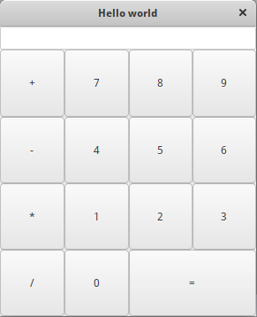

# Розробка базового калькулятора із використанням GTK

# Зміст

${toc}

# Початковий проект

- Проект можна знайти на рипозиторії [gtk-calc](https://github.com/endlesskwazar/gtk-calc)
- Гілка master

# Домашнє завдання

Доробіть в проекті функціональність згідно варіанта.

## Варіанти

1. Кнопки 0,1. Віднімання.
2. Кнопки 2,3. Множення.
3. Кнопки 4,5. Ділення.
4. Кнопки 6,8. Очищення дисплея і стана.
5. Кнопку 9. Піднесення в степінь.