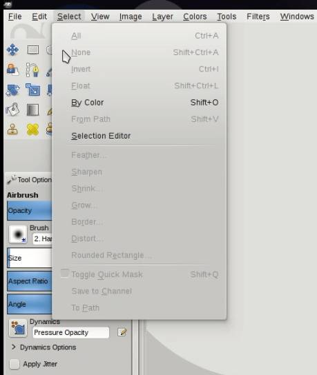
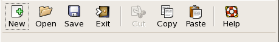

# Меню, контекстне меню, панель інструментів

# Зміст

${toc}

# Status Bar

GtkStatusbar зазвичай розміщується у нижній частині головного GtkWindow програми. Він може надавати регулярний коментар про стан програми (як це звичайно буває у веб-переглядачі), або може бути використаний для простого виведення повідомлення при зміні статусу (коли завершується завантаження на клієнті FTP, наприклад).

Рядки стану в GTK + підтримують стек повідомлень. Повідомлення у верхній частині стека кожного бару - це те, що відображатиметься зараз.

Будь-які повідомлення, додані до стека рядка стану, повинні вказувати ідентифікатор контексту, який використовується для однозначної ідентифікації джерела повідомлення. Цей ідентифікатор контексту може бути згенеровано за допомогою gtk_statusbar_get_context_id(), з урахуванням повідомлення та рядка стану, до якого воно буде додано. Зверніть увагу, що повідомлення зберігаються в стеку, і при виборі повідомлення, яке буде відображатися, дотримується структура стека, незалежно від ідентифікатора контексту повідомлення.

Для створення GtkStatusbar використовується функція:

```cpp
GtkWidget *
gtk_statusbar_new (void);
```

Для додавання повідомлення в GtkStatusBar викиористовується функція:

```cpp
guint
gtk_statusbar_push (GtkStatusbar *statusbar,
                    guint context_id,
                    const gchar *text);
```

Параметри:
- statusbar - GtkStatusbar
- context_id - ідентифікатор контексту повідомлення, який повертається gtk_statusbar_get_context_id ()
- text - повідомлення, яке потрібно додати до рядка стану

Вихідні дані функції:
- ідентифікатор повідомлення, який можна використовувати з gtk_statusbar_remove().

```cpp
#include <gtk/gtk.h>

void button_clicked(GtkButton* button, gpointer *data){
    GtkStatusbar* statusbar = GTK_STATUSBAR(data);
    guint context_id = gtk_statusbar_get_context_id(statusbar, "btn");
    gtk_statusbar_push(statusbar, context_id, "Button was clicked");
}

int main(int argc, char *argv[]) {

    GtkWidget *window;
    GtkWidget *vbox;
    GtkWidget *statusBar;
    GtkWidget *button;

    gtk_init(&argc, &argv);

    window = gtk_window_new(GTK_WINDOW_TOPLEVEL);
    gtk_window_set_position(GTK_WINDOW(window), GTK_WIN_POS_CENTER);
    gtk_window_set_default_size(GTK_WINDOW(window), 300, 200);
    gtk_window_set_title(GTK_WINDOW(window), "toolbar");
    vbox = gtk_box_new(GTK_ORIENTATION_VERTICAL, 0);
    button = gtk_button_new_with_label("Click me!!!");
    statusBar = gtk_statusbar_new();
    g_signal_connect(GTK_BUTTON(button), "clicked", G_CALLBACK(button_clicked), statusBar);
    gtk_box_pack_start(GTK_BOX(vbox), button, FALSE, FALSE, 5);
    gtk_box_pack_end(GTK_BOX(vbox), statusBar, FALSE, FALSE, 5);
    gtk_container_add(GTK_CONTAINER(window), vbox);
    gtk_widget_show_all(window);
    gtk_main();

    return 0;
}
```

# Меню



**GtkMenuBar** - це віджет, який створює панель меню. Він містить один до багатьох GtkMenuItems. Пункт меню - це об'єкт, який користувач може вибрати. GtkMenu реалізує випадаюче меню, що складається зі списку об'єктів GtkMenuItem, які можуть переміщатися та активуватися користувачем для виконання функцій програми.

```cpp
#include <gtk/gtk.h>

int main(int argc, char *argv[]) {

    GtkWidget *window;
    GtkWidget *vbox;

    GtkWidget *menubar;
    GtkWidget *fileMenu;
    GtkWidget *fileMi;
    GtkWidget *quitMi;

    gtk_init(&argc, &argv);

    window = gtk_window_new(GTK_WINDOW_TOPLEVEL);
    gtk_window_set_position(GTK_WINDOW(window), GTK_WIN_POS_CENTER);
    gtk_window_set_default_size(GTK_WINDOW(window), 300, 200);
    gtk_window_set_title(GTK_WINDOW(window), "Simple menu");

    vbox = gtk_box_new(GTK_ORIENTATION_VERTICAL, 0);
    gtk_container_add(GTK_CONTAINER(window), vbox);

    menubar = gtk_menu_bar_new();
    fileMenu = gtk_menu_new();

    fileMi = gtk_menu_item_new_with_label("File");
    quitMi = gtk_menu_item_new_with_label("Quit");

    gtk_menu_item_set_submenu(GTK_MENU_ITEM(fileMi), fileMenu);
    gtk_menu_shell_append(GTK_MENU_SHELL(fileMenu), quitMi);
    gtk_menu_shell_append(GTK_MENU_SHELL(menubar), fileMi);
    gtk_box_pack_start(GTK_BOX(vbox), menubar, FALSE, FALSE, 0);

    g_signal_connect(G_OBJECT(window), "destroy",
                     G_CALLBACK(gtk_main_quit), NULL);

    g_signal_connect(G_OBJECT(quitMi), "activate",
                     G_CALLBACK(gtk_main_quit), NULL);

    gtk_widget_show_all(window);

    gtk_main();

    return 0;
}
```

Меню на екрані має один пункт меню. Вибравши елемент, програма закривається.

```cpp
menubar = gtk_menu_bar_new ();
```

Gtk_menu_bar_new () створює новий GtkMenuBar.

```cpp
filemenu = gtk_menu_new();
```

Функція gtk_menu_new () створює нове GtkMenu.

```cpp
gtk_menu_item_set_submenu(GTK_MENU_ITEM(fileMi), fileMenu);
```

Меню FileMenu встановлено у пункт меню File з функцією gtk_menu_item_set_submenu (). Меню - це контейнери, які містять пункти меню. Вони самі підключаються до певного пункту меню.

```cpp
gtk_menu_shell_append(GTK_MENU_SHELL(fileMenu), quitMi);
```

QuitMi додано до меню Файл з функцією gtk_menu_shell_append ().

```cpp
gtk_menu_shell_append(GTK_MENU_SHELL(menubar), fileMi);
```

Пункт меню File додається до меню з функцією gtk_menu_shell_append (). Як GtkMenu, так і GtkMenuBar виведені з GtkMenuShell.

```cpp
g_signal_connect(G_OBJECT(quitMi), "activate",
    G_CALLBACK(gtk_main_quit), NULL);
```

## Під-меню

Наступний приклад демонструє, як створити підменю. Підменю - це меню в іншому меню.

```cpp
#include <gtk/gtk.h>

int main(int argc, char *argv[]) {

    GtkWidget *window;
    GtkWidget *vbox;

    GtkWidget *menubar;
    GtkWidget *fileMenu;
    GtkWidget *imprMenu;
    GtkWidget *sep;
    GtkWidget *fileMi;
    GtkWidget *imprMi;
    GtkWidget *feedMi;
    GtkWidget *bookMi;
    GtkWidget *mailMi;
    GtkWidget *quitMi;

    gtk_init(&argc, &argv);

    window = gtk_window_new(GTK_WINDOW_TOPLEVEL);
    gtk_window_set_position(GTK_WINDOW(window), GTK_WIN_POS_CENTER);
    gtk_window_set_default_size(GTK_WINDOW(window), 300, 200);
    gtk_window_set_title(GTK_WINDOW(window), "Submenu");

    vbox = gtk_box_new(GTK_ORIENTATION_VERTICAL, 0);
    gtk_container_add(GTK_CONTAINER(window), vbox);

    menubar = gtk_menu_bar_new();

    fileMenu = gtk_menu_new();
    fileMi = gtk_menu_item_new_with_label("File");

    imprMenu = gtk_menu_new();
    imprMi = gtk_menu_item_new_with_label("Import");
    feedMi = gtk_menu_item_new_with_label("Import news feed...");
    bookMi = gtk_menu_item_new_with_label("Import bookmarks...");
    mailMi = gtk_menu_item_new_with_label("Import mail...");

    gtk_menu_item_set_submenu(GTK_MENU_ITEM(imprMi), imprMenu);
    gtk_menu_shell_append(GTK_MENU_SHELL(imprMenu), feedMi);
    gtk_menu_shell_append(GTK_MENU_SHELL(imprMenu), bookMi);
    gtk_menu_shell_append(GTK_MENU_SHELL(imprMenu), mailMi);
    sep = gtk_separator_menu_item_new();
    quitMi = gtk_menu_item_new_with_label("Quit");

    gtk_menu_item_set_submenu(GTK_MENU_ITEM(fileMi), fileMenu);
    gtk_menu_shell_append(GTK_MENU_SHELL(fileMenu), imprMi);
    gtk_menu_shell_append(GTK_MENU_SHELL(fileMenu), sep);
    gtk_menu_shell_append(GTK_MENU_SHELL(fileMenu), quitMi);
    gtk_menu_shell_append(GTK_MENU_SHELL(menubar), fileMi);
    gtk_box_pack_start(GTK_BOX(vbox), menubar, FALSE, FALSE, 0);

    g_signal_connect(G_OBJECT(window), "destroy",
                     G_CALLBACK(gtk_main_quit), NULL);

    g_signal_connect(G_OBJECT(quitMi), "activate",
                     G_CALLBACK(gtk_main_quit), NULL);

    gtk_widget_show_all(window);
    gtk_main();
    return 0;
}
```

Приклад створює меню в іншому меню. В підменю є три пункти меню. Також ми додаємо горизонтальний роздільник.

```cpp
imprMenu = gtk_menu_new();
imprMi = gtk_menu_item_new_with_label("Import");
feedMi = gtk_menu_item_new_with_label("Import news feed...");
bookMi = gtk_menu_item_new_with_label("Import bookmarks...");
mailMi = gtk_menu_item_new_with_label("Import mail...");
```

Це підменю з пунктами меню.

gtk_menu_item_set_submenu(GTK_MENU_ITEM(imprMi), imprMenu);

Підменю imprMenu додано до власного пункту меню.

```cpp
gtk_menu_shell_append(GTK_MENU_SHELL(imprMenu), feedMi);
gtk_menu_shell_append(GTK_MENU_SHELL(imprMenu), bookMi);
gtk_menu_shell_append(GTK_MENU_SHELL(imprMenu), mailMi);
```

Три пункти меню додаються до підменю з функцією gtk_menu_shell_append ().

```cpp
sep = gtk_separator_menu_item_new();
```

Роздільник горизонтального меню створюється за допомогою функції gtk_separator_menu_item_new().

```cpp
gtk_menu_shell_append(GTK_MENU_SHELL(fileMenu), imprMi);
gtk_menu_shell_append(GTK_MENU_SHELL(fileMenu), sep);
```

ImprMi та роздільник додаються до меню File за допомогою функцією gtk_menu_shell_append ().

## Картинки в меню

GtkImageMenuItem - це пункт меню, який має значок поряд з текстовою міткою. Оскільки користувач може відключити відображення значків меню, нам все одно потрібно заповнити текстову мітку. Accelerators - це комбінації клавіш для активації пункту меню. Mnemonics - це комбінації клавіш для елементів графічного інтерфейсу.

Знайти імена іконок для використання можна знайти за посиланням: [Icon Naming Specification](https://specifications.freedesktop.org/icon-naming-spec/icon-naming-spec-latest.html)

### old way

```cpp
#include <gtk/gtk.h>
#include <gdk/gdkkeysyms.h>
#include <path_utils.h>

int main(int argc, char *argv[]) {

    GtkWidget *window;
    GtkWidget *vbox;

    GtkWidget *menubar;
    GtkWidget *fileMenu;
    GtkWidget *fileMi;
    GtkWidget *newMi;
    GtkWidget *openMi;
    GtkWidget *quitMi;

    GtkWidget *sep;

    GtkAccelGroup *accel_group = NULL;

    gtk_init(&argc, &argv);

    window = gtk_window_new(GTK_WINDOW_TOPLEVEL);
    gtk_window_set_position(GTK_WINDOW(window), GTK_WIN_POS_CENTER);
    gtk_window_set_default_size(GTK_WINDOW(window), 300, 200);
    gtk_window_set_title(GTK_WINDOW(window), "Images");

    vbox = gtk_box_new(GTK_ORIENTATION_VERTICAL, 0);
    gtk_container_add(GTK_CONTAINER(window), vbox);

    menubar = gtk_menu_bar_new();
    fileMenu = gtk_menu_new();

    accel_group = gtk_accel_group_new();
    gtk_window_add_accel_group(GTK_WINDOW(window), accel_group);

    fileMi = gtk_menu_item_new_with_mnemonic("_File");
    newMi = gtk_image_menu_item_new_from_stock(GTK_STOCK_NEW, NULL);
    openMi = gtk_image_menu_item_new_from_stock(GTK_STOCK_OPEN, NULL);
    sep = gtk_separator_menu_item_new();
    quitMi = gtk_image_menu_item_new_from_stock(GTK_STOCK_QUIT, accel_group);

    gtk_widget_add_accelerator(quitMi, "activate", accel_group,
                               GDK_KEY_Q, GDK_CONTROL_MASK, GTK_ACCEL_VISIBLE);

    gtk_menu_item_set_submenu(GTK_MENU_ITEM(fileMi), fileMenu);
    gtk_menu_shell_append(GTK_MENU_SHELL(fileMenu), newMi);
    gtk_menu_shell_append(GTK_MENU_SHELL(fileMenu), openMi);
    gtk_menu_shell_append(GTK_MENU_SHELL(fileMenu), sep);
    gtk_menu_shell_append(GTK_MENU_SHELL(fileMenu), quitMi);
    gtk_menu_shell_append(GTK_MENU_SHELL(menubar), fileMi);
    gtk_box_pack_start(GTK_BOX(vbox), menubar, FALSE, FALSE, 0);

    g_signal_connect(G_OBJECT(window), "destroy",
                     G_CALLBACK(gtk_main_quit), NULL);

    g_signal_connect(G_OBJECT(quitMi), "activate",
                     G_CALLBACK(gtk_main_quit), NULL);

    g_object_set (gtk_settings_get_default (), "gtk-menu-images", TRUE, NULL);

    gtk_widget_show_all(window);

    gtk_main();

    return 0;
}
```

> Зверніть увагу, що за замовчуванням картинки не показуються, їх потрібно увімкнути:

```cpp
g_object_set (gtk_settings_get_default (), "gtk-menu-images", TRUE, NULL);
```

### new way

[Deprecation](https://developer.gnome.org/gtk3/stable/GtkImageMenuItem.html)

```cpp
#include <gtk/gtk.h>
#include <gdk/gdkkeysyms.h>
#include <path_utils.h>

int main(int argc, char *argv[]) {

    GtkWidget *window;
    GtkWidget *vbox;

    GtkWidget *menubar;
    GtkWidget *fileMenu;
    GtkWidget *fileMi;
    GtkWidget *newMi;
    GtkWidget *openMi;
    GtkWidget *quitMi;

    GtkWidget *sep;

    GtkAccelGroup *accel_group = NULL;

    gtk_init(&argc, &argv);

    window = gtk_window_new(GTK_WINDOW_TOPLEVEL);
    gtk_window_set_position(GTK_WINDOW(window), GTK_WIN_POS_CENTER);
    gtk_window_set_default_size(GTK_WINDOW(window), 300, 200);
    gtk_window_set_title(GTK_WINDOW(window), "Images");

    vbox = gtk_box_new(GTK_ORIENTATION_VERTICAL, 0);
    gtk_container_add(GTK_CONTAINER(window), vbox);

    menubar = gtk_menu_bar_new();
    fileMenu = gtk_menu_new();

    accel_group = gtk_accel_group_new();
    gtk_window_add_accel_group(GTK_WINDOW(window), accel_group);

    fileMi = gtk_menu_item_new_with_mnemonic("_File");
    newMi = gtk_menu_item_new();
    GtkWidget *box = gtk_box_new (GTK_ORIENTATION_HORIZONTAL, 6);
    GtkWidget *icon = gtk_image_new_from_icon_name ("folder-music-symbolic", GTK_ICON_SIZE_MENU);
    GtkWidget *label = gtk_label_new ("Music");
    gtk_container_add (GTK_CONTAINER (box), icon);
    gtk_container_add (GTK_CONTAINER (box), label);
    gtk_container_add (GTK_CONTAINER (newMi), box);
    openMi = gtk_menu_item_new_with_mnemonic("_Open");
    sep = gtk_separator_menu_item_new();
    quitMi = gtk_menu_item_new_with_mnemonic("_Quite");

    gtk_widget_add_accelerator(quitMi, "activate", accel_group,
                               GDK_KEY_Q, GDK_CONTROL_MASK, GTK_ACCEL_VISIBLE);

    gtk_menu_item_set_submenu(GTK_MENU_ITEM(fileMi), fileMenu);
    gtk_menu_shell_append(GTK_MENU_SHELL(fileMenu), newMi);
    gtk_menu_shell_append(GTK_MENU_SHELL(fileMenu), openMi);
    gtk_menu_shell_append(GTK_MENU_SHELL(fileMenu), sep);
    gtk_menu_shell_append(GTK_MENU_SHELL(fileMenu), quitMi);
    gtk_menu_shell_append(GTK_MENU_SHELL(menubar), fileMi);
    gtk_box_pack_start(GTK_BOX(vbox), menubar, FALSE, FALSE, 0);

    g_signal_connect(G_OBJECT(window), "destroy",
                     G_CALLBACK(gtk_main_quit), NULL);

    g_signal_connect(G_OBJECT(quitMi), "activate",
                     G_CALLBACK(gtk_main_quit), NULL);

    g_object_set (gtk_settings_get_default (), "gtk-menu-images", TRUE, NULL);

    gtk_widget_show_all(window);

    gtk_main();

    return 0;
}
```

## GtkCheckMenu

```cpp
#include <gtk/gtk.h>

void toggle_statusbar(GtkWidget *widget, gpointer statusbar) {

    if (gtk_check_menu_item_get_active(GTK_CHECK_MENU_ITEM(widget))) {

        gtk_widget_show(GTK_WIDGET(statusbar));
    } else {

        gtk_widget_hide(GTK_WIDGET(statusbar));
    }
}

int main(int argc, char *argv[]) {

    GtkWidget *window;
    GtkWidget *vbox;
    GtkWidget *menubar;
    GtkWidget *viewmenu;
    GtkWidget *view;
    GtkWidget *tog_stat;
    GtkWidget *statusbar;

    gtk_init(&argc, &argv);

    window = gtk_window_new(GTK_WINDOW_TOPLEVEL);
    gtk_window_set_position(GTK_WINDOW(window), GTK_WIN_POS_CENTER);
    gtk_window_set_default_size(GTK_WINDOW(window), 300, 200);
    gtk_window_set_title(GTK_WINDOW(window), "GtkCheckMenuItem");

    vbox = gtk_box_new(GTK_ORIENTATION_VERTICAL, 0);
    gtk_container_add(GTK_CONTAINER(window), vbox);

    menubar = gtk_menu_bar_new();
    viewmenu = gtk_menu_new();

    view = gtk_menu_item_new_with_label("View");
    tog_stat = gtk_check_menu_item_new_with_label("View statusbar");
    gtk_check_menu_item_set_active(GTK_CHECK_MENU_ITEM(tog_stat), TRUE);

    gtk_menu_item_set_submenu(GTK_MENU_ITEM(view), viewmenu);
    gtk_menu_shell_append(GTK_MENU_SHELL(viewmenu), tog_stat);
    gtk_menu_shell_append(GTK_MENU_SHELL(menubar), view);
    gtk_box_pack_start(GTK_BOX(vbox), menubar, FALSE, FALSE, 0);

    statusbar = gtk_statusbar_new();
    gtk_statusbar_push(GTK_STATUSBAR(statusbar), 1, "Status text");
    gtk_box_pack_end(GTK_BOX(vbox), statusbar, FALSE, TRUE, 0);

    g_signal_connect(G_OBJECT(window), "destroy",
                     G_CALLBACK(gtk_main_quit), NULL);

    g_signal_connect(G_OBJECT(tog_stat), "activate",
                     G_CALLBACK(toggle_statusbar), statusbar);

    gtk_widget_show_all(window);

    gtk_main();

    return 0;
}
```

Приклад містить GtkCheckMenuItem у меню View. Якщо прапорець увімкнено, відображається віджет панелі стану.

```cpp
tog_stat = gtk_check_menu_item_new_with_label("View statusbar");
```

Функція gtk_check_menu_item_new_with_label () створює новий елемент CheckMenuItem.

```cpp
statusbar = gtk_statusbar_new();
```

Функція gtk_statusbar_new () створює новий віджет GtkStatusbar. Він використовується для повідомлення про незначне повідомлення для користувача.

```cpp
if (gtk_check_menu_item_get_active(GTK_CHECK_MENU_ITEM(widget))) {
    
  gtk_widget_show(statusbar);
} else {
    
  gtk_widget_hide(statusbar);
}
```

Якщо прапорець у пункті меню активовано, ми покажемо віджет панелі стану; в іншому випадку рядок стану приховано.

# Панель інструментів




## GtkToolbar

Меню групових команд, які ми можемо використовувати в додатку. Панелі інструментів забезпечують швидкий доступ до найчастіше використовуваних команд. GtkToolbar - це віджет панелі інструментів у GTK +. Панель інструментів може містити екземпляри підкласу GtkToolItem, наприклад, GtkToolButton або GtkSeparatorToolItem.

### Icons only

```cpp
#include <gtk/gtk.h>

int main(int argc, char *argv[]) {

  GtkWidget *window;
  GtkWidget *vbox;

  GtkWidget *toolbar;
  GtkToolItem *newTb;
  GtkToolItem *openTb;
  GtkToolItem *saveTb;
  GtkToolItem *sep;
  GtkToolItem *exitTb;

  gtk_init(&argc, &argv);

  window = gtk_window_new(GTK_WINDOW_TOPLEVEL);
  gtk_window_set_position(GTK_WINDOW(window), GTK_WIN_POS_CENTER);
  gtk_window_set_default_size(GTK_WINDOW(window), 300, 200);
  gtk_window_set_title(GTK_WINDOW(window), "toolbar");

  vbox = gtk_box_new(GTK_ORIENTATION_VERTICAL, 0);
  gtk_container_add(GTK_CONTAINER(window), vbox);

  toolbar = gtk_toolbar_new();
  gtk_toolbar_set_style(GTK_TOOLBAR(toolbar), GTK_TOOLBAR_ICONS);

  newTb = gtk_tool_button_new(NULL, NULL);
  gtk_tool_button_set_icon_name(GTK_TOOL_BUTTON(newTb), "document-new");
  gtk_toolbar_insert(GTK_TOOLBAR(toolbar), newTb, -1);

  openTb = gtk_tool_button_new(NULL, NULL);
  gtk_tool_button_set_icon_name(GTK_TOOL_BUTTON(openTb), "document-open");
  gtk_toolbar_insert(GTK_TOOLBAR(toolbar), openTb, -1);

  saveTb = gtk_tool_button_new(NULL, NULL);
  gtk_tool_button_set_icon_name(GTK_TOOL_BUTTON(saveTb), "document-save");
  gtk_toolbar_insert(GTK_TOOLBAR(toolbar), saveTb, -1);

  sep = gtk_separator_tool_item_new();
  gtk_toolbar_insert(GTK_TOOLBAR(toolbar), sep, -1);

  exitTb = gtk_tool_button_new(NULL, NULL);
  gtk_tool_button_set_icon_name(GTK_TOOL_BUTTON(exitTb), "application-exit");
  gtk_toolbar_insert(GTK_TOOLBAR(toolbar), exitTb, -1);

  gtk_box_pack_start(GTK_BOX(vbox), toolbar, FALSE, FALSE, 5);

  g_signal_connect(G_OBJECT(exitTb), "clicked",
        G_CALLBACK(gtk_main_quit), NULL);

  g_signal_connect(G_OBJECT(window), "destroy",
        G_CALLBACK(gtk_main_quit), NULL);

  gtk_widget_show_all(window);

  gtk_main();

  return 0;
}
```


### Icons and Labels

```cpp
#include <gtk/gtk.h>

int main(int argc, char *argv[]) {

  GtkWidget *window;
  GtkWidget *vbox;

  GtkWidget *toolbar;
  GtkToolItem *newTb;
  GtkToolItem *openTb;
  GtkToolItem *saveTb;
  GtkToolItem *sep;
  GtkToolItem *exitTb;

  gtk_init(&argc, &argv);

  window = gtk_window_new(GTK_WINDOW_TOPLEVEL);
  gtk_window_set_position(GTK_WINDOW(window), GTK_WIN_POS_CENTER);
  gtk_window_set_default_size(GTK_WINDOW(window), 300, 200);
  gtk_window_set_title(GTK_WINDOW(window), "toolbar");

  vbox = gtk_box_new(GTK_ORIENTATION_VERTICAL, 0);
  gtk_container_add(GTK_CONTAINER(window), vbox);

  toolbar = gtk_toolbar_new();
  gtk_toolbar_set_style(GTK_TOOLBAR(toolbar), GTK_TOOLBAR_BOTH);

  newTb = gtk_tool_button_new(NULL, "New");
  gtk_tool_button_set_icon_name(GTK_TOOL_BUTTON(newTb), "document-new");
  gtk_toolbar_insert(GTK_TOOLBAR(toolbar), newTb, -1);

  openTb = gtk_tool_button_new(NULL, "Open");
  gtk_tool_button_set_icon_name(GTK_TOOL_BUTTON(openTb), "document-open");
  gtk_toolbar_insert(GTK_TOOLBAR(toolbar), openTb, -1);

  saveTb = gtk_tool_button_new(NULL, "Save");
  gtk_tool_button_set_icon_name(GTK_TOOL_BUTTON(saveTb), "document-save");
  gtk_toolbar_insert(GTK_TOOLBAR(toolbar), saveTb, -1);

  sep = gtk_separator_tool_item_new();
  gtk_toolbar_insert(GTK_TOOLBAR(toolbar), sep, -1);

  exitTb = gtk_tool_button_new(NULL, "Exit");
  gtk_tool_button_set_icon_name(GTK_TOOL_BUTTON(exitTb), "application-exit");
  gtk_toolbar_insert(GTK_TOOLBAR(toolbar), exitTb, -1);

  gtk_box_pack_start(GTK_BOX(vbox), toolbar, FALSE, FALSE, 5);

  g_signal_connect(G_OBJECT(exitTb), "clicked",
        G_CALLBACK(gtk_main_quit), NULL);

  g_signal_connect(G_OBJECT(window), "destroy",
        G_CALLBACK(gtk_main_quit), NULL);

  gtk_widget_show_all(window);

  gtk_main();

  return 0;
}
```

# Домашнє завдання

Розробіть додаток, який містить в собі меню(File, View, About). Панель інструментів з 6 кнопками(із текстом) і рядок статуса. В меню View міститься саб-меню(CheckMenuItem), який показує або приховує Toolbar.

# Контрольні запитання
1. Поясніть принцип реалізації меню в GTK.
2. Поясніть принцип реалізації рядка статуса в GTK.
3. Поясніть принцип реалізації Панелі інструкментів в GTK.