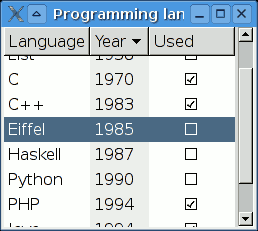

# TreeView, Dialogs

# Зміст


# GtkTreeView

**GtkTreeView** — Віджет, який дозволяє відображати списки і дерева.




## MVC

Щоб створити дерево або список у GTK+, використовується інтерфейс GtkTreeModel у поєднанні з віджетом GtkTreeView. Цей віджет розроблений навколо Model / View / Controller і складається з чотирьох основних частин:

- Сам віджет (GtkTreeView)
- Вджет, який представляє собою стовпець (GtkTreeViewColumn)
- Віджет, який відповідає за відображення даних (GtkCellRenderer)
- Модель (GtkTreeModel)

Метою GtkCellRenderer є забезпечення розширюваності віджету і забезпечення можливості декількох способів візуалізації одного і того ж типу даних. Наприклад, розглянемо, як зробити візуальну змінну. Якщо вона відображається як рядок "True" або "False", "On" або "Off", або вона повинна відображатися як прапорець?

## Моделі

GTK+ надає дві прості моделі: GtkListStore і GtkTreeStore. GtkListStore використовується для моделювання віджетів списку, тоді як GtkTreeStore моделює дерева. Можна розробити новий тип моделі, але існуючі моделі повинні бути задовільними для більшості ситуацій.

### GtkListStore

Створення GtkListStore:

```cpp
GtkListStore *store = gtk_list_store_new (2, G_TYPE_STRING, G_TYPE_BOOLEAN);
```

Цей код створює GtkListStore з двома стовпцями: рядком і булевим стовпцем. Зазвичай, 2 ніколи не передається прямо так; зазвичай створюється перелік, в якому перераховуються різні стовпці, за якими йде маркер, що представляє загальну кількість стовпців. Наступний приклад ілюструє це:

```cpp
enum
{
   TITLE_COLUMN,
   AUTHOR_COLUMN,
   CHECKED_COLUMN,
   N_COLUMNS
};
```

```cpp
GtkListStore *store = gtk_list_store_new (N_COLUMNS, G_TYPE_STRING, G_TYPE_STRING, G_TYPE_BOOLEAN);
```

**Приклад GtkTreeView, використовуючи GtkListStore**:

```cpp
#include <gtk/gtk.h>

int main(int argc, char *argv[]) {

    GtkWidget* window;
    GtkWidget* vbox;
    GtkWidget* treeView;
    GtkListStore* model;

    gtk_init(&argc, &argv);

    window = gtk_window_new(GTK_WINDOW_TOPLEVEL);
    gtk_window_set_position(GTK_WINDOW(window), GTK_WIN_POS_CENTER);
    gtk_window_set_default_size(GTK_WINDOW(window), 300, 200);
    gtk_window_set_title(GTK_WINDOW(window), "toolbar");

    vbox = gtk_box_new(GTK_ORIENTATION_VERTICAL, 0);

    //створення моделі
    model = gtk_list_store_new(2, G_TYPE_STRING, G_TYPE_BOOLEAN);

    /*
    * Додаємо новий рядок.
    * Після цього кроку буде створений пустий рядок і буде встановлений ітератор,
    * який ми потім використаємо для вставки даних
    */
    GtkTreeIter iter;
    gtk_list_store_append (model, &iter);


    /*
     * номер колонки значення
     * останій параметр -1 - термінальний оператор(для завершення спред оператора)
     */
    gtk_list_store_set(model, &iter, 0, "Some data", 1, FALSE, -1);

    //Додаємо ще дані
    gtk_list_store_append (model, &iter);
    gtk_list_store_set(model, &iter, 0, "Some other data", 1, FALSE, -1);

    //creat  e treeview
    treeView = gtk_tree_view_new_with_model(GTK_TREE_MODEL(model));


    /*
     * Після того як TreeView має модель
     * йому потрібно знати як її відображати
     */
    GtkCellRenderer *renderer1;
    GtkTreeViewColumn *column1;

    renderer1 = gtk_cell_renderer_text_new ();
    column1 = gtk_tree_view_column_new_with_attributes ("Title",
                                                       renderer1,
                                                       "text", 0,
                                                       NULL);
    gtk_tree_view_append_column (GTK_TREE_VIEW (treeView), column1);

    GtkCellRenderer *renderer2;
    GtkTreeViewColumn *column2;

    renderer2 = gtk_cell_renderer_toggle_new();
    column2 = gtk_tree_view_column_new_with_attributes ("Checked",
                                                        renderer2,
                                                        "toggle", 1,
                                                        NULL);
    gtk_tree_view_append_column (GTK_TREE_VIEW (treeView), column2);


    gtk_box_pack_start(GTK_BOX(vbox), treeView, FALSE, FALSE, 5);
    gtk_container_add(GTK_CONTAINER(window), vbox);
    gtk_widget_show_all(window);

    gtk_main();

    return 0;
}
```

### GtkTreeStore

```cpp
#include <gtk/gtk.h>

/*
 * Перечислення, яке використовується для номерації колонк
 */
enum{
    TITLE_COLUMN,
    AUTHOR_COLUMN,
    CHECKED_COLUMN,
    N_COLUMNS
};

int main(int argc, char *argv[]) {

    GtkWidget* window;
    GtkWidget* vbox;
    GtkWidget* treeView;

    gtk_init(&argc, &argv);

    window = gtk_window_new(GTK_WINDOW_TOPLEVEL);
    gtk_window_set_position(GTK_WINDOW(window), GTK_WIN_POS_CENTER);
    gtk_window_set_default_size(GTK_WINDOW(window), 300, 200);
    gtk_window_set_title(GTK_WINDOW(window), "toolbar");

    vbox = gtk_box_new(GTK_ORIENTATION_VERTICAL, 0);

    //створення моделі
    GtkTreeStore* model = gtk_tree_store_new (N_COLUMNS,
                                              G_TYPE_STRING,
                                              G_TYPE_STRING,
                                              G_TYPE_BOOLEAN);


    /*
    * Додаємо новий рядок.
    * Після цього кроку буде створений пустий рядок і буде встановлений ітератор,
    * який ми потім використаємо для вставки даних
     * Null означає, що цей рядок не має батька
    */
    GtkTreeIter   iter;
    gtk_tree_store_append (model, &iter, NULL);


    /*
     * номер колонки значення
     * останій параметр -1 - термінальний оператор(для завершення спред оператора)
     */
    gtk_tree_store_set (model, &iter,
                        TITLE_COLUMN, "The Principle of Reason",
                        AUTHOR_COLUMN, "Martin Heidegger",
                        CHECKED_COLUMN, FALSE,
                        -1);

    /*
     * Останій параметр в gtk_tree_store_append батько(щоб брати батька можна використовувати ітератор)
     */
    GtkTreeIter iter1;  /* Parent iter */
    GtkTreeIter iter2;  /* Child iter  */

    gtk_tree_store_append (model, &iter1, NULL);
    gtk_tree_store_set (model, &iter1,
                        TITLE_COLUMN, "The Art of Computer Programming",
                        AUTHOR_COLUMN, "Donald E. Knuth",
                        CHECKED_COLUMN, FALSE,
                        -1);

    gtk_tree_store_append (model, &iter2, &iter1);
    gtk_tree_store_set (model, &iter2,
                        TITLE_COLUMN, "Volume 1: Fundamental Algorithms",
                        -1);

    gtk_tree_store_append (model, &iter2, &iter1);
    gtk_tree_store_set (model, &iter2,
                        TITLE_COLUMN, "Volume 2: Seminumerical Algorithms",
                        -1);

    gtk_tree_store_append (model, &iter2, &iter1);
    gtk_tree_store_set (model, &iter2,
                        TITLE_COLUMN, "Volume 3: Sorting and Searching",
                        -1);

    //creat  e treeview
    treeView = gtk_tree_view_new_with_model(GTK_TREE_MODEL(model));


    /*
     * Після того як TreeView має модель
     * йому потрібно знати як її відображати
     */
    GtkCellRenderer *renderer;
    GtkTreeViewColumn *column;
    renderer = gtk_cell_renderer_text_new ();
    column = gtk_tree_view_column_new_with_attributes ("Author",
                                                       renderer,
                                                       "text", AUTHOR_COLUMN,
                                                       NULL);
    gtk_tree_view_append_column (GTK_TREE_VIEW (treeView), column);

    GtkCellRenderer *renderer2;
    GtkTreeViewColumn *column2;
    renderer2 = gtk_cell_renderer_text_new ();
    column2 = gtk_tree_view_column_new_with_attributes ("Title",
                                                       renderer2,
                                                       "text", TITLE_COLUMN,
                                                       NULL);
    gtk_tree_view_append_column (GTK_TREE_VIEW (treeView), column2);


    gtk_box_pack_start(GTK_BOX(vbox), treeView, FALSE, FALSE, 5);
    gtk_container_add(GTK_CONTAINER(window), vbox);
    gtk_widget_show_all(window);

    gtk_main();

    return 0;
}
```

## Приклад застосунка з використанням selected

```cpp
#include <gtk/gtk.h>

GtkWidget* window;
GtkWidget* vbox;
GtkWidget* treeView;
GtkListStore* model;
GtkWidget* entry;
GtkWidget* submitButton;
GtkWidget* removeButton;

void buildModel(GtkListStore* model){
    GtkTreeIter iter;
    gtk_list_store_append (model, &iter);
    gtk_list_store_set(model, &iter, 0, "Some data", -1);
    gtk_list_store_append (model, &iter);
    gtk_list_store_set(model, &iter, 0, "Some other data", -1);
}

GtkWidget* buildTreeViewWithModel(GtkListStore* model){
    GtkWidget* treeView;
    treeView = gtk_tree_view_new_with_model(GTK_TREE_MODEL(model));

    GtkCellRenderer *renderer1;
    GtkTreeViewColumn *column1;

    renderer1 = gtk_cell_renderer_text_new ();
    column1 = gtk_tree_view_column_new_with_attributes ("Title",
                                                        renderer1,
                                                        "text", 0,
                                                        NULL);
    gtk_tree_view_append_column (GTK_TREE_VIEW (treeView), column1);
    return treeView;
}

void tree_selection_changed_cb (GtkTreeSelection *selection, gpointer data)
{
    GtkTreeIter iter;
    GtkTreeModel *model;
    gchar *title;

    if (gtk_tree_selection_get_selected (selection, &model, &iter))
    {
        gtk_tree_model_get (model, &iter, 0, &title, -1);
        g_print ("Selected a %s\n", title);
        g_free (title);
    }
}

void add_new_title(GtkButton* btn, gpointer data){
    const gchar* newTitle = gtk_entry_get_text(GTK_ENTRY(entry));
    GtkTreeIter iter;
    gtk_list_store_append (model, &iter);
    gtk_list_store_set(model, &iter, 0, newTitle, -1);
}

void remove_title(GtkButton* btn, gpointer data){
    GtkTreeIter iter;
    GtkTreeModel *model;
    gchar *title;
    GtkTreeSelection* selection = GTK_TREE_SELECTION(data);

    if (gtk_tree_selection_get_selected (selection, &model, &iter))
    {
        gtk_tree_model_get (model, &iter, 0, &title, -1);
        g_print ("Will delete a %s\n", title);
        gtk_list_store_remove(GTK_LIST_STORE(model),&iter);
        g_free (title);
    }
}

int main(int argc, char *argv[]) {


    gtk_init(&argc, &argv);

    window = gtk_window_new(GTK_WINDOW_TOPLEVEL);
    gtk_window_set_position(GTK_WINDOW(window), GTK_WIN_POS_CENTER);
    gtk_window_set_default_size(GTK_WINDOW(window), 300, 200);
    gtk_window_set_title(GTK_WINDOW(window), "toolbar");

    vbox = gtk_box_new(GTK_ORIENTATION_VERTICAL, 0);
    model = gtk_list_store_new(1, G_TYPE_STRING);
    buildModel(model);
    treeView = buildTreeViewWithModel(model);
    entry = gtk_entry_new();
    submitButton = gtk_button_new_with_label("add");
    g_signal_connect(GTK_BUTTON(submitButton), "clicked", G_CALLBACK(add_new_title), NULL);


    /*
     * Прив'язка до вибраного елемента
     */
    GtkTreeSelection *select;

    select = gtk_tree_view_get_selection (GTK_TREE_VIEW (treeView));
    gtk_tree_selection_set_mode (select, GTK_SELECTION_SINGLE);
    g_signal_connect (G_OBJECT (select), "changed",
                      G_CALLBACK (tree_selection_changed_cb),
                      NULL);

    removeButton = gtk_button_new_with_label("remove");
    g_signal_connect(GTK_BUTTON(removeButton), "clicked", G_CALLBACK(remove_title), select);


    gtk_box_pack_start(GTK_BOX(vbox), entry, FALSE, FALSE, 5);
    gtk_box_pack_start(GTK_BOX(vbox), submitButton, FALSE, FALSE, 5);
    gtk_box_pack_start(GTK_BOX(vbox), treeView, FALSE, FALSE, 5);
    gtk_box_pack_start(GTK_BOX(vbox), removeButton, FALSE, FALSE, 5);
    gtk_container_add(GTK_CONTAINER(window), vbox);
    gtk_widget_show_all(window);

    gtk_main();

    return 0;
}
```

# Dialogs

```cpp
#include <gtk/gtk.h>

GtkWidget* window;
GtkWidget* vbox;
GtkWidget* treeView;
GtkListStore* model;
GtkWidget* entry;
GtkWidget* submitButton;
GtkWidget* removeButton;

void buildModel(GtkListStore* model){
    GtkTreeIter iter;
    gtk_list_store_append (model, &iter);
    gtk_list_store_set(model, &iter, 0, "Some data", -1);
    gtk_list_store_append (model, &iter);
    gtk_list_store_set(model, &iter, 0, "Some other data", -1);
}

GtkWidget* buildTreeViewWithModel(GtkListStore* model){
    GtkWidget* treeView;
    treeView = gtk_tree_view_new_with_model(GTK_TREE_MODEL(model));

    GtkCellRenderer *renderer1;
    GtkTreeViewColumn *column1;

    renderer1 = gtk_cell_renderer_text_new ();
    column1 = gtk_tree_view_column_new_with_attributes ("Title",
                                                        renderer1,
                                                        "text", 0,
                                                        NULL);
    gtk_tree_view_append_column (GTK_TREE_VIEW (treeView), column1);
    return treeView;
}

void tree_selection_changed_cb (GtkTreeSelection *selection, gpointer data)
{
    GtkTreeIter iter;
    GtkTreeModel *model;
    gchar *title;

    if (gtk_tree_selection_get_selected (selection, &model, &iter))
    {
        gtk_tree_model_get (model, &iter, 0, &title, -1);
        g_print ("Selected a %s\n", title);
        g_free (title);
    }
}

void add_new_title(GtkButton* btn, gpointer data){
    const gchar* newTitle = gtk_entry_get_text(GTK_ENTRY(entry));
    GtkTreeIter iter;
    gtk_list_store_append (model, &iter);
    gtk_list_store_set(model, &iter, 0, newTitle, -1);
}

void remove_title(GtkButton* btn, gpointer data){
    GtkTreeIter iter;
    GtkTreeModel *model;
    gchar *title;
    GtkTreeSelection* selection = GTK_TREE_SELECTION(data);
    GtkWidget *dialog;

    dialog = gtk_dialog_new_with_buttons ("Delete Title?",
                                          GTK_WINDOW(window),
                                          GTK_DIALOG_DESTROY_WITH_PARENT,
                                          "OK",
                                          GTK_RESPONSE_ACCEPT,
                                          "Cancel",
                                          GTK_RESPONSE_REJECT,
                                          NULL);


    if (gtk_tree_selection_get_selected (selection, &model, &iter))
    {
        gtk_tree_model_get (model, &iter, 0, &title, -1);
        g_print ("Will delete a %s\n", title);
        if(gtk_dialog_run (GTK_DIALOG(dialog)) == GTK_RESPONSE_ACCEPT){
            gtk_list_store_remove(GTK_LIST_STORE(model),&iter);
            gtk_widget_destroy(dialog);
        }
        gtk_widget_destroy(dialog);

        g_free (title);
    }
}

int main(int argc, char *argv[]) {


    gtk_init(&argc, &argv);

    window = gtk_window_new(GTK_WINDOW_TOPLEVEL);
    gtk_window_set_position(GTK_WINDOW(window), GTK_WIN_POS_CENTER);
    gtk_window_set_default_size(GTK_WINDOW(window), 300, 200);
    gtk_window_set_title(GTK_WINDOW(window), "toolbar");

    vbox = gtk_box_new(GTK_ORIENTATION_VERTICAL, 0);
    model = gtk_list_store_new(1, G_TYPE_STRING);
    buildModel(model);
    treeView = buildTreeViewWithModel(model);
    entry = gtk_entry_new();
    submitButton = gtk_button_new_with_label("add");
    g_signal_connect(GTK_BUTTON(submitButton), "clicked", G_CALLBACK(add_new_title), NULL);


    /*
     * Прив'язка до вибраного елемента
     */
    GtkTreeSelection *select;

    select = gtk_tree_view_get_selection (GTK_TREE_VIEW (treeView));
    gtk_tree_selection_set_mode (select, GTK_SELECTION_SINGLE);
    g_signal_connect (G_OBJECT (select), "changed",
                      G_CALLBACK (tree_selection_changed_cb),
                      NULL);

    removeButton = gtk_button_new_with_label("remove");
    g_signal_connect(GTK_BUTTON(removeButton), "clicked", G_CALLBACK(remove_title), select);


    gtk_box_pack_start(GTK_BOX(vbox), entry, FALSE, FALSE, 5);
    gtk_box_pack_start(GTK_BOX(vbox), submitButton, FALSE, FALSE, 5);
    gtk_box_pack_start(GTK_BOX(vbox), treeView, FALSE, FALSE, 5);
    gtk_box_pack_start(GTK_BOX(vbox), removeButton, FALSE, FALSE, 5);
    gtk_container_add(GTK_CONTAINER(window), vbox);
    gtk_widget_show_all(window);

    gtk_main();

    return 0;
}
```

## Content Area

```cpp
#include <gtk/gtk.h>

GtkWidget* window;
GtkWidget* vbox;
GtkWidget* treeView;
GtkListStore* model;
GtkWidget* entry;
GtkWidget* submitButton;
GtkWidget* removeButton;

void buildModel(GtkListStore* model){
    GtkTreeIter iter;
    gtk_list_store_append (model, &iter);
    gtk_list_store_set(model, &iter, 0, "Some data", -1);
    gtk_list_store_append (model, &iter);
    gtk_list_store_set(model, &iter, 0, "Some other data", -1);
}

GtkWidget* buildTreeViewWithModel(GtkListStore* model){
    GtkWidget* treeView;
    treeView = gtk_tree_view_new_with_model(GTK_TREE_MODEL(model));

    GtkCellRenderer *renderer1;
    GtkTreeViewColumn *column1;

    renderer1 = gtk_cell_renderer_text_new ();
    column1 = gtk_tree_view_column_new_with_attributes ("Title",
                                                        renderer1,
                                                        "text", 0,
                                                        NULL);
    gtk_tree_view_append_column (GTK_TREE_VIEW (treeView), column1);
    return treeView;
}

void tree_selection_changed_cb (GtkTreeSelection *selection, gpointer data)
{
    GtkTreeIter iter;
    GtkTreeModel *model;
    gchar *title;

    if (gtk_tree_selection_get_selected (selection, &model, &iter))
    {
        gtk_tree_model_get (model, &iter, 0, &title, -1);
        g_print ("Selected a %s\n", title);
        g_free (title);
    }
}

void add_new_title(GtkButton* btn, gpointer data){
    const gchar* newTitle = gtk_entry_get_text(GTK_ENTRY(entry));
    GtkTreeIter iter;
    gtk_list_store_append (model, &iter);
    gtk_list_store_set(model, &iter, 0, newTitle, -1);
}

void remove_title(GtkButton* btn, gpointer data){
    GtkTreeIter iter;
    GtkTreeModel *model;
    gchar *title;
    GtkTreeSelection* selection = GTK_TREE_SELECTION(data);
    GtkWidget *dialog, *label, *content_area;

    dialog = gtk_dialog_new_with_buttons ("Delete Title?",
                                          GTK_WINDOW(window),
                                          GTK_DIALOG_DESTROY_WITH_PARENT,
                                          "OK",
                                          GTK_RESPONSE_ACCEPT,
                                          "Cancel",
                                          GTK_RESPONSE_REJECT,
                                          NULL);
    content_area = gtk_dialog_get_content_area (GTK_DIALOG (dialog));
    label = gtk_label_new ("Do you really want to delete title?");
    gtk_container_add (GTK_CONTAINER (content_area), label);
    gtk_widget_show_all (dialog);

    if (gtk_tree_selection_get_selected (selection, &model, &iter))
    {
        gtk_tree_model_get (model, &iter, 0, &title, -1);
        g_print ("Will delete a %s\n", title);
        if(gtk_dialog_run (GTK_DIALOG(dialog)) == GTK_RESPONSE_ACCEPT){
            gtk_list_store_remove(GTK_LIST_STORE(model),&iter);
            gtk_widget_destroy(dialog);
        }
        gtk_widget_destroy(dialog);

        g_free (title);
    }
}

int main(int argc, char *argv[]) {


    gtk_init(&argc, &argv);

    window = gtk_window_new(GTK_WINDOW_TOPLEVEL);
    gtk_window_set_position(GTK_WINDOW(window), GTK_WIN_POS_CENTER);
    gtk_window_set_default_size(GTK_WINDOW(window), 300, 200);
    gtk_window_set_title(GTK_WINDOW(window), "toolbar");

    vbox = gtk_box_new(GTK_ORIENTATION_VERTICAL, 0);
    model = gtk_list_store_new(1, G_TYPE_STRING);
    buildModel(model);
    treeView = buildTreeViewWithModel(model);
    entry = gtk_entry_new();
    submitButton = gtk_button_new_with_label("add");
    g_signal_connect(GTK_BUTTON(submitButton), "clicked", G_CALLBACK(add_new_title), NULL);


    /*
     * Прив'язка до вибраного елемента
     */
    GtkTreeSelection *select;

    select = gtk_tree_view_get_selection (GTK_TREE_VIEW (treeView));
    gtk_tree_selection_set_mode (select, GTK_SELECTION_SINGLE);
    g_signal_connect (G_OBJECT (select), "changed",
                      G_CALLBACK (tree_selection_changed_cb),
                      NULL);

    removeButton = gtk_button_new_with_label("remove");
    g_signal_connect(GTK_BUTTON(removeButton), "clicked", G_CALLBACK(remove_title), select);


    gtk_box_pack_start(GTK_BOX(vbox), entry, FALSE, FALSE, 5);
    gtk_box_pack_start(GTK_BOX(vbox), submitButton, FALSE, FALSE, 5);
    gtk_box_pack_start(GTK_BOX(vbox), treeView, FALSE, FALSE, 5);
    gtk_box_pack_start(GTK_BOX(vbox), removeButton, FALSE, FALSE, 5);
    gtk_container_add(GTK_CONTAINER(window), vbox);
    gtk_widget_show_all(window);

    gtk_main();

    return 0;
}
```

# Домашнє завдання

Розробіть TreeView із наступними полями title, price. Реалізуйте функціонал додавання і виділення. Реалізуйте два діалоги: один для підтвердження видалення, інший показує помилку,якщо заголовок пустий, або число введено в невірному форматі(число може бути лише додатнім).

