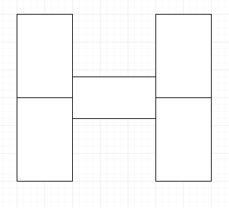
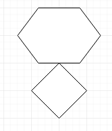

# Drawing area, key events

# Зміст

${toc}

# Key events

## GDK

**GDK** - це бібліотека низького рівня, яку використовує GTK + для взаємодії з віконною системою для графіки та пристроїв введення. Хоча GDK рідко використовується безпосередньо в коді програми, він містить всі необхідні функції для створення вікон низького рівня на екрані та взаємодії з користувачем з різними пристроями введення. GDK діє як абстракція над різними віконними системами, так що GTK + може бути портативним для всіх: X Window System (X11), Microsoft Windows, Mac OS X.

## Custom key handling

Для прослуховування подій певним віджетом потрібно скористатися функцією:
```cpp
void
gtk_widget_add_events (GtkWidget *widget,
                       gint events);
```

- віджет, який буде слухати подію
- event mask

enum GdkEventType:

|Значення|Пояснення|
|-|-|
|GDK_BUTTON_PRESS_MASK|отримувати події натискання кнопок(мишки)|
|GDK_BUTTON_RELEASE_MASK|події віджимання кнопки(мишки)|
|GDK_KEY_PRESS_MASK|отримувати події натиску на клавіші|
|GDK_KEY_RELEASE_MASK|отримувати події віджимання клавіші|
|GDK_ALL_EVENTS_MASK|поєднання всіх масок подій.|

Повний список: [gdk3-Events](https://developer.gnome.org/gdk3/stable/gdk3-Events.html)

### Приклад подій із мишкою

Натиснута або відпущена кнопка, пронумерована від 1 до 5. Зазвичай кнопка 1 - ліва кнопка миші, 2 - середня, а 3 - права.

```cpp
#include <cairo.h>
#include <gtk/gtk.h>

void mouse_clicked(GtkWidget *widget, GdkEventButton *event,
                   gpointer data){
    if(event->button == 1){
        g_print("left mouse clicked");
    }
    if(event->button == 3){
        g_print("right mouse clicked");
    }

}

int main(int argc, char *argv[])
{
    GtkWidget *window;


    gtk_init(&argc, &argv);

    window = gtk_window_new(GTK_WINDOW_TOPLEVEL);

    gtk_widget_add_events(window, GDK_BUTTON_PRESS_MASK);

    g_signal_connect(window, "destroy",
                     G_CALLBACK(gtk_main_quit), NULL);

    g_signal_connect(window, "button-press-event",
                     G_CALLBACK(mouse_clicked), NULL);

    gtk_window_set_position(GTK_WINDOW(window), GTK_WIN_POS_CENTER);
    gtk_window_set_default_size(GTK_WINDOW(window), 400, 300);
    gtk_window_set_title(GTK_WINDOW(window), "Events");

    gtk_widget_show_all(window);

    gtk_main();

    return 0;
}
```

### Визначення координат курсора, при клікові

```cpp
#include <cairo.h>
#include <gtk/gtk.h>

void mouse_clicked(GtkWidget *widget, GdkEventButton *event,
                   gpointer data){
    if(event->button == 1){
        g_print("left mouse clicked");
        gchar buf[5];
        gchar* x = g_ascii_dtostr(buf, 5, event->x);
        g_print(x);
    }
    if(event->button == 3){
        g_print("right mouse clicked");
    }

}

int main(int argc, char *argv[])
{
    GtkWidget *window;


    gtk_init(&argc, &argv);

    window = gtk_window_new(GTK_WINDOW_TOPLEVEL);

    gtk_widget_add_events(window, GDK_BUTTON_PRESS_MASK);

    g_signal_connect(window, "destroy",
                     G_CALLBACK(gtk_main_quit), NULL);

    g_signal_connect(window, "button-press-event",
                     G_CALLBACK(mouse_clicked), NULL);

    gtk_window_set_position(GTK_WINDOW(window), GTK_WIN_POS_CENTER);
    gtk_window_set_default_size(GTK_WINDOW(window), 400, 300);
    gtk_window_set_title(GTK_WINDOW(window), "Events");

    gtk_widget_show_all(window);

    gtk_main();

    return 0;
}
```

### Приклад подій із клавіатурою

```cpp
#include <gtk/gtk.h>

void mouse_clicked(GtkWidget *widget, GdkEventKey *event,
                   gpointer data){
    if(event->keyval == GDK_KEY_q || event->keyval == GDK_KEY_Q){
        g_print("q was presed");
    }
    if(event->keyval == GDK_KEY_x){
        g_print("x was pressed");
    }

}

int main(int argc, char *argv[])
{
    GtkWidget *window;


    gtk_init(&argc, &argv);

    window = gtk_window_new(GTK_WINDOW_TOPLEVEL);

    gtk_widget_add_events(window, GDK_BUTTON_PRESS_MASK);
    gtk_widget_add_events(window, GDK_KEY_PRESS_MASK);

    g_signal_connect(window, "destroy",
                     G_CALLBACK(gtk_main_quit), NULL);

    g_signal_connect(window, "key-press-event",
                     G_CALLBACK(mouse_clicked), NULL);

    gtk_window_set_position(GTK_WINDOW(window), GTK_WIN_POS_CENTER);
    gtk_window_set_default_size(GTK_WINDOW(window), 400, 300);
    gtk_window_set_title(GTK_WINDOW(window), "Events");

    gtk_widget_show_all(window);

    gtk_main();

    return 0;
}
```


# Drawing area & Cairo

## Cairo

Cairo - це програмна бібліотека для малювання векторної графіки з відкритим джерельним кодом. Включає в себе апаратно-незалежний прикладний програмний інтерфейс для розробників програмного забезпечення. Cairo надає графічні примітиви для відтворення двовимірних зображень за допомогою різноманітних бекендов. Коли є можливість, Cairo використовує апаратне прискорення.

## Drawing Area

DrawingArea по суті є вікном X і нічого більше. Це чисте полотно, в якому ми можемо намалювати все, що нам подобається. Drawing
area створюється за допомогою виклику:

```cpp
GtkWidget* gtk_drawing_area_new(void);
```

Розмір за замовчуванням для віджета можна вказати за допомогою виклику:

```cpp
void       gtk_drawing_area_size       (GtkDrawingArea *darea, gint width, gint height);
```

Розмір за замовчуванням може бути перевизначений, як це справедливо для всіх віджетів, за допомогою виклику:

```cpp
gtk_widget_set_size_request ()
```

### Малювання ліній(приклад)

```cpp
#include <cairo.h>
#include <gtk/gtk.h>

gboolean on_draw_event(GtkWidget *widget, cairo_t *cr,
                              gpointer user_data)
{
    cairo_set_source_rgb(cr, 0, 0, 0);
    cairo_set_line_width(cr, 0.5);
    cairo_move_to(cr, 50, 50);
    cairo_line_to(cr, 100, 100);
    cairo_stroke(cr);
    gtk_widget_queue_draw(widget);

    //g_print("drawing...");

    return FALSE;
}


int main(int argc, char *argv[])
{
    GtkWidget *window;
    GtkWidget *darea;

    gtk_init(&argc, &argv);

    window = gtk_window_new(GTK_WINDOW_TOPLEVEL);

    darea = gtk_drawing_area_new();
    gtk_container_add(GTK_CONTAINER(window), darea);

    gtk_widget_add_events(window, GDK_BUTTON_PRESS_MASK);

    g_signal_connect(G_OBJECT(darea), "draw",
                     G_CALLBACK(on_draw_event), NULL);
    g_signal_connect(window, "destroy",
                     G_CALLBACK(gtk_main_quit), NULL);

    gtk_window_set_position(GTK_WINDOW(window), GTK_WIN_POS_CENTER);
    gtk_window_set_default_size(GTK_WINDOW(window), 400, 300);
    gtk_window_set_title(GTK_WINDOW(window), "Lines");

    gtk_widget_show_all(window);

    gtk_main();

    return 0;
}
```

**cairo_t** є основним об'єктом, що використовується при малюванні з cairo. Щоб намалювати за допомогою cairo, ви створюєте cairo_t, встановлюєте surface та параметри малювання для cairo_t, створюєте фігури з функціями, такими як:
- cairo_move_to - Початок нового шляху. Після цього виклику поточна точка буде (x, y).
- cairo_line_to () - Додає рядок до шляху від поточної точки до позиції (x, y) у координатах простору користувача. Після цього виклику поточна точка буде (x, y).

## Малювання ліній, використовуючи мишку

```cpp
#include <cairo.h>
#include <gtk/gtk.h>

void do_drawing(cairo_t *);

struct {
    int count;
    double coordx[100];
    double coordy[100];
} glob;

gboolean on_draw_event(GtkWidget *widget, cairo_t *cr,
                              gpointer user_data)
{
    do_drawing(cr);

    return FALSE;
}

void do_drawing(cairo_t *cr)
{
    cairo_set_source_rgb(cr, 0, 0, 0);
    cairo_set_line_width(cr, 0.5);

    int i, j;
    for (i = 0; i <= glob.count - 1; i++ ) {
        for (j = 0; j <= glob.count - 1; j++ ) {
            cairo_move_to(cr, glob.coordx[i], glob.coordy[i]);
            cairo_line_to(cr, glob.coordx[j], glob.coordy[j]);
        }
    }

    glob.count = 0;
    cairo_stroke(cr);
}

gboolean clicked(GtkWidget *widget, GdkEventButton *event,
                        gpointer user_data)
{
    if (event->button == 1) {
        glob.coordx[glob.count] = event->x;
        glob.coordy[glob.count++] = event->y;
    }

    if (event->button == 3) {
        gtk_widget_queue_draw(widget);
    }

    return TRUE;
}


int main(int argc, char *argv[])
{
    GtkWidget *window;
    GtkWidget *darea;

    glob.count = 0;

    gtk_init(&argc, &argv);

    window = gtk_window_new(GTK_WINDOW_TOPLEVEL);

    darea = gtk_drawing_area_new();
    gtk_container_add(GTK_CONTAINER(window), darea);

    gtk_widget_add_events(window, GDK_BUTTON_PRESS_MASK);

    g_signal_connect(G_OBJECT(darea), "draw",
                     G_CALLBACK(on_draw_event), NULL);
    g_signal_connect(window, "destroy",
                     G_CALLBACK(gtk_main_quit), NULL);

    g_signal_connect(window, "button-press-event",
                     G_CALLBACK(clicked), NULL);

    gtk_window_set_position(GTK_WINDOW(window), GTK_WIN_POS_CENTER);
    gtk_window_set_default_size(GTK_WINDOW(window), 400, 300);
    gtk_window_set_title(GTK_WINDOW(window), "Lines");

    gtk_widget_show_all(window);

    gtk_main();

    return 0;
}
```

У нашому прикладі ми натискаємо випадково на вікно за допомогою лівої кнопки миші. Кожен клік зберігається в масиві. Коли ми натискаємо правою кнопкою миші на вікно, всі точки з'єднуються з кожною точкою масиву. Таким чином, ми можемо створити кілька цікавих об'єктів. Клацніть правою кнопкою миші на намальованому об'єкті, очищуючи вікно, і ми можемо намалювати інший об'єкт.

1. Лінії будуть намальовані чорним кольром і будуть мати товщину 0,5.
```cpp
cairo_set_source_rgb(cr, 0, 0, 0);
cairo_set_line_width (cr, 0.5);
```

2. Ми з'єднуємо кожну точку з масиву з кожною іншою точкою.
```cpp
int i, j;
for (i = 0; i <= glob.count - 1; i++ ) {
    for (j = 0; j <= glob.count - 1; j++ ) {
        cairo_move_to(cr, glob.coordx[i], glob.coordy[i]);
        cairo_line_to(cr, glob.coordx[j], glob.coordy[j]);
    }
}
```

3. Підключаємо button-press-event функції clicked.
```cpp
g_signal_connect(window, "button-press-event", 
    G_CALLBACK(clicked), NULL);
```

Усередині clicked, ми визначаємо, чи є подія лівою або правою кнопкою миші. Якщо ми натискаємо лівою кнопкою миші, зберігаємо координати x, y у масивах. Правою кнопкою ми перемальовуємо вікно.

## Basic shapes

Cairo має заздалегіть визначені функції для малювання базових фігур:

|Функція|Параметри|Пояснення|
|-|-|-|
|cairo_rectangle|cairo_t *cr, double x, double y, double width, double height|Прямокутник|
|cairo_arc|cairo_t *cr, double xc, double yc, double radius, double angle1, double angle2|Додає поточну траєкторію кругової дуги даного радіуса. Дуга центрована в (xc, yc), починається під angle1 і продовжується в напрямку збільшення кутів до кінця під angle2. Якщо angle2 менше angle1, він буде поступово збільшуватися на 2 * M_PI, поки він не перевищує angle1.|
|cairo_arc_negative|cairo_t *cr, double xc, double yc, double radius, double angle1, double angle2|Додає поточну траєкторію кругової дуги даного радіуса. Дуга центрована в (xc, yc), починається під angle1 і продовжується в напрямку зменшення кутів до кінця під angle2. Якщо angle2 більше angle1, він буде поступово зменшуватися на 2 * M_PI, доки він не буде меншим за angle1.|


### Приклад

```cpp
#include <cairo.h>
#include <gtk/gtk.h>
#include <gd.h>

gboolean on_draw_event(GtkWidget *widget, cairo_t *cr,
                       gpointer user_data)
{
    cairo_set_source_rgb(cr, 0.6, 0.6, 0.6);
    cairo_set_line_width(cr, 1);

    cairo_rectangle(cr, 20, 20, 120, 80);
    cairo_rectangle(cr, 180, 20, 80, 80);
    cairo_stroke_preserve(cr);
    cairo_fill(cr);

    cairo_arc(cr, 330, 60, 40, 0, 2*M_PI);
    cairo_stroke_preserve(cr);
    cairo_fill(cr);

    cairo_arc(cr, 90, 160, 40, M_PI/4, M_PI);
    cairo_close_path(cr);
    cairo_stroke_preserve(cr);
    cairo_fill(cr);

    cairo_translate(cr, 220, 180);
    cairo_scale(cr, 1, 0.7);
    cairo_arc(cr, 0, 0, 50, 0, 2*M_PI);
    cairo_stroke_preserve(cr);
    cairo_fill(cr);

    return FALSE;
}


int main(int argc, char *argv[])
{
    GtkWidget *window;
    GtkWidget *darea;

    gtk_init(&argc, &argv);

    window = gtk_window_new(GTK_WINDOW_TOPLEVEL);

    darea = gtk_drawing_area_new();
    gtk_container_add(GTK_CONTAINER(window), darea);

    gtk_widget_add_events(window, GDK_BUTTON_PRESS_MASK);

    g_signal_connect(G_OBJECT(darea), "draw",
                     G_CALLBACK(on_draw_event), NULL);
    g_signal_connect(window, "destroy",
                     G_CALLBACK(gtk_main_quit), NULL);

    gtk_window_set_position(GTK_WINDOW(window), GTK_WIN_POS_CENTER);
    gtk_window_set_default_size(GTK_WINDOW(window), 400, 300);
    gtk_window_set_title(GTK_WINDOW(window), "Example");

    gtk_widget_show_all(window);

    gtk_main();

    return 0;
}
```

## Fill & Stroke

Операція stroke малює контури фігур, а операція fill заповнює нутрощі фігур.

Алгоритм обводки або закрашення.
1. Встановити ширину лінії(для stroke)
```cpp
void
cairo_set_line_width (cairo_t *cr,
                      double width);
```
2. Встановити колір
```cpp
void
cairo_set_source_rgb (cairo_t *cr,
                      double red,
                      double green,
                      double blue);
void
cairo_set_source_rgba (cairo_t *cr,
                       double red,
                       double green,
                       double blue,
                       double alpha);
```
3. Виконати функції обведення або заповнення
```cpp
void
cairo_stroke_preserve (cairo_t *cr);

void
cairo_fill (cairo_t *cr);
```

### Приклад

```cpp
#include <cairo.h>
#include <gtk/gtk.h>
#include <math.h>

void do_drawing(cairo_t *, GtkWidget *);

gboolean on_draw_event(GtkWidget *widget, cairo_t *cr,
                              gpointer user_data)
{
    do_drawing(cr, widget);

    return FALSE;
}

void do_drawing(cairo_t *cr, GtkWidget *widget)
{
    GtkWidget *win = gtk_widget_get_toplevel(widget);

    int width, height;
    gtk_window_get_size(GTK_WINDOW(win), &width, &height);

    cairo_set_line_width(cr, 9);
    cairo_set_source_rgb(cr, 0.69, 0.19, 0);

    cairo_translate(cr, width/2, height/2);
    cairo_arc(cr, 0, 0, 50, 0, 2 * M_PI);
    cairo_stroke_preserve(cr);

    cairo_set_source_rgb(cr, 0.3, 0.4, 0.6);
    cairo_fill(cr);
}


int main (int argc, char *argv[])
{
    GtkWidget *window;
    GtkWidget *darea;

    gtk_init(&argc, &argv);

    window = gtk_window_new(GTK_WINDOW_TOPLEVEL);

    darea = gtk_drawing_area_new();
    gtk_container_add(GTK_CONTAINER(window), darea);

    g_signal_connect(G_OBJECT(darea), "draw",
                     G_CALLBACK(on_draw_event), NULL);
    g_signal_connect(G_OBJECT(window), "destroy",
                     G_CALLBACK(gtk_main_quit), NULL);

    gtk_window_set_position(GTK_WINDOW(window), GTK_WIN_POS_CENTER);
    gtk_window_set_default_size(GTK_WINDOW(window), 300, 200);
    gtk_window_set_title(GTK_WINDOW(window), "Fill & stroke");

    gtk_widget_show_all(window);

    gtk_main();

    return 0;
}
```

### Приклад із використанням з rgba

```cpp
#include <cairo.h>
#include <gtk/gtk.h>
#include <math.h>

void do_drawing(cairo_t *, GtkWidget *);

gboolean on_draw_event(GtkWidget *widget, cairo_t *cr,
                              gpointer user_data)
{
    do_drawing(cr, widget);

    return FALSE;
}

void do_drawing(cairo_t *cr, GtkWidget *widget)
{
    gint i;
    for ( i = 1; i <= 10; i++) {
        cairo_set_source_rgba(cr, 0, 0, 1, i*0.1);
        cairo_rectangle(cr, 50*i, 20, 40, 40);
        cairo_fill(cr);
    }
}


int main (int argc, char *argv[])
{
    GtkWidget *window;
    GtkWidget *darea;

    gtk_init(&argc, &argv);

    window = gtk_window_new(GTK_WINDOW_TOPLEVEL);

    darea = gtk_drawing_area_new();
    gtk_container_add(GTK_CONTAINER(window), darea);

    g_signal_connect(G_OBJECT(darea), "draw",
                     G_CALLBACK(on_draw_event), NULL);
    g_signal_connect(G_OBJECT(window), "destroy",
                     G_CALLBACK(gtk_main_quit), NULL);

    gtk_window_set_position(GTK_WINDOW(window), GTK_WIN_POS_CENTER);
    gtk_window_set_default_size(GTK_WINDOW(window), 300, 200);
    gtk_window_set_title(GTK_WINDOW(window), "Fill & stroke");

    gtk_widget_show_all(window);

    gtk_main();

    return 0;
}
```

## Custom Paint

```cpp
#include <gtk/gtk.h>

cairo_surface_t *surface = NULL;

void
clear_surface (void)
{
    cairo_t *cr;

    cr = cairo_create (surface);

    cairo_set_source_rgb (cr, 1, 1, 1);
    cairo_paint (cr);

    cairo_destroy (cr);
}

gboolean
configure_event_cb (GtkWidget         *widget,
                    GdkEventConfigure *event,
                    gpointer           data)
{
    if (surface)
        cairo_surface_destroy (surface);

    surface = gdk_window_create_similar_surface (gtk_widget_get_window (widget),
                                                 CAIRO_CONTENT_COLOR,
                                                 gtk_widget_get_allocated_width (widget),
                                                 gtk_widget_get_allocated_height (widget));

    clear_surface ();

    return TRUE;
}


gboolean
draw_cb (GtkWidget *widget,
         cairo_t   *cr,
         gpointer   data)
{
    cairo_set_source_surface (cr, surface, 0, 0);
    cairo_paint (cr);

    return FALSE;
}

/* Малюємо прямокутник на поверхні в заданій позиції */
void
draw_brush (GtkWidget *widget,
            gdouble    x,
            gdouble    y)
{
    cairo_t *cr;

    cr = cairo_create (surface);

    cairo_rectangle (cr, x - 3, y - 3, 6, 6);
    cairo_fill (cr);

    cairo_destroy (cr);

    gtk_widget_queue_draw_area (widget, x - 3, y - 3, 6, 6);
}

/* Обробляйте події натискання кнопки або малюючи прямокутник
 * або очищення поверхні, залежно від натискання кнопки.
 * The ::button-press signal handler receives a GdkEventButton
 * struct which contains this information.
 */
gboolean
button_press_event_cb (GtkWidget      *widget,
                       GdkEventButton *event,
                       gpointer        data)
{
    if (surface == NULL)
        return FALSE;

    if (event->button == GDK_BUTTON_PRIMARY)
    {
        draw_brush (widget, event->x, event->y);
    }
    else if (event->button == GDK_BUTTON_SECONDARY)
    {
        clear_surface ();
        gtk_widget_queue_draw (widget);
    }

    return TRUE;
}

/* Обробляйте події руху, продовжуючи малювати, якщо кнопка 1 є
 * як і раніше утримується. The ::motion-notify signal handler receives
 * a GdkEventMotion struct which contains this information.
 */
gboolean
motion_notify_event_cb (GtkWidget      *widget,
                        GdkEventMotion *event,
                        gpointer        data)
{
    if (surface == NULL)
        return FALSE;

    if (event->state & GDK_BUTTON1_MASK)
        draw_brush (widget, event->x, event->y);

    return TRUE;
}

void
close_window (void)
{
    if (surface)
        cairo_surface_destroy (surface);
}

void
activate (GtkApplication *app,
          gpointer        user_data)
{
    GtkWidget *window;
    GtkWidget *frame;
    GtkWidget *drawing_area;

    window = gtk_application_window_new (app);
    gtk_window_set_title (GTK_WINDOW (window), "Drawing Area");

    g_signal_connect (window, "destroy", G_CALLBACK (close_window), NULL);

    gtk_container_set_border_width (GTK_CONTAINER (window), 8);

    frame = gtk_frame_new (NULL);
    gtk_frame_set_shadow_type (GTK_FRAME (frame), GTK_SHADOW_IN);
    gtk_container_add (GTK_CONTAINER (window), frame);

    drawing_area = gtk_drawing_area_new ();
    gtk_widget_set_size_request (drawing_area, 100, 100);

    gtk_container_add (GTK_CONTAINER (frame), drawing_area);

    g_signal_connect (drawing_area, "draw",
                      G_CALLBACK (draw_cb), NULL);
    g_signal_connect (drawing_area,"configure-event",
                      G_CALLBACK (configure_event_cb), NULL);

    g_signal_connect (drawing_area, "motion-notify-event",
                      G_CALLBACK (motion_notify_event_cb), NULL);
    g_signal_connect (drawing_area, "button-press-event",
                      G_CALLBACK (button_press_event_cb), NULL);

    gtk_widget_set_events (drawing_area, gtk_widget_get_events (drawing_area)
                                         | GDK_BUTTON_PRESS_MASK
                                         | GDK_POINTER_MOTION_MASK);

    gtk_widget_show_all (window);
}

int
main (int    argc,
      char **argv)
{
    GtkApplication *app;
    int status;

    app = gtk_application_new ("org.gtk.example", G_APPLICATION_FLAGS_NONE);
    g_signal_connect (app, "activate", G_CALLBACK (activate), NULL);
    status = g_application_run (G_APPLICATION (app), argc, argv);
    g_object_unref (app);

    return status;
}
```

## Прозрачне вікно

```cpp
#include <cairo.h>
#include <gtk/gtk.h>

void do_drawing(cairo_t *);


void tran_setup(GtkWidget *win)
{
    GdkScreen *screen;
    GdkVisual *visual;

    gtk_widget_set_app_paintable(win, TRUE);
    screen = gdk_screen_get_default();
    visual = gdk_screen_get_rgba_visual(screen);

    if (visual != NULL && gdk_screen_is_composited(screen)) {
        gtk_widget_set_visual(win, visual);
    }
}

gboolean on_draw_event(GtkWidget *widget, cairo_t *cr,
                              gpointer user_data)
{
    do_drawing(cr);

    return FALSE;
}

void do_drawing(cairo_t *cr)
{
    cairo_set_source_rgba(cr, 0.2, 0.2, 0.2, 0.4);
    cairo_set_operator(cr, CAIRO_OPERATOR_SOURCE);
    cairo_paint(cr);
}

int main (int argc, char *argv[])
{
    GtkWidget *window;
    GtkWidget *darea;

    gtk_init(&argc, &argv);

    window = gtk_window_new(GTK_WINDOW_TOPLEVEL);

    tran_setup(window);

    darea = gtk_drawing_area_new();
    gtk_container_add(GTK_CONTAINER (window), darea);

    g_signal_connect(G_OBJECT(darea), "draw",
                     G_CALLBACK(on_draw_event), NULL);
    g_signal_connect(window, "destroy",
                     G_CALLBACK(gtk_main_quit), NULL);

    gtk_window_set_position(GTK_WINDOW(window), GTK_WIN_POS_CENTER);
    gtk_window_set_default_size(GTK_WINDOW(window), 300, 250);
    gtk_window_set_title(GTK_WINDOW(window), "Transparent window");

    gtk_widget_show_all(window);

    gtk_main();

    return 0;
}
```

# Домашнє завдання

Намалюйте наступну фігуру(на вибір):






