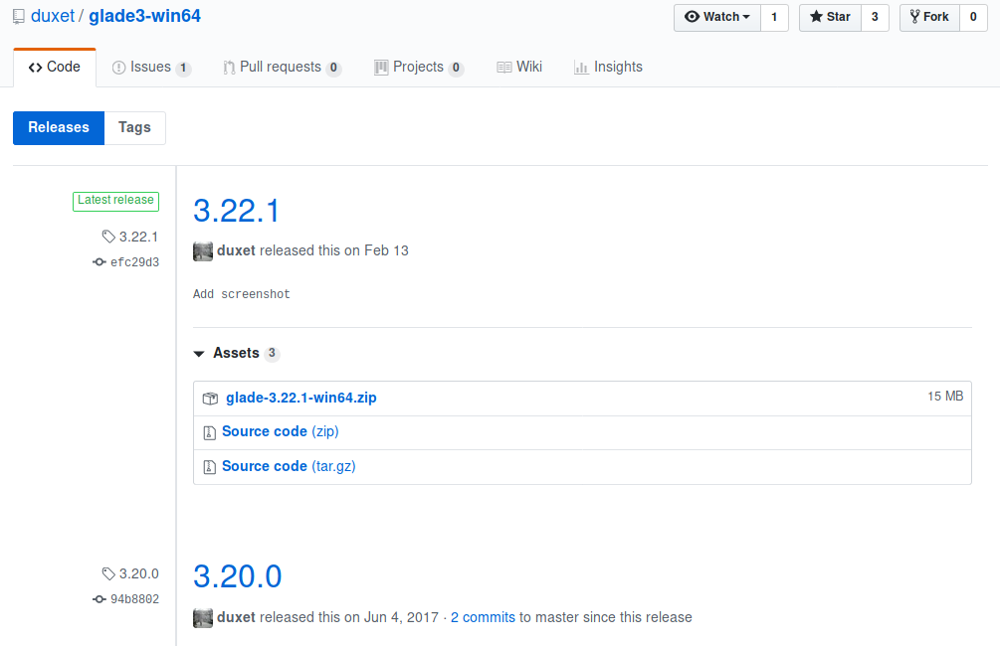
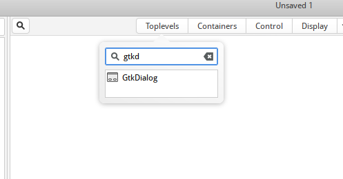
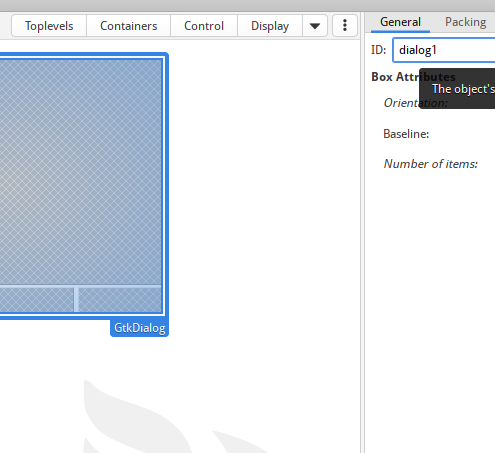
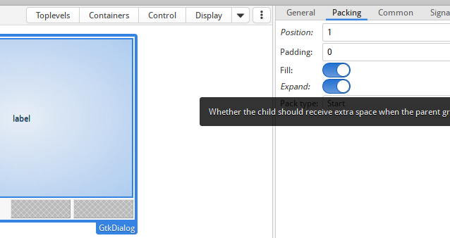
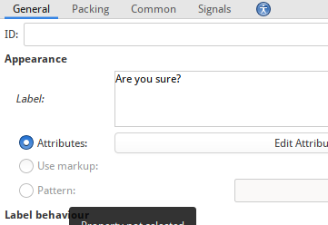
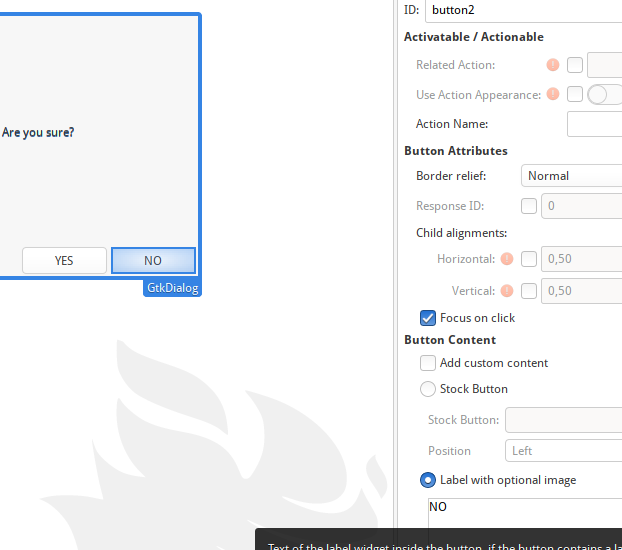
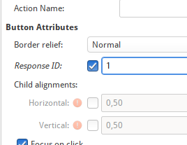

# Glade

# Зміст

${toc}

# Glade

Glade - open source застосунок для візуального створення графічних інтерфейсів на основі GTK+. Опис візуально створюваного розробником інтерфейсу зберігається в файлах формату XML, які потім можуть бути підключені до програм під час виконання з використанням об'єкта GtkBuilder.

# Декларативний опис і XML - формат Glade

**Імперативне програмування** - це опис того, як ти робиш щось, а **декларативне** - того, що ти робиш. Найскладнішим є той факт, що різниця між декларативним і імперативним підходами часто зрозуміла інтуїтивно, але її складно поставити визначенням.

Імперативний підхід (як): Я бачу, що той 2-гий столик вільний. Ми підемо туди і сядемо там.

Декларативний підхід (що): Столик для двох, будь ласка.

Glade використовує декларативний підхід для описання інтерфейсу:

```xml
<?xml version="1.0" encoding="UTF-8"?>
<!-- Generated with glade 3.22.1 -->
<interface>
  <requires lib="gtk+" version="3.20"/>
  <object class="GtkWindow" id="main_window">
    <property name="can_focus">False</property>
    <child>
      <placeholder/>
    </child>
    <child>
      <object class="GtkBox">
        <property name="visible">True</property>
        <property name="can_focus">False</property>
        <property name="orientation">vertical</property>
        <child>
          <object class="GtkButton">
            <property name="label" translatable="yes">button</property>
            <property name="visible">True</property>
            <property name="can_focus">True</property>
            <property name="receives_default">True</property>
          </object>
          <packing>
            <property name="expand">False</property>
            <property name="fill">True</property>
            <property name="position">0</property>
          </packing>
        </child>
      </object>
    </child>
  </object>
</interface>
```

Проти імперативного, який існує в GTK:

```cpp
GtkWidget *window;
window = gtk_window_new(GTK_WINDOW_TOPLEVEL);
gtk_window_set_title(GTK_WINDOW(window), "Hello world");
gtk_window_set_default_size(GTK_WINDOW(window), 500, 500);
GtkWidget *button;
button = gtk_button_new_with_label("Click Me!!!");
gtk_container_add(GTK_CONTAINER(window), button);
```

# Завантаження Glade - файла за допомогою GtkBuilder

Для завантження потрібно:

1. Створити новий екземпляр GtkBuilder

```cpp
GtkBuilder *
gtk_builder_new (void);

GtkBuilder *
gtk_builder_new_from_file (const gchar *filename);

GtkBuilder *
gtk_builder_new_from_string (const gchar *string,
                             gssize length);
```

2. Завантажити в builder glade - файл(Опціонально, взалежності від створення GtkBuilder)

```cpp
guint
gtk_builder_add_from_file (GtkBuilder *builder,
                           const gchar *filename,
                           GError **error);
```

## Отримання доступу до віджетів в програмному коді

Тег object може містити атрибут id, який є унікальним ідентифікатором за допомогою, якого можна знайти цей віджет.

Для отримання екземпляра віджета в програмному коді можна використати функцію 
```cpp
GObject *
gtk_builder_get_object (GtkBuilder *builder,
                        const gchar *name);
```

де name - це id віджета.

## Приклад завантаження glade - файла і виконання застосунка

f_ex.glade:
```xml
<?xml version="1.0" encoding="UTF-8"?>
<!-- Generated with glade 3.22.1 -->
<interface>
  <requires lib="gtk+" version="3.20"/>
  <object class="GtkWindow" id="main_window">
    <property name="can_focus">False</property>
    <child>
      <placeholder/>
    </child>
    <child>
      <object class="GtkBox">
        <property name="visible">True</property>
        <property name="can_focus">False</property>
        <property name="orientation">vertical</property>
        <child>
          <object class="GtkButton">
            <property name="label" translatable="yes">button</property>
            <property name="visible">True</property>
            <property name="can_focus">True</property>
            <property name="receives_default">True</property>
          </object>
          <packing>
            <property name="expand">False</property>
            <property name="fill">True</property>
            <property name="position">0</property>
          </packing>
        </child>
      </object>
    </child>
  </object>
</interface>
```

main.cpp:
```cpp
#include <gtk/gtk.h>

int main (int argc, char *argv[])
{
    GtkBuilder *builder;
    GtkWidget *window;

    gtk_init(&argc, &argv);

    builder = gtk_builder_new();
    gtk_builder_add_from_file (builder, "f_ex.glade", NULL);

    window = GTK_WIDGET(gtk_builder_get_object(builder, "main_window"));

    g_signal_connect(window, "destroy",
                     G_CALLBACK(gtk_main_quit), NULL);

    //Після цього builder може бути знищений, якщо count = 0
    g_object_unref(builder);

    gtk_widget_show_all(window);

    gtk_main();

    return 0;
}
```

# Сигнали і Glade

Тег object, окрім дочірніх тегів property, може містити теги signal із наступними головними атрибутами:
- name(назва сигнала, наприклад active, clicked, toggled)
- handler - назва функції зворотнього виклику, яка буди реалізована в програмному коді

```xml
<object class="GtkButton">
<property name="label" translatable="yes">button</property>
<property name="visible">True</property>
<property name="can_focus">True</property>
<property name="receives_default">True</property>
<signal name="clicked" handler="on_button_clicked"/>
</object>
```

Для того, щоб програмно сигнали, які описані в glade були додані в таблицю потрібно викликати функції:

```cpp
void
gtk_builder_add_callback_symbol (GtkBuilder *builder,
                                 const gchar *callback_name,
                                 GCallback callback_symbol);

void
gtk_builder_add_callback_symbols (GtkBuilder *builder,
                                  const gchar *first_callback_name,
                                  GCallback first_callback_symbol,
                                  ...);
```

Додати символи до таблиці:

```cpp
void
gtk_builder_connect_signals (GtkBuilder *builder,
                             gpointer user_data);
```

## Приклад
f_ex.glade
```xml
<?xml version="1.0" encoding="UTF-8"?>
<!-- Generated with glade 3.22.1 -->
<interface>
  <requires lib="gtk+" version="3.18"/>
  <object class="GtkWindow" id="main_window">
    <property name="can_focus">False</property>
    <child>
      <placeholder/>
    </child>
    <child>
      <object class="GtkBox">
        <property name="visible">True</property>
        <property name="can_focus">False</property>
        <property name="orientation">vertical</property>
        <child>
          <object class="GtkButton" id="btn1">
            <property name="label" translatable="yes">button</property>
            <property name="visible">True</property>
            <property name="can_focus">True</property>
            <property name="receives_default">True</property>
            <signal name="clicked" handler="on_button_clicked"/>
          </object>
          <packing>
            <property name="expand">False</property>
            <property name="fill">True</property>
            <property name="position">0</property>
          </packing>
        </child>
      </object>
    </child>
  </object>
</interface>
```

main.cpp:
```cpp
<?xml version="1.0" encoding="UTF-8"?>
<!-- Generated with glade 3.22.1 -->
<interface>
  <requires lib="gtk+" version="3.18"/>
  <object class="GtkWindow" id="main_window">
    <property name="can_focus">False</property>
    <child>
      <placeholder/>
    </child>
    <child>
      <object class="GtkBox">
        <property name="visible">True</property>
        <property name="can_focus">False</property>
        <property name="orientation">vertical</property>
        <child>
          <object class="GtkButton" id="btn1">
            <property name="label" translatable="yes">button</property>
            <property name="visible">True</property>
            <property name="can_focus">True</property>
            <property name="receives_default">True</property>
            <signal name="clicked" handler="on_button_clicked"/>
          </object>
          <packing>
            <property name="expand">False</property>
            <property name="fill">True</property>
            <property name="position">0</property>
          </packing>
        </child>
      </object>
    </child>
  </object>
</interface>
```

## Приклад пов'язування подій без gtk_builder_add_callback_symbol

Можна використовували лише одну функцію
```cpp
void
gtk_builder_connect_signals (GtkBuilder *builder,
                             gpointer user_data);
```

Для пов'язання із функціями зворотнього виклику буде використане ім'я, яке описано в glade.

Всі функції зворотнього виклику повинні мати декларацію, використовуючи extern.

Cmake повинен бути збудований із модулем gmodule-export-2.0, і використовувати наступні флаги компілятора -Wl,--export-dynamic.

CMakeLists.txt
```
cmake_minimum_required(VERSION 3.13)
project(untitled)

set(CMAKE_CXX_STANDARD 14)
set( CMAKE_CXX_FLAGS "-Wl,--export-dynamic " )

FIND_PACKAGE(PkgConfig REQUIRED)
PKG_CHECK_MODULES(GTK3 REQUIRED gtk+-3.0 gmodule-export-2.0)

INCLUDE_DIRECTORIES(${GTK3_INCLUDE_DIRS})
LINK_DIRECTORIES(${GTK3_LIBRARY_DIRS})

# Add other flags to the compiler
ADD_DEFINITIONS(${GTK3_CFLAGS_OTHER})

add_executable(untitled main.cpp)

TARGET_LINK_LIBRARIES(untitled ${GTK3_LIBRARIES})
```

```cpp
#include <gtk/gtk.h>

extern "C" void on_button_clicked(GtkButton*, gpointer) ;

int main (int argc, char *argv[])
{
    GtkBuilder *builder;
    GtkWidget *window;

    gtk_init(&argc, &argv);

    builder = gtk_builder_new();
    gtk_builder_add_from_file (builder, "f_ex.glade", NULL);

    window = GTK_WIDGET(gtk_builder_get_object(builder, "main_window"));

    gtk_builder_connect_signals(builder, NULL);

    gtk_widget_show_all(window);

    gtk_main();

    return 0;
}

void on_button_clicked(GtkButton *btn1, gpointer user_data){
    g_print("clicked");
}
```

# Огляд інтерфейсу візуального середовища Glade

## Завантаження Glade на Windows

Завантажити Glade можна із репозиторія [duxet](https://github.com/duxet/glade3-win64) Перейшовши на вкладку releases і вибрати потрібну Вам версію



Альтернативно, можна використати [MSYS2](https://www.gtk.org/download/windows.php)

# Діалог, використовуючи Glade

Створіть новий Toplevel, типу GtkDialog:



Встановіть id - dialog1:



Перемістіть в content area GtkLable і встановіть у вкладці Packing, expand = true



Встановіть властивість label:



Перемістіть дві кнопки на placeholder в DialogBox, встановіть їм id, labels.



Встановіть кнопкам Response Id 1 і 2:



Збережіть файл під іменем dialog.glade.

Отриманий файл:
```xml
<?xml version="1.0" encoding="UTF-8"?>
<!-- Generated with glade 3.22.1 -->
<interface>
  <requires lib="gtk+" version="3.20"/>
  <object class="GtkDialog" id="dialog1">
    <property name="can_focus">False</property>
    <property name="type_hint">dialog</property>
    <child>
      <placeholder/>
    </child>
    <child internal-child="vbox">
      <object class="GtkBox">
        <property name="can_focus">False</property>
        <property name="orientation">vertical</property>
        <property name="spacing">2</property>
        <child internal-child="action_area">
          <object class="GtkButtonBox">
            <property name="can_focus">False</property>
            <property name="layout_style">end</property>
            <child>
              <object class="GtkButton" id="button1">
                <property name="label" translatable="yes">YES</property>
                <property name="visible">True</property>
                <property name="can_focus">True</property>
                <property name="receives_default">True</property>
              </object>
              <packing>
                <property name="expand">True</property>
                <property name="fill">True</property>
                <property name="position">0</property>
              </packing>
            </child>
            <child>
              <object class="GtkButton" id="button2">
                <property name="label" translatable="yes">NO</property>
                <property name="visible">True</property>
                <property name="can_focus">True</property>
                <property name="receives_default">True</property>
              </object>
              <packing>
                <property name="expand">True</property>
                <property name="fill">True</property>
                <property name="position">1</property>
              </packing>
            </child>
          </object>
          <packing>
            <property name="expand">False</property>
            <property name="fill">False</property>
            <property name="position">0</property>
          </packing>
        </child>
        <child>
          <object class="GtkLabel">
            <property name="visible">True</property>
            <property name="can_focus">False</property>
            <property name="label" translatable="yes">Are you sure?</property>
          </object>
          <packing>
            <property name="expand">True</property>
            <property name="fill">True</property>
            <property name="position">1</property>
          </packing>
        </child>
      </object>
    </child>
    <action-widgets>
      <action-widget response="1">button1</action-widget>
      <action-widget response="2">button2</action-widget>
    </action-widgets>
  </object>
</interface>

```

main.cpp:
```cpp
#include <gtk/gtk.h>

void on_button_clicked (GtkButton *button, gpointer user_data) {
    int response;
    GtkWidget  *dialog;
    GtkBuilder *builder;

    g_return_if_fail (user_data != NULL);

    builder = gtk_builder_new_from_file("dialog.glade");

    dialog = GTK_WIDGET(gtk_builder_get_object (builder, "dialog1"));
    gtk_window_set_transient_for (GTK_WINDOW(dialog), GTK_WINDOW(user_data));

    gtk_widget_show_all(dialog);

    response = gtk_dialog_run(GTK_DIALOG(dialog));

    gtk_widget_destroy(dialog);

    g_object_unref(G_OBJECT(builder));

    g_print ("Response is %s\n", response == 1 ? "Yes" : "No");
}


int main(int argc, char *argv[]) {
    GtkWidget *button;
    GtkWidget *window;

    gtk_init(&argc,&argv);

    button = gtk_button_new_with_label("Press for dialog");
    window = gtk_window_new(GTK_WINDOW_TOPLEVEL);

    gtk_container_add(GTK_CONTAINER(window), button);

    g_signal_connect(G_OBJECT(button), "clicked", G_CALLBACK(on_button_clicked), window);
    g_signal_connect(G_OBJECT(window), "destroy", G_CALLBACK(gtk_main_quit), NULL);

    gtk_widget_show_all(window);

    gtk_main();

    return 0;
}
```

# Переміщення джерельних файлів glade

```
cmake_minimum_required(VERSION 3.13)
project(untitled)

set(CMAKE_CXX_STANDARD 14)
set( CMAKE_CXX_FLAGS "-Wl,--export-dynamic " )

set (source "${CMAKE_SOURCE_DIR}/ui")
set (destination "${CMAKE_CURRENT_BINARY_DIR}/ui")

FIND_PACKAGE(PkgConfig REQUIRED)
PKG_CHECK_MODULES(GTK3 REQUIRED gtk+-3.0 gmodule-export-2.0)

INCLUDE_DIRECTORIES(${GTK3_INCLUDE_DIRS})
LINK_DIRECTORIES(${GTK3_LIBRARY_DIRS})

# Add other flags to the compiler
ADD_DEFINITIONS(${GTK3_CFLAGS_OTHER})

add_executable(untitled main.cpp)

TARGET_LINK_LIBRARIES(untitled ${GTK3_LIBRARIES})

add_custom_command(
        TARGET ${PROJECT_NAME} POST_BUILD
        COMMAND ${CMAKE_COMMAND} -E create_symlink ${source} ${destination}
        DEPENDS ${destination}
        COMMENT "symbolic link resources folder from ${source} => ${destination}"
)
```

# Домашнє завдання

Переробіть 6 - лабораторну роботу, використовуючи glade.

