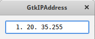

# Custom GTK+ Widgets

# Зміст

${toc}

# IP Adress Widget

В даному прикладі ми створимо віджет, який дозволяє користувачеві ввести IP - адресу. Цей віджет буде успадковуватися від GtkEntry.



## Створення header - файла

**Першим кроком** у створенні будь-якого типу GObject є створення заголовного файлу. Цей файл дозволяє налаштувати основні виклики функцій, необхідні для кожного об'єкта. Це також хороше місце для планування вашого віджета, оскільки файл заголовка буде містити загальнодоступні функції, доступні для будь-якого коду, який використовує Ваш об'єкт.

Для того, щоб компілятори C++ змогли скомпілювати код, ви повинні обернути вміст вашого заголовного файлу в G_BEGIN_DECLS і G_END_DECLS. Ці два макроси додають extern "C" навколо вмісту, який змусить всі функції використовувати свої імена для імен символів, коли їх компілюють.

ipadress.h
```cpp
#ifndef UNTITLED_IPADRESS_H
#define UNTITLED_IPADRESS_H

#include <glib.h>
#include <glib-object.h>
#include <gtk/gtkentry.h>

G_BEGIN_DECLS
...
G_END_DECLS

#endif /* __MY_IP_ADDRESS_H__ */
```

**Разом з необхідними структурами і функціями**, необхідно визначити п'ять макросів для кожного нового віджета
```cpp
#define MY_IP_ADDRESS_TYPE            (my_ip_address_get_type ())
#define MY_IP_ADDRESS(obj)            (G_TYPE_CHECK_INSTANCE_CAST ((obj), MY_IP_ADDRESS_TYPE, MyIPAddress))
#define MY_IP_ADDRESS_CLASS(klass)    (G_TYPE_CHECK_CLASS_CAST ((klass), MY_IP_ADDRESS_TYPE, MyIPAddressClass))
#define IS_MY_IP_ADDRESS(obj)         (G_TYPE_CHECK_INSTANCE_TYPE ((obj), MY_IP_ADDRESS_TYPE))
#define IS_MY_IP_ADDRESS_CLASS(klass) (G_TYPE_CHECK_CLASS_TYPE ((klass), MY_IP_ADDRESS_TYPE))
```

Пояснення макросів:
- Першим макросом, який потрібно визначити, є MY_IP_ADDRESS_TYPE. Цей макрос повертає структуру GType, що відповідає вашому об'єкту. Ми визначимо my_ip_address_get_type () пізніше у файлі заголовка.
- Наступний макрос, MY_IP_ADDRESS (), використовується для приведення об'єкта до MyIPAddress. Це схоже на приведення об'єкта з такими функціями, як GTK_WIDGET (), GTK_ENTRY () або G_OBJECT (). G_TYPE_CHECK_INSTANCE_CAST () виконує два завдання. Спочатку перевіряється, чи є об'єкт правильного типу. Якщо це не так, буде видано попередження. В іншому випадку об'єкт буде відправлений як віджет MyIPAddress і повернуто.
- MY_IP_ADDRESS_CLASS () використовується так само, як і MY_IP_ADDRESS (), за винятком того, що він використовується для передачі об'єкта як MyIPAddressClass.
- Останні два макроси, IS_MY_IP_ADDRESS () і IS_MY_IP_ADDRESS_CLASS (), використовуються для перевірки правильного типу об'єкта. Кожна функція повертає TRUE, якщо об'єкт має вказаний тип.

**Наступним кроком** є ​​визначення структур MyIPAddress і MyIPAddressClass. Вміст віджета утримується _MyIPAddress. Перший член нової структури віджета завжди повинен бути екземпляром типу, від якого ви наслідуєтеся. Як ви можете бачити у списку, віджет MyIPAddress буде отриманий з GtkEntry.

```cpp
typedef struct _MyIPAddress        MyIPAddress;
typedef struct _MyIPAddressClass   MyIPAddressClass;

struct _MyIPAddress
{
  GtkEntry entry;
};

struct _MyIPAddressClass
{
  GtkEntryClass parent_class;

  void (* ip_changed) (MyIPAddress *ipaddress);
};
```

**Останнім кроком** у створенні заголовного файлу є визначення прототипів функцій для тих функцій, які доступні розробникові для виклику.

```cpp
GType      my_ip_address_get_type (void) G_GNUC_CONST;
GtkWidget* my_ip_address_new      (void);

gchar* my_ip_address_get_address (MyIPAddress *ipaddress);
void   my_ip_address_set_address (MyIPAddress *ipaddress, gint address[4]);
```

## Створення cpp - файла

Тепер, коли заголовочний файл створений, настав час створити новий об'єкт і реалізувати функціональність MyIPAddress. Віджет буде мати ряд властивостей і сигналів, які необхідно відстежувати.

**Визначимо глобальні змінні і структури**, які будуть використовуватися напротязі всього - файла - реалізації.

ipadress.cpp
```cpp
#include <gtk/gtk.h>
#include <gdk/gdkkeysyms.h>
#include <stdlib.h>
#include <math.h>
#include "myipaddress.h"

#define MY_IP_ADDRESS_GET_PRIVATE(obj) (G_TYPE_INSTANCE_GET_PRIVATE ((obj), \
                                        MY_IP_ADDRESS_TYPE, MyIPAddressPrivate))

typedef struct _MyIPAddressPrivate  MyIPAddressPrivate;

struct _MyIPAddressPrivate
{
  guint address[4];
};
enum
{
  CHANGED_SIGNAL,
  LAST_SIGNAL
};

enum
{
  PROP_0,
  PROP_IP1,
  PROP_IP2,
  PROP_IP3,
  PROP_IP4
};

static guint my_ip_address_signals[LAST_SIGNAL] = { 0 };
```

Макрос MY_IP_ADDRESS_GET_PRIVATE (), отримує структуру MyIPAddressPrivate, пов'язану з поточним екземпляром об'єкта. Ця структура використовується для зберігання приватних властивостей об'єкта, які є унікальними для кожного екземпляра. У цьому прикладі MyIPAddressPrivate утримує кожне з чотирьох значень IP-адрес. Ці значення зберігаються приватними, так що тільки функції, визначені в цьому файлі, можуть змінювати їх, оскільки віджет повинен бути оновлений, коли вони змінюються.

Наступним кроком є ​​визначення enum, які будуть використовуватися для позначення сигналів і властивостей, встановлених у віджеті. CHANGED_SIGNAL посилається на змінений ip-сигнал, який буде випускатися, коли користувач змінює зміст IP-адреси або коли він програмно змінюється. LAST_SIGNAL використовується, щоб з'ясувати, скільки сигналів встановлено на віджеті та збережено в my_ip_address_signals []. Визначаючи це як останнє значення переліку, сигнали можуть бути легко додані в майбутньому, не турбуючись про оновлення кількості сигналів.

Інше перерахування містить ідентифікатори властивостей. Оскільки всі ваші ідентифікатори властивості повинні бути більше нуля, коли оголошено, традиційно розміщувати початкове значення переліку PROP_0. Інші значення переліку відносяться до чотирьох цілих чисел, які будуть складати IP-адресу. Вони використовуються тільки при додаванні сигналів до класу віджетів. Програмісти, які використовують новий віджет, можуть використовувати імена властивостей, які ви пізніше визначите.

**У заголовному файлі** ми визначили прототип функції my_ip_address_get_type () Ця функція повертає значення GType, яке є просто числовим значенням, унікальним для зареєстрованого типу. У цьому випадку зареєстрованим типом є об'єкт MyIPAddress.

```cpp
GType
my_ip_address_get_type (void)
{
  static GType entry_type = 0;

  if (!entry_type)
  {
    static const GTypeInfo entry_info =
    {
      sizeof (MyIPAddressClass),
      NULL,
      NULL,
      (GClassInitFunc) my_ip_address_class_init,
      NULL,
      NULL,
      sizeof (MyIPAddress),
      0,
      (GInstanceInitFunc) my_ip_address_init,
    };

    entry_type = g_type_register_static (GTK_TYPE_ENTRY, "MyIPAddress",
                                         &entry_info, 0);
  }

  return entry_type;
}
```

Якщо тип ще не створено, що означає, що статичний ідентифікатор ще не встановлений під час ініціалізації об'єкта, нам потрібно його встановити. При реєстрації нового GType, спочатку потрібно оголосити об'єкт GTypeInfo для цього типу. У структурі GTypeInfo є десять членів:

|Змінна|Пояснення|
|-|-|
|guint16 class_size|Розмір структури класу, який необхідний при створенні віджетів. Це просто розмір структури MyIPAddressClass.|
|GBaseInitFunc base_init|Необов'язкове розташування базової функції ініціалізації. Ця функція зворотного виклику використовується для перерозподілу всіх динамічних членів класу, копійованих з батьківського класу.|
|GBaseFinalizeFunc base_finalize|Необов'язкове розташування базової функції фіналізації. Ця функція зворотного виклику використовується для завершення дій, виконаних функцією GBaseInitFunc.|
|GClassInitFunc class_init|Необов'язкова реалізація функції ініціалізації класу, яка використовується для заповнення віртуальних функцій для класу і реєстрації сигналів і властивостей об'єкта.|
|GClassFinalizeFunc class_finalize|Необов'язкова реалізація функції завершення класу. Ця функція рідко потрібна, тому що динамічно виділені ресурси повинні оброблятися у функціях GBaseInitFunc та GBaseFinalizeFunc.|
|gconstpointer class_data|Дані покажчика, які будуть передані реалізаціям GClassInitFunc і GClassFinalizeFunc.|
|guint16 instance_size|Розмір віджета або об'єкта, від якого наслідується. Це просто розмір структури MyIPAddress.|
|guint16 n_preallocs|З моменту виходу GLib 2.10 цей член ігнорується, оскільки розподіл пам'яті екземплярів обробляється за допомогою slice allocator.|
|GInstanceInitFunc instance_init|Необов'язкова функція, яка використовується для налаштування екземпляра. У прикладі MyIPAddress ця функція підключає подію key-press-event і змінені сигнали до кожного GtkEntry і запаковує віджет.|
|const GTypeValueTable *value_table|Таблиця функцій, яка обробляє загальні об'єкти GValue для цього типу. Зазвичай це використовується тільки при створенні фундаментальних типів, тому в більшості випадків це не потрібно визначати.|

Після налаштування об'єкта GTypeInfo для вашого нового типу, наступним кроком буде реєстрація GType за допомогою g_type_register_static (). Першим параметром цієї функції є значення GType, що відноситься до батьківського типу. Наприклад, якщо ви отримаєте об'єкт з MyIPAddress, це буде встановлено на GTK_TYPE_IP_ADDRESS. Можна використовувати макрос GTK_TYPE_ENTRY для виведення нового об'єкта з віджета GtkEntry.

```cpp
GType g_type_register_static (GType parent_type,
                              const gchar *type_name,
                              const GTypeInfo *info,
                              GTypeFlags flags);
```

Далі слід вказати рядок, який буде використовуватися як ім'я нового типу і відповідний об'єкт GTypeInfo. У нашому прикладі було використано назву віджета MyIPAddress. Як правило, це гарна ідея, оскільки вона повинна бути унікальною для вашого об'єкта. Це ім'я має складатися щонайменше з трьох символів і починатися з алфавітного символу.

Останнім параметром є побітова комбінація GTypeFlags. У цьому перерахуванні визначено два значення. G_TYPE_FLAG_ABSTRACT вказує, що тип є абстрактним. Вам буде заборонено створювати екземпляри абстрактних типів. Інший прапор, G_TYPE_FLAG_VALUE_ABSTRACT, вказує тип абстрактного значення, наприклад таблицю значень, але його не можна використовувати з g_value_init (). Функція повертає новий GType для заданих параметрів.

Останнім кроком для налаштування нового GType є повернення нового значення з my_ip_address_get_type (), будь то просто зареєстрований або просто збережений статичним значенням. Ця функція використовується для реєстрації нового типу, а потім для отримання унікального значення GType. Повернене значення можна використовувати в багатьох місцях, наприклад, якщо ви отримуєте новий віджет з MyIPAddress або коли створюєте новий віджет MyIPAddress.

**Наступною функцією** у cpp - файлі є реалізація функції ініціалізації класу (GClassInitFunc), що забезпечується my_ip_address_class_init (). Ця функція приймає об'єкт MyIPAddressClass і необов'язковий параметр даних gpointer, вказаний при реєстрації типу. Другий параметр ігнорується, оскільки параметр даних користувача був визначений як NULL при визначенні нового GType.

```cpp
static void
my_ip_address_class_init (MyIPAddressClass *klass)
{
  GObjectClass *gobject_class = G_OBJECT_CLASS (klass);

  /* Перезаписуємо функції встановлення і повернення атрибутів. */
  gobject_class->set_property = my_ip_address_set_property;
  gobject_class->get_property = my_ip_address_get_property;
  /* Add MyIPAddressPrivate as a private data class of MyIPAddressClass. */
  g_type_class_add_private (klass, sizeof (MyIPAddressPrivate));

  /* Реєструємо сигнал */
  my_ip_address_signals[CHANGED_SIGNAL] =
         g_signal_new ("ip-changed", G_TYPE_FROM_CLASS (klass),
                       G_SIGNAL_RUN_FIRST | G_SIGNAL_ACTION,
                       G_STRUCT_OFFSET (MyIPAddressClass, ip_changed),
                       NULL, NULL, g_cclosure_marshal_VOID__VOID, G_TYPE_NONE, 0);

  /* Реєструємо атрибути */
  g_object_class_install_property (gobject_class, PROP_IP1,
                 g_param_spec_int ("ip-number-1",
                                   "IP Address Number 1",
                                   "The first IP address number",
                                   0, 255, 0,
                                   G_PARAM_READWRITE));

  g_object_class_install_property (gobject_class, PROP_IP2,
                 g_param_spec_int ("ip-number-2",
                                   "IP Address Number 2",
                                   "The second IP address number",
                                   0, 255, 0,
                                   G_PARAM_READWRITE));

  g_object_class_install_property (gobject_class, PROP_IP3,
                 g_param_spec_int ("ip-number-3",
                                   "IP Address Number 3",
                                   "The third IP address number",
                                   0, 255, 0,
                                   G_PARAM_READWRITE));

  g_object_class_install_property (gobject_class, PROP_IP4,
                 g_param_spec_int ("ip-number-4",
                                   "IP Address Number 1",
                                   "The fourth IP address number",
                                   0, 255, 0,
                                   G_PARAM_READWRITE));
}
```

Перше, що потрібно зробити в функції ініціалізації класу, - це перевизначення будь-яких необхідних функцій для GObjectClass, від якого наслідується ваш клас віджетів. У цьому прикладі нам потрібно було перевизначити типові реалізації set_property () та get_property (). Ці функції викликаються, коли програміст викликає g_object_set () і g_object_get () відповідно. Ви завжди повинні перевизначити ці функції, якщо ваш новий об'єкт буде мати будь-яку кількість встановлених властивостей.

Після того, як ви перевизначите будь-які необхідні віртуальні функції, наступним кроком у функції ініціалізації класу віджетів є налаштування будь-яких сигналів, необхідних для вашого об'єкта за допомогою g_signal_new (). Це дуже довга і складна функція:
```cpp
guint g_signal_new (const gchar *signal_name,
                    GType class_type,
                    GSignalFlags signal_flags,
                    guint class_offset,
                    GSignalAccumulator accumulator,
                    gpointer accumulator_data,
                    GSignalCMarshaller c_marshaller,
                    GType return_type,
                    guint n_parameters,
                    ...);
```

Останнє, що потрібно зробити в функції ініціалізації класу для цього прикладу, це встановити необхідні властивості. У віджеті MyIPAddress встановлено чотири властивості, всі чотири цілі числа.

Властивості встановлюються на GObjectClass за допомогою g_object_class_install_property (). Перші два параметри цієї функції приймають GObjectClass, що відповідає вашому новому класу віджетів і ідентифікатору властивості. Ідентифікатор - це просто унікальне ціле число без знака, яке посилається на певну властивість. Ці ідентифікатори зазвичай визначаються в переліку, як це було зроблено для MyIPAddress, так що вони гарантовано є унікальними для об'єкта.

```cpp
void g_object_class_install_property (GObjectClass *object_class,
                                      guint property_id,
                                      GParamSpec *pspec);
```

Останній параметр g_object_class_install_property () - це об'єкт GParamSpec, який зберігає інформацію про те, який тип змінної має властивість, його ім'я та різні інші характеристики.

```cpp
ParamSpec* g_param_spec_int (const gchar *name,
                              const gchar *nick,
                              const gchar *blurb,
                              gint minimum,
                              gint maximum,
                              gint default_value,
                              GParamFlags flags);
```

**У функції ініціалізації класу**, функції за замовчуванням set_property () і get_property () були перевизначені в GObjectClass. Ці дві функції повинні бути перевизначені, якщо ваш новий GObject має одне або більше властивостей.

```cpp
static void
my_ip_address_set_property (GObject *object,
                            guint prop_id,
                            const GValue *value,
                            GParamSpec *pspec)
{
  MyIPAddress *ipaddress = MY_IP_ADDRESS (object);
  gint address[4] = { −1, −1, −1, −1 };

  switch (prop_id)
  {
    case PROP_IP1:
      address[0] = g_value_get_int (value);
      my_ip_address_set_address (ipaddress, address);
      break;
    case PROP_IP2:
      address[1] = g_value_get_int (value);
      my_ip_address_set_address (ipaddress, address);
      break;
    case PROP_IP3:
      address[2] = g_value_get_int (value);
      my_ip_address_set_address (ipaddress, address);
      break;
    case PROP_IP4:
      address[3] = g_value_get_int (value);
      my_ip_address_set_address (ipaddress, address);
      break;
    default:
      G_OBJECT_WARN_INVALID_PROPERTY_ID (object, prop_id, pspec);
      break;
  }
}
```

Коли властивість встановлюється, вона зберігається як об'єкт GValue, який є загальним контейнером, що використовується для зберігання будь-якого типу об'єкта. Функція g_value_get_int () використовується для отримання цілого значення, збереженого GValue. Є функції, доступні для перетворення між усіма основними типами даних і наявними об'єктами GValue

```cpp
tatic void
my_ip_address_get_property (GObject *object,
                            guint prop_id,
                            GValue *value,
                            GParamSpec *pspec)
{
  MyIPAddress *ipaddress = MY_IP_ADDRESS (object);
  MyIPAddressPrivate *priv = MY_IP_ADDRESS_GET_PRIVATE (ipaddress);

  switch (prop_id)
  {
    case PROP_IP1:
      g_value_set_int (value, priv->address[0]);
      break;
    case PROP_IP2:
      g_value_set_int (value, priv->address[1]);
      break;
    case PROP_IP3:
      g_value_set_int (value, priv->address[2]);
      break;
    case PROP_IP4:
      g_value_set_int (value, priv->address[3]);
      break;
    default:
      G_OBJECT_WARN_INVALID_PROPERTY_ID (object, prop_id, pspec);
      break;
  }
}
```

Функція my_ip_address_get_property () бере відповідну властивість з структури MyIPAddressPrivate і перетворює її у GValue.

**Іншою функцією ініціалізації**, яка повинна бути реалізована, є my_ip_address_init (), яка викликається кожного разу, коли створюється новий віджет MyIPAddress. Ця функція відрізняється від функції ініціалізації класу, яка викликається тільки для того, щоб налаштувати клас об'єкта, а не кожен раз, коли об'єкт створюється.

```cpp
static void
my_ip_address_init (MyIPAddress *ipaddress)
{
  MyIPAddressPrivate *priv = MY_IP_ADDRESS_GET_PRIVATE (ipaddress);
  PangoFontDescription *fd;
  guint i;

  for (i = 0; i < 4; i++)
    priv->address[i] = 0;

  fd = pango_font_description_from_string ("Monospace");
  gtk_widget_modify_font (GTK_WIDGET (ipaddress), fd);
  my_ip_address_render (ipaddress);
  pango_font_description_free (fd);

  g_signal_connect (G_OBJECT (ipaddress), "key-press-event",
                    G_CALLBACK (my_ip_address_key_pressed), NULL);
  g_signal_connect (G_OBJECT (ipaddress), "notify::cursor-position",
                    G_CALLBACK (my_ip_address_move_cursor), NULL);
}
```

Функція my_ip_address_init () приймає об'єкт MyIPAddress, який вже був створений і переданий. Ваше завдання - зробити будь-яку подальшу обробку, яку потрібно виконати на віджеті, перш ніж він буде повернутий програмусту і показаний користувачеві.

У цьому прикладі функція спочатку ініціалізує чотири значення IP-адреси до нуля. Потім шрифт віджета встановлюється як Monospace. Зверніть увагу, що розмір не вказано, що дозволяє користувачеві задавати розмір. Це робиться для того, щоб користувачі з великими шрифтами могли читати вміст віджета.

Нарешті, віджет MyIPAddress підключається до двох сигналів. Функція зворотного виклику події key-press-event фільтруватиме клавіші, на які реагує віджет. Потім, коли змінюється позиція курсору, позиція буде оновлена, тому ми можемо контролювати, куди вводиться текст. Пам'ятайте, що, оскільки MyIPAddress походить від GtkEntry, він успадковує всі його члени, властивості, сигнали, функції тощо. Він також успадковує все, починаючи від GtkWidget, GtkObject і GObject, оскільки ці класи є його предками.

**Далі реалізовано декілька приватних функцій**, які оброблятимуть, як віджет взаємодіє з користувачем. Функція my_ip_address_render (). Ця функція створює рядок із значень IP-адреси і додає його до віджета GtkEntry. Це єдина функція, яка взаємодіє з віджетом GtkEntry.

```cpp
static void
my_ip_address_render (MyIPAddress *ipaddress)
{
  MyIPAddressPrivate *priv = MY_IP_ADDRESS_GET_PRIVATE (ipaddress);
  GString *text;
  guint i;

  text = g_string_new (NULL);
  for (i = 0; i < 4; i++)
  {
    gchar *temp = g_strdup_printf ("%3i.", priv->address[i]);
    text = g_string_append (text, temp);
    g_free (temp);
  }

  text = g_string_truncate (text, 15);
  gtk_entry_set_text (GTK_ENTRY (ipaddress), text->str);
  g_string_free (text, TRUE);
}
```

Ця функція використовує GString для побудови рядка IP-адреси з п'ятнадцяти символів з трьох крапок і чотирьох цілих чисел, які в даний час зберігаються в екземплярі MyIPAddressPrivate. Цей рядок буде показано користувачеві у віджеті GtkEntry. Якщо ціле число не заповнює три пробіли, воно доповнено одним або двома пробілами, так що IP-адреса завжди матиме ширину від п'ятнадцяти символів. Це дозволяє нам точно знати, куди слід розміщувати курсор у будь-який час, оскільки ширина гарантована.

Віджет MyIPAddress побудований таким чином, що курсор примушується до однієї з чотирьох позицій. Кожен номер завжди вирівнюється праворуч і доповнюється пробілами ліворуч, якщо це необхідно. Через це курсор примушується в положення праворуч від одного з чотирьох чисел. Це робиться в функції **notify::cursor-position**

```cpp
static void
my_ip_address_move_cursor (GObject *entry,
                           GParamSpec *spec)
{
  gint cursor = gtk_editable_get_position (GTK_EDITABLE (entry));

  if (cursor <= 3)
    gtk_editable_set_position (GTK_EDITABLE (entry), 3);
  else if (cursor <= 7)
    gtk_editable_set_position (GTK_EDITABLE (entry), 7);
  else if (cursor <= 11)
    gtk_editable_set_position (GTK_EDITABLE (entry), 11);
  else
    gtk_editable_set_position (GTK_EDITABLE (entry), 15);

}

/* Handle key presses of numbers, tabs, backspaces and returns. */
static gboolean
my_ip_address_key_pressed (GtkEntry *entry,
                           GdkEventKey *event)
{
  MyIPAddressPrivate *priv = MY_IP_ADDRESS_GET_PRIVATE (entry);
  guint k = event->keyval;
  gint cursor, value;

  /* If the key is an integer, append the new number to the address. This is only
   * done if the resulting number will be less than 255. */
  if ((k >= GDK_0 && k <= GDK_9) || (k >= GDK_KP_0 && k <= GDK_KP_9))
  {
    cursor = floor (gtk_editable_get_position (GTK_EDITABLE (entry)) / 4);
    value = g_ascii_digit_value (event->string[0]);

    if ((priv->address[cursor] == 25) && (value > 5))
      return TRUE;
    if (priv->address[cursor] < 26)
    {
      priv->address[cursor] *= 10;
      priv->address[cursor] += value;
      my_ip_address_render (MY_IP_ADDRESS (entry));
      gtk_editable_set_position (GTK_EDITABLE (entry), (4 * cursor) + 3);
      g_signal_emit_by_name ((gpointer) entry, "ip-changed");
    }
  }

  /* Move to the next number or wrap around to the first. */
  else if (k == GDK_Tab)
  {
    cursor = (floor (gtk_editable_get_position (GTK_EDITABLE (entry)) / 4) + 1);
    gtk_editable_set_position (GTK_EDITABLE (entry), (4 * (cursor % 4)) + 3);
  }

  /* Delete the last digit of the current number. This just divides the number by
   * 10, relying on the fact that any remainder will be ignored. */
  else if (k == GDK_BackSpace)
  {
    cursor = floor (gtk_editable_get_position (GTK_EDITABLE (entry)) / 4);
    priv->address[cursor] /= 10;
    my_ip_address_render (MY_IP_ADDRESS (entry));
    gtk_editable_set_position (GTK_EDITABLE (entry), (4 * cursor) + 3);
    g_signal_emit_by_name ((gpointer) entry, "ip-changed");
  }

  /* Activate the GtkEntry widget, which corresponds to the activate signal. */
  else if ((k == GDK_Return) || (k == GDK_KP_Enter))
    gtk_widget_activate (GTK_WIDGET (entry));

  return TRUE;
}
```

**Останнім кроком для створення віджета** є реалізація загальнодоступних функцій, оголошених у заголовному файлі віджета. Перша функція my_ip_address_new (), яка створює новий віджет MyIPAddress

```cpp
GtkWidget*
my_ip_address_new ()
{
  return GTK_WIDGET (g_object_new (my_ip_address_get_type (), NULL));
}
```

Слід зауважити, що єдиним завданням, яке ця функція надає, є приведення до GtkWidget об'єкта, який повертається g_object_new (). Це просто зручна функція для багатьох віджетів, тому програмісту не потрібно самостійно створювати екземпляр GObject.

**Функція my_ip_address_get_address ()** повертає рядкове представлення IP-адреси, яка наразі зберігається у віджеті.

```cpp
gchar*
my_ip_address_get_address (MyIPAddress *ipaddress)
{
  MyIPAddressPrivate *priv = MY_IP_ADDRESS_GET_PRIVATE (ipaddress);

  return g_strdup_printf ("%d.%d.%d.%d", priv->address[0], priv->address[1],
                          priv->address[2], priv->address[3]);
}
```

**Остання функція, my_ip_address_set_address ()**, застосовує програмні зміни до IP-адреси. Ви помітите, що функція відфільтровує числа, менші ніж 0 або більше, ніж 255. При цьому програмісту не доведеться надавати нові значення для кожного номера IP-адреси. Це означає, що нам потрібно лише надати одну функцію для програмного оновлення IP-адреси, оскільки програміст може оновлювати єдине значення.

```cpp
void
my_ip_address_set_address (MyIPAddress *ipaddress,
                           gint address[4])
{
  MyIPAddressPrivate *priv = MY_IP_ADDRESS_GET_PRIVATE (ipaddress);
  guint i;

  for (i = 0; i < 4; i++)
  {
    if (address[i] >= 0 && address[i] <= 255)
    {
      priv->address[i] = address[i];
    }
  }

  my_ip_address_render (ipaddress);
  g_signal_emit_by_name ((gpointer) ipaddress, "ip-changed");
}
```

## Тестуємо віджет

```cpp
#include <gtk/gtk.h>
#include "myipaddress.h"

static void ip_address_changed (MyIPAddress*);

int main (int argc,
          char *argv[])
{
  GtkWidget *window, *ipaddress;
  gint address[4] = { 1, 20, 35, 255 };

  gtk_init (&argc, &argv);

  window = gtk_window_new (GTK_WINDOW_TOPLEVEL);
  gtk_window_set_title (GTK_WINDOW (window), "MyIPAddress");
  gtk_container_set_border_width (GTK_CONTAINER (window), 10);

  g_signal_connect (G_OBJECT (window), "destroy",
                    G_CALLBACK (gtk_main_quit), NULL);

  ipaddress = my_ip_address_new ();
  my_ip_address_set_address (MY_IP_ADDRESS (ipaddress), address);
  g_signal_connect (G_OBJECT (ipaddress), "ip-changed",
                    G_CALLBACK (ip_address_changed), NULL);

  gtk_container_add (GTK_CONTAINER (window), ipaddress);
  gtk_widget_show_all (window);

  gtk_main ();
  return 0;
}

static void
ip_address_changed (MyIPAddress *ipaddress)
{
  gchar *address = my_ip_address_get_address (ipaddress);
  g_print ("%s\n", address);
  g_free (address);
}
```
